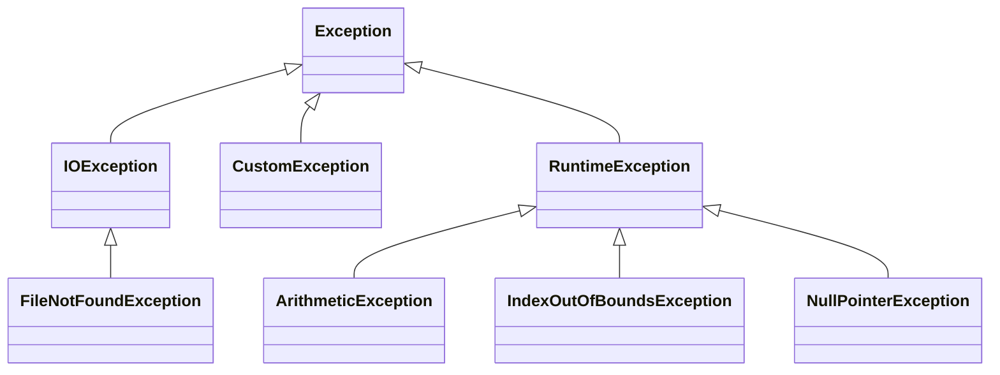

# Exceptions

An error that occurs within a program at runtime.

# What to do when an error occurs?
- Old style: return "error code"
- Caller must check on each call
  - Did the method return an error?
  - Requires a special value to indicate error
  - E.g. `open("file.txt")` in C returns a file descriptor that allows reading from a file
  - Returns -1 (invalid file descriptor) if open fails
  - Programmer must remember to check for -1
- Prone to forgetting to check for errors and causing entire program to crash
- In java, we can throw errors and catch them to be handled accordingly, without having the program fully crash on us

# Java Approach - Exceptions

- Write code without worrying about checking for errors
- When error is detected, an exception is thrown
  - Stop execution of current method
  - Search for "exception handler" to deal with the problem
- Search begins in current method and continues to
  - Caller of method
  - Caller's caller
  - Caller's caller's caller
  - All the way up to main
  - Heads up the caller chain until it either finds a handler, or ends
- Each method either **catches** the error (handles it immediately) or **throws** the error (lets the caller handle it)

# Syntax

```java
try {
    // statements that might throw exception
    int x = 30/0;
} catch (Exception e) {
    // statements to recover from exception
}
```

Note: `Exception` is a class name, not a reserved word. `e` is an object reference to the exception that was thrown.

Note that the code that causes the exception must be in the try block when the error happens. If it is not, it will not be caught by the `catch` block, and instead cause the entire program to crash.

Instead of catching an exception and dealing with it, a method can declare that it will just throw an exception without catching it by declaring it as such:

```java
public void doSomething(int x) throws Exception {
    // statements that might throw an exception
}
```

In this case, we leave it to the user to handle the exception accordingly rather than having the function handle the exception.

A method can also re-throw an `Exception`

```java
try {
    // statements that might throw an exception
} catch (Exception e) {
    // statements to recover from exception
    // ...
    // recovery fails, re-throw
    throw new RuntimeException(e);
}
```

# Exception Class

- Exceptions are objects
- Created with `new` just like an object
- The exception object is an instance of 
  - `class Exception` or
  - A subclass of `Exception`
- 2 useful methods
  - `e.getMessage()` gets the associated text message
  - `e.printStackTrace()` prints the current call stack



# Checked vs Unchecked Exceptions

We are not expected to catch unchecked exceptions

- `RuntimeException` class and its subclasses are **unchecked exceptions**
    - No need to check for them (No need to include try catch block or declare that method throws an unchecked exception)
    - Typically no recovery is possible; program crashes
    - Generally indicate program or JVM error (null pointer, arithmetic, invalid array index etc)
    - Problem with program logic, must change code to fix
- All other exceptions are **checked**
    - Generally indicate "user" error (e.g. file not found)
    - Must check for them (try-catch or throws)
    - Typically recoverable (E.g. prompt user again)


```java
public class Main {
    static void doSomething(int x) throws Exception {
        if (x % 2 == 0) {
            throw new Exception("Fail");
        } else {
            System.out.println("Hello");
        }
    }

    public static void main(String[] args) {
        doSomething(1);
    }
}
```

The code above will have a compile time error because Exception is a checked error, and we are required to handle it in a try catch. We can remove the error by including a try catch:

```java
public class Person {
    static void doSomething(int x) throws Exception { // declare that it throws since exception is checked
        if (x % 2 == 0) {
            throw new Exception("Fail");
        } else {
            System.out.println("Hello");
        }
    }

    public static void main(String[] args) {
        try {
            doSomething(1); 
        } catch(Exception e) { // required try catch to handle exception
            System.out.println(e.getMessage());
        }
    }
}
```

However, if `RuntimeException` was thrown instead, then `doSomething()` will not cause a compile time error, because `RuntimeException` is an unchecked exception

```java
public class Main {
    static void doSomething(int x) { // dont need to declare throw because RuntimeException is unchecked
        if (x % 2 == 0) {
            throw new RuntimeException("Fail");
        } else {
            System.out.println("Hello");
        }
    }

    public static void main(String[] args) {
        doSomething(22); // dont need try catch because RuntimeException is unchecked
    }
}
```

However, if `doSomething` throws an error, the program will stop immediately

# Examples of Exception

```java
Scanner s = new Scanner(System.in);
while (true) {
    try {
        String word = s.next();
        System.out.println(word);
    } catch (NoSuchElementException e) {
        System.out.printf("NoSuchElementException: %s\n", e.getMessage());
        break;
    }
}
```

If we enter `\n` as an input to our scanner (the end-of-file(EOF) input), the program will throw a `NoSuchElementException`, which is handled by the catch block. Also, a `NoSuchElementException` is a checked error, because we have to check whether we reached the end of a file.

```java
public static void main(String[] args) {
    File f = new File(args[0]);

    try {
        Scanner s = new Scanner(System.in);
        int c = 0;
        while (s.hasNextLine()) {
            s.nextLine();
            c++;
        }

        System.out.printf("This file has %d lines", c);
    } catch (FileNotFoundException e) {
        System.out.printf("Exception: %s\n", e.getMessage());
    }
}
```

The program above tries to read a file. If we pass no arguments to `main`, then args[0] will not exist, and an error will be thrown, but not handled, causing the program to end immediately.

However, if we pass in a file that does not exist, then the `FileNotFoundException` will be caught by the try-catch block.

# Practice

```java
import java.util.Scanner;
 
public class Practice {
     public static void main(String[] args) {
          int x, y, z;
          Scanner scan = new Scanner(System.in);

          /*** TODO: Write the header for the try-catch block ***/
          {
               System.out.println("Enter two integers: ");
               x = scan.nextInt();
               y = scan.nextInt();

               z = x / y;
               System.out.printf("The value %d divides %d %d times",x,y,z);
          }
          /*** TODO: Write the header for the block that catches the 
                     ArithmeticException. ***/
          {
               System.err.print("Divided by zero!");
          }
     }
}
```

# Making Your Own Exception Class

```java
public class StudentNotFoundException extends Exception { // extend either Exception or RuntimeException
    public StudentNotFoundException(String message) {
        super(message);
    }
}

public class FindStudent {
    public int search(String studentID) throws StudentNotFoundException { // declare throw if checked exception is thrown
        if (...) {
            throw new StudentNotFoundException(studentID);
        }
    }
}
```

# Catching Multiple Exceptions

- Possible to catch multiple exceptions from a single try
- Catches must be ordered from lowest subclass to highest superclass
    - If we put the most general class `Exception` in the first catch block, since all other exceptions extend `Exception`, the first catch block is matched and will run
    - Similar to multiple if else statements, only the first matching try-catch block will run
  
```java
try {
    // statements that throw
} catch (StudentNotFoundException e) {
    // code to handle student not found exception
} catch (Exception e) {
    // code to handle exception
}
```

# Finally Clause

- `finally`, if present, will run only after all the try catch blocks run
- `finally` clause is guaranteed to execute even if earlier clause returns

