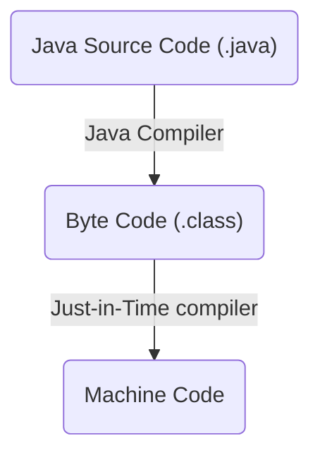

# Programming Paradigms

- Unstructured Programming
  - Closest to CPU language
  - Assembly, COBOL, Basic

```
clrscr proc near
    mov ax, 0b800h
    mov es, ax
endp
```

- Procedural Programming
  - Programs are based on procedures (Sequence, selection, iteration)
  - Pascal, C, ADA, Fortran

```c
int main() {
    int x = 1;
    x += 2;
    printf("%d\n", x);
}
```

- Object-oriented Programming
  - Programs are based on objects, and how they interact with each other
  - Java, C++, C#

```java
public class Main {
    public static void main(String[] args) {
        Person p = new Person("John", 'M');
        p.talk();
        p.cry();
    }
}
```

# Object Oriented Programming

- Based on the notion of objects
- Computation is represented by interactions with objects, or communcation between objects

# Java

- Developed by SUN for embedded consumer goods; now popular for Web
- No pointers
- No multiple-inheritance
- Uses a Java Virtual Machine (JVM)
- Slow (Java code must be converted into byte-code, which can be translated by the java virtual machine into machine-readable code to be executed)
- "Compile once, run everywhere"



