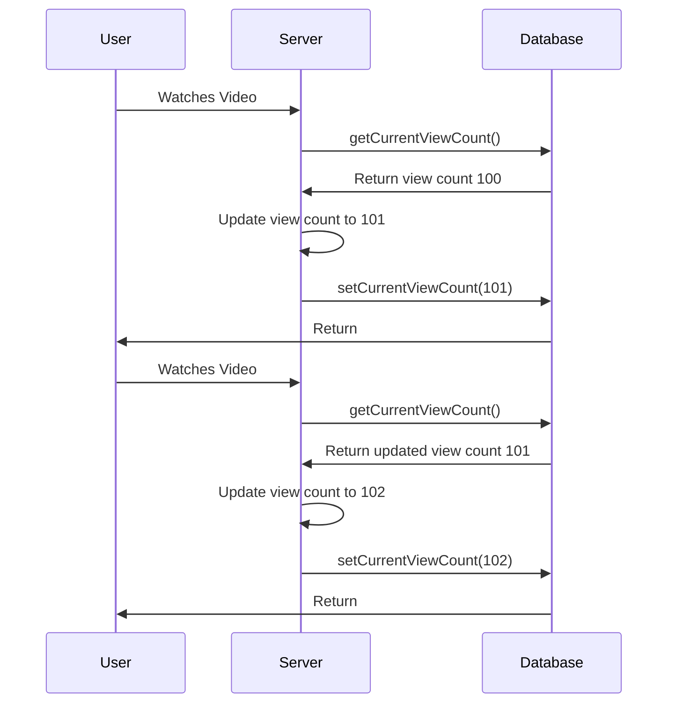
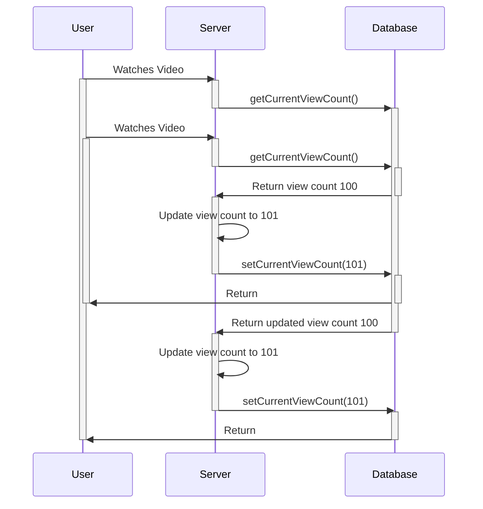

# Process Synchronisation

# Background

- Access to shared data from concurrent processes may result in data inconsistency
    - Data value depends on the order of instructions executions from concurrent processes. I.e. when context switches occur between concurrent processes
- Maintaining data consistency requires mechanisms to ensure the orderly execution of concurrent processes
    - We need to find a way to sequence concurrent processes to ensure data consistency

# Race Conditions

A race condition is the condition of a system where the system's behavior is **dependent on the sequence or timing of other uncontrollable events**. It becomes a bug when one or more of the possible behaviors is undesirable.

For example, consider the following process that are used to update the view count of a video

```
void updateViewCount() {
    int currentViewCount = await getCurrentViewCount();
    int newViewCount = currentViewCount + 1;
    await setCurrentViewCount(newViewCount);
}
```



Here, there is no race condition because the view count has been updated before it was accessed again. However, consider the scenario where 2 users watch the video at roughly the same time



Now, when both users access the current view count at the same time, they incorrectly update the view count. 

# The Critical-Section Problem

- $n$ processes all competing to use some shared data
- Each process has a code segment, called the **critical section**, in which the shared data is accessed
    - Process may be changing shared variables, updating shared table, writing shared file etc.
    - At least one process modifies the shared data
- Problem: Design a protocol to ensure that when one process is executing in its critical section, no other process is allowed to execute in its own critical section

# Generic Solution Structure for Critical Section Problem

1. Entry section: Ask for permission to enter critical section
2. Exit section: Exit critical section (notify other processes)

```
while (1) {
    runEntrySection(); // what should be the logic here?
    runCriticalSection(); // only 1 process can be executing this code at the same time
    runExitSection();  // what should be the logic here?
    // remainder section of code
}
```

# Desired Properties of Solutions to the Critical-Section Problem

- Assumptions of critical and remainder sections
    - Each process is guaranteed to make progress over time in these sections (no halting)
    - No assumption about relative execution speed of different processes in these sections

## Desired Properties of Entry and Exit Sections

1. Mutual Exclusion

> If a process is executing in its critical section, no other process can be executing in its critical section at the same time

- This is to ensure the shared data is consistent and contains the most updated value whenever a process tries to access the shared data

2. Progress

> If no process is executing in its critical section and some processes wish to enter their critical sections, then only those processes that are not executing in their remainder section can participate in deciding which will enter its critical section next, and this selection cannot be postponed indefinitely.

- If a process is executing in its critical section, then work is being done, and we are making progress. 
- If no process is executing in its critical section, but no process wants to enter its critical section, it means that there is no more work to do. But since there is at least 1 process that wants to enter their critical section, there is more work to be done
- Only processes that have not completed their critical section should be able to choose which process to enter the critical section
- Since the selection cannot be postponed indefinitely, it will only take a limited amount of time for some process to enter its critical section. If no process enters its critical section, although at least 1 process wants to enter its critical section, we will have reached a **deadlock** or **livelock**, and no work will be done

3. Bounded Waiting

> There exists a bound, or limit, on the number of times other processes are allowed to enter their critical sections after a process has made request to enter its critical section and before that request is granted.

- Consider a process P that has made a request to enter its critical section
- If there was no bound for other processes to enter their critical sections, P's entry to its critical section can be postponed indefinitely
- This means P will never make any progress, and starvation will occur
- By placing an upper bound on the number of times other processes are allowed to enter their critical section after P requested to enter, it is guaranteed that after a finite amount of time, P will enter its critical section and make progress

# Process Synchronisation

## User-level Solutions

Remember our generic structure of a process

```
while (1) {
    runEntrySection();
    runCriticalSection();
    runExitSection();
    // remainder section
    ...
}
```

We shall consider 2 processes P0 and P1
- Although P0 and P1 have the same generic structure, they may have different implementations for the 4 sections

# Resources

- https://stackoverflow.com/questions/33143779/what-is-progress-and-bounded-waiting-in-critical-section