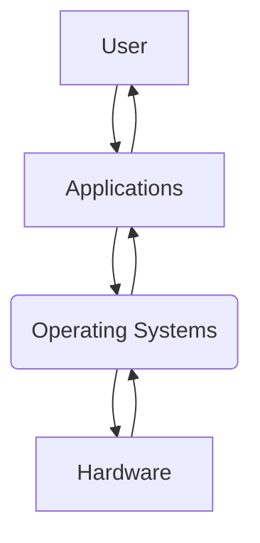
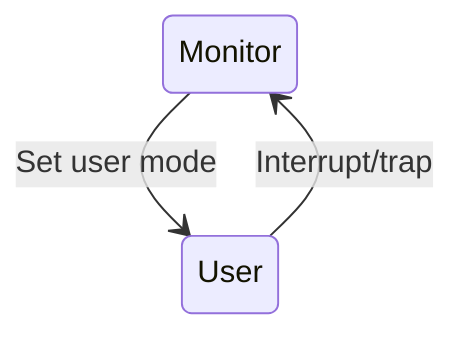

# Introduction to Operating Systems

# What is an Operating System?

> An operating system is a program that acts as an intermediary between the **user** and **computer hardware**

- 2 major goals
    - User convenience
    - Efficient hardware utilisation

# Computer System Components

1. **Hardware** - Provide basic computing resources (CPU, memory, IO)
2. **Operating System** - Controls and coordinates the use of hardware among various applications for various users
3. **Application programs** - Defines the way system resources are used to solve problems for users (Compilers, Database systems, Video games, Business Programs)
4. **Users** - People, other machines, other computers

# Operating System Definitions

- **Resource allocator**: Manages and allocates hardware resources
- **Control Program**: Controls the execution of user programs and operations of IO devices
- **Kernel**: The one "core" program that is always ready to accept new commands from the user or the hardware

# Types of Computing Systems

- Batch Systems
- Multiprogrammed and Time-sharing systems
    - Desktop systems
- Embedded and Cyber-physical systems
    - Real-time systems
    - Handheld systems

## Simple Batch Systems
- Reduce setup times by **batching** similar jobs
- Automatic job sequencing: automatically transfers control from one job to another
- Simple memory layout: Only 1 user job in the memory at any given time
- Not efficient: When job waits for IO, CPU is idle

## Multiprogrammed (Time-Sharing) Systems
- Several jobs are kept in the main memory at the same time, and CPU is multiplexed among them
- A job is swaped in and out of memory to the hard disk
- System is highly interactive - supports multiple online users
- E.g. desktops, servers

### OS Features required for Multi-Programming
- Memory management: To allocate memory for multiple jobs
- CPU scheduling: To choose among several jobs ready to run
- IO device scheduling: To allocate IO devices to jobs

### Desktop Systems
- Personal computers: Computer systems dedicated to a single user
- Several IO devices: Keyboard, mouse, printer etc.
- User convenience and responsiveness is the main focus
- May run several different types of operating systems (Windows, Linux, MacOS etc.)

## Embedded and Cyber-Physical Systems
- Physical systems whose operations are monitored and controlled by a reliable computing and communication core
- Resource-constrained: Low power, small memory, low bandwidth etc.
- Domain-specific OSes: Real-time, handheld, automotive etc.

### Real-time Systems
- Used as a control device in a dedicated application such as industrial controls, automotives, medical devices etc.
- Well-defined fixed-time constraints
    - Job must be completed within a deadline
    - E.g. airbag control in vehicles
- E.g. of real-time OSes: LynxOS, RTLinux

### Handheld Systems
- Mobile phones, tablets
- Issues: Limited memory, slow processors, small display screens
- Popular OSes: Android, iOS, Windows Phone

# Multiprocessor Systems

> Multiprocessor systems are systems with more than 1 CPU, or CPU with multiple cores (Also called multi-core systems)

- Tightly coupled system: Communication usually takes place through shared memory
- Advantages of such systems
    - Increased system throughput
    - Economical due to sharing of memory and IO
    - Increased reliability due to redundancy

# Computer System Architecture
- Computer-System Operation
- Storage hierarchy
- Hardware protection

# Computer-System Operation

- IO devices and CPU can execute concurrently
- Each device controller is in charge of a particular device type
- Each device controller has a local buffer
- Device controller moves data between local buffer and memory
- Device controller informs CPU that it has finished operations by causing an **interrupt**

## Common Functions of an Interrupt

- Interrupts transfer control to the interrupt service routine (ISR) generally through the interrupt vector: which contains the address for all ISRs
- Incoming interrupts are disabled while processing the current interrupt, to prevent loss of interrupts
- A trap is a CPU generated interrupt, caused by software error or request
    - E.g. unhandled exceptions in user program
- An OS is typically **interrupt driven**
    - If the OS is not interrupt driven, it would be required to constantly poll for task/event completion, which is inefficient.

## Interrupt Handling

- The operating system preserves the state of the CPU by storing registers and the program counter
    - Also called a **context switch**
- Then it determines which type of interrupt has occured
    - Separate segments of code determine what action should be taken for each type of interrupt
- Based on the interrupt type, it identifies the appropriate **ISR** to execute
    - Obtained from **interrupt vector table**

## Direct Memory Access (DMA)

DMA is a feature of computer systems that allows certain hardware subsystems to **directly access** main system memory (random-access memory) **independently of the CPU**

- Used for high-speed IO devices that are able to transmit information at close to memory speeds
- OS sets up the memory blocks, counters etc
- Device controller transfers data block from buffer to main memory **without CPU intervention**
- Only one interrupt is generated per block, rather than one interrupt per byte

# Storage Hierarchy

A storage device hierarchy consists of a group of storage devices that have different costs for storing data, different amounts of data stored, and different speeds of accessing the data. Storage devices higher up the hierarchy usually **cost more**, have **lower capacity**, but **faster speeds**

- Memory hierarchy: CPU registers, CPU Cache, Main memory, Hard Disks
- Storage system organisation is based on
    - speed
    - cost
    - volatility
    - size
- Caching: Copying information into faster storage systems: main memory can be viewed as the last cache before secondary storage

# Hardware Protection

Hardware protection is vulnerability protection that comes in the form of a physical device rather than software that is installed on the hardware of a computer system. Types of hardware protection include:

- Dual-mode Operation
- IO Protection
- Memory Protection

## Dual-mode Operation

- Provides hardware protection by differentiating between at least 2 modes of operations
    1. User mode: Execution of user process
    2. Monitor mode (Supervisor mode or system mode or kernel mode): Execution of operating system processes
- Mode bit added to computer hardware to indicate the current mode: monitor (0) or user (1)
- When an interrupt or trap occurs, hardware switches to monitor mode
- Privileged instructions can only be used in monitor mode

### Kernel Mode vs root/admin

- Kernel mode and root/admin are not the same
- Kernel or user mode is a hardware operation mode
- Root/Administrator is a user account in the OS
    - Jobs still execute in user mode, even when executed by root/admin user
    - This may in turn execute code in kernel mode indirectly, e.g. loading a kernel module

## IO Protection

- User program may issue illegal IO operations, hence IO must be protected
    - E.g. reading files that do not exist
    - Unauthorized access to a device
- All IO instructions are privileged instructions
- All IO operations must go through the OS to ensure its correctness and legality
    - CPU generates a trap for IO operations that try to bypass the OS

## Memory Protection

- OS must provide memory protection, at least for the interrupt vector and the interrupt service routines
- 2 CPU registers determine the range of legal addresses a program may access
    1. Base register: Holds the first legal memory address
    2. Limit register: Contains the size of the legal memory range
- Memory outside the defined range is protected and cannot be accessed

- The load instructions for the base and limit registers are privileged instructions (Only in monitor mode)
- CPU issues trap to OS is the above check fails

# Operating System Services

## System Calls
- System calls provide the interface between a user program and the operating system
    - Generally available as assembly-language instructions
    - Possible to replace assembly language for system programming to allow system calls to be directly made (e.g. in C/C++)
- The execution of a system call requires the switch from the user to the kernel mode

# Further Resources
- https://www.cs.uic.edu/~jbell/CourseNotes/OperatingSystems/8_MainMemory.html
- https://www.cs.uic.edu/~jbell/CourseNotes/OperatingSystems/2_Structures.html