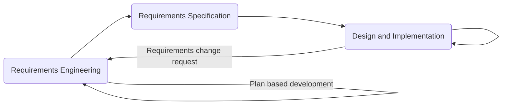
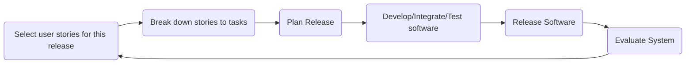
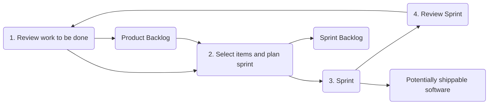

# Agile Software Development

# Rapid Software Development

- **Rapid development and delivery** is now often the most important requirement for software systems
    - Businesses operate in fast, constantly changing environments and it is impossible to produce a set of stable software requirements
    - Software needs to evolve quickly to adapt to changing business needs
- Plan-driven development is essential for some systems, but do not meet these business needs
- Agile development methods emerged to radically reduce delivery time for working software systems

# Agile Development

- Program specification, design and implementation are interleaved
- System is developed as a series of versions or increments with stakeholders involved in version specification and evaluation
- Frequent delivery of new versions for evaluation
- Extensive tool support (e.g. automated testing) used to support development
- Minimal documentation - focus on working code

# Plan-driven vs Agile Development

## Plan-driven Development

- Based around separate develpoment stages with outputs to be produced at each of thesee stages planned in advance
- Not necessarily waterfall - plan-driven, incremental development is possible
- Iteration occurs within activities

## Agile Development

- Specification, design, implementation and testing interleaved
- Outputs from development process are decided through a process of negotiation during software development process

# Agile Methods

- Dissatisfaction with overheads involved in software design methods of 1980s and 1990s led to the creation of agile methods. These methods
    - Focus on code rather than design
    - Based on iterative approach to software development
    - Intended to deliver working software quickly and evolve this quickly to meet changing requirements
- Aim of agile methods is to **reduce overheads in the software process** (by limiting documentation) and to be able to respond quickly to changing requirements without excessive work

## Principles of Agile Methods

| Principle            | Description                                                                                                                                                                                                                                    |
| -------------------- | ---------------------------------------------------------------------------------------------------------------------------------------------------------------------------------------------------------------------------------------------- |
| Customer involvement | Customers should be closely involved throughout the development process. THeir role is to provide and prioritize new system requiremetns, and evaluate the iterations of the system                                                            |
| Incremental delivery | The software is developed in increments with the customer specifying requirements to be included in each increment. The software development is prioritised over comprehensive documentation, although documentation is not completely ignored |
| People not process   | Skills of dev team should be recognised and exploited. Team members should be left to develop their own ways of working without prescriptive processes                                                                                         |
| Embrace change       | Expect system requirements to change and so design the system to accommodate these changes                                                                                                                                                     |
| Maintain simplicity  | Focus on simplicity in both the software being developed and in the development process. Wherever possible, actively work to eliminate complexity from the system                                                                              |

## Agile Method Applicability

- Product developpment where a software company is developing a small or medium-sized product for sale
    - Virtually all software are now developed with agile approach
- Custom system developement within an organisation, where there is clear commitment from customer to become involved in the development process and where there are few external rules and regulations that affect software

# Agile Development Techniques

## Extreme Programming

- An influential agile method developed in 1990s that introduced a range of agile development techniques
- XP takes an 'extreme' approach to iterative development
    - New versions may be built several times per day
    - Increments are delivered to customers every 2 weeks
    - All tests must be run for every build and build is only accepted if tests run successfully

## XP Release Cycle

## XP Practices

| Principle              | Description                                                                                                                                                                                                                                                                   |
| ---------------------- | ----------------------------------------------------------------------------------------------------------------------------------------------------------------------------------------------------------------------------------------------------------------------------- |
| Incremental Planning   | Requirements are recorded on story cards, stories to be included in a release determined by time available and relative priority. Developers break these stories into development tasks                                                                                       |
| Small releases         | The minimal useful set of functionality that provides business value is developed first. Releases of system are frequent and incrementally add functionality to the first release                                                                                             |
| Simple design          | Just enough design is carried out to meet current requirements, nothing more                                                                                                                                                                                                  |
| Test-first development | Automated unit test framework is used to write tests for new pieces of functionality before that functionality itself is implemented                                                                                                                                          |
| Refactoring            | All developers are expected to refactor code continuously as much as possible, to keep code simple and maintainable                                                                                                                                                           |
| Pair Programming       | Developers work in pairs to check each other's work and provide support to always do a good job                                                                                                                                                                               |
| Collective ownership   | The pairs of developers work on all areas of the system so that no islands of expertise develop and all the developers take responsibility  for all the code. Anyone can change anything                                                                                      |
| Continuous integration | As soon as the work on a task is complete, it is integrated into the whole system. After any such integration, all unit tests in the system must pass                                                                                                                         |
| Sustainable pace       | Large amounts of overtime are not considered acceptable as the net effect is often to reduce code quality and medium term productivity                                                                                                                                        |
| On-site customer       | A representative of the end-user of the system (the customer) should be available full time for the use of the XP team. In an XP process, the customer is a member of the development team and is responsible for bringing system requirements to the team for implementation |

## XP and Agile Principles

- Incremental development is supported through small, frequent system releases
- Customer involvement means full-time customer engagement with the team
- People not processes through pair programming, collective ownership and a process that avoids long work hours
- Change supported through regular system releases
- Maintaining simplicity through constant refactoring of code

## Influential XP practices

- XP has a technicalfocus and is not easy to integrate with management practice in most organisations
- Consequently, while agile development uses practices from XP, the method as originally defined is not widely used
- Key practices
    - User stories for specifications
    - Refactoring
    - Test-first development
    - Pair programming

## User Stories for Requirements

- In XP, a customer/user is part of the XP team, and is responsible for making decisions on requirements
- User requirements are expressed as user stories/scenarios
- User stories written on to cards, and the development team breaks them down into implementation tasks. These tasks are the basis of schedule and cost estimates
- Customer chooses the stories for inclusion in the next release based on their priorities and the schedule estimates

### Story Example

#### Prescribing Medication

The record of the patient must be open for input, click on the medication field and select either "current medication", "new medication", or "formulary"

If you select "current medication", you will be asked to check the dose; If you wish to change the dose, enter the new dose then confirm the prescription.

If you choose "new medication", the system assumes you know which medication you wish to prescribe. Type the first few letters of the drug name. You will then see a list of possible drugs starting with those letters. Choose the correct medication. Then you will be asked to check that the medication you have selected is correct. Enter the dose then confirm prescription.

If you choose "formulary", you will be presented with a search box for the approved formulary. Search for the required drug and select it. You will then be asked to check that the medication you have selected is correct. Enter dose and confirm prescription. 

In all cases, system will check that dose is within approved range and will ask you to change it if it is outside range of recommended doses.

After confirming prescription, it will be dispalyed for checking. Either click "OK" or "Change". If you clicked "OK", your prescription will be recorded on the audit database. If you click "Change" , you reenter the "Prescribing medication" process.

### Task Example:

- Task 1: Change dose of prescribed drug - ...
- Task 2: Formulary selection - ...
- Task 3: Dose checking - Using formulary id for generic drug name, lookup formulary and retrieve maximum and minimum dose. Check prescribed dose against minimum and maximum. If outside range, issue error saying that dose is too high or too low. If within range, enable "confirm" button

## Refactoring

- Conventional wisdom in software engineering is to design for change. It is worth spending time and effort anticipating changes as this reduces costs later in the life cycle.
- XP however maintains that this is not worthwhile as changes cannot be reliably anticipated
- Rather it proposes constant code improvement to make changes easier when they have to be implemented
- Programming team look for possible software improvements and make these improvements even where there is no immediate need for them
- This improves understandability of the software and so reduces the need for documentation
- Changes are easier to make because the code is well-structured and clear
- However some changes require architecture refactoring and is much more expensive

### Examples of Refactoring

- Reorganisation of class hierarchy to remove duplicate code
- Tidying up and renaming attributes and methods to make them easier to understand
- The replacement of inline code with calls to methods that have been included in a program library

## Test-first Development

- Testing is central to XP, and XP has developed an approach where the program is tested after every change has been made
- XP testing features:
    - Test first development
    - Incremental test development from scenarios
    - User involvement in test development and validation
    - Automated test harnesses are used to run all component tests each time that a new release is built

## Test-driven Development (TDD)

- Writing tests before code clarifies the requirements to be implemented
- Tests are written as programs rather than data so that they can be executed automatically. Test includes a check that it has executed correctly
    - Usually relies on testing frameworks such as Jest, Junit, Cypress
- All previous and new tests are run automatically when new functionality is added, this checking that the new functionality has not introduced errors

## Customer Involvement

- Role of customer in the testing process is to help develop acceptance tests for the stories that are to be implemented in the next release of the system
- Customer who is part of the team writes test as development proceeds. All new code is therefore validated to ensure that it is what the customer needs
- However people adopting the customer role have limited time available and so cannot work fulltime with the development team. They may feel that providing the requirements was enough of a contribution and so may be reluctant to get involved in the testing process.

### Example Testing

Test 4: Dose checking
Input:
1. A number in mg representing a single dose of the drug
2. A number representing the number of single doses per day

Tests:
1. Test for inputs where the single dose is correct but frequency too high
2. Test for inputs where single dose is too high and too low
...

Output:
OK or error message indicating that dose is outside the safe range

## Test Automation

- Test automation means that tests are written as executable components before the task is implemented
    - Testing components should be stand-alone, should simulate the submission of input to be tested and should check that the result meets the output specification. An automated test framework is a system that makes it easy to write executable tests and submit a set of tests for execution
- As testing is automated, there is always a set of tests that can be quickly and easily executed
    - Whenver any functionality is added to the system, the tests can be run and problems that the new code has introduced can be caught immediately

## Problems with Test-First Development

- Programmers prefer programming to testing and sometimes they take short cuts when writing tests. E.g. writing incomplete tests that do not check for all possible exceptions that may occur
- Some tests can be very difficult to write incrementally. E.g. in a complex user interface, difficult to write unit tests for the code that implements the display logic and workflow between screens
- Difficult to judge the completeness of a set of tests. Although you may have lots of system tests, your test set may not provide complete coverage

## Pair Programming

- Involves programmers working in pairs, developing code together
- Helps develop common ownership of code and spreads knowledge across the team
- Serves as an informal review process as each line of code is looked by more than 1 person
- Encourages refactoring as whole team can benefit from improving system code
- In pair programming, programmers sit together at the same computer to develop software
- Pairs are created dynamically so that all team members work with each other during the development provcess
- Sharing of knowledge that happens during pair programming is very important as it reduces overall risks to a project when team members leave
- Pair programming not necessarily inefficient and there is some evidence that suggests that a pair working together is more efficient than 2 programmers working separately

# Agile Project Management

- The principal responsibility of software project managers is to manage project such that software is **delivered on time**, and **within planned budget** for the project
- The standard approach to project management is plan-driven. Managers draw up a plan for the project showing what should be delivered, when it should be delivered and who will work on the development of the project deliverables
- Agile project management requires a different approach, which is adapted to incremental development and the practices used in agile methods

## Scrum

- Scrum is an agile method that focuses on managing iterative development rather than specific agile practices
- There are 3 phases in scrum
    1. Initial phase - An outline planning phase where you establish the general objectives for the project, and design software architecture
    2. Sprint cycles - A period of time where each cycle develops an increment of the system
    3. Project closure - Wraps up the project, completes required documentation (such as system help frames and user manuals), and assesses lessons learned from the project

## Scrum Terminology

| Term                                     | Definition                                                                                                                                                                                                                                                                                                                                                                                                            |
| ---------------------------------------- | --------------------------------------------------------------------------------------------------------------------------------------------------------------------------------------------------------------------------------------------------------------------------------------------------------------------------------------------------------------------------------------------------------------------- |
| Development team                         | Self-organising group of software developers, which should be no more than 7 people. Responsible for developing software and other essential project documentation                                                                                                                                                                                                                                                    |
| Potentiallly shippable product increment | A software increment delivered from a sprint. "Potentially shippable" means that it is in a finished state, and no further work (such as testing) is required to incorporate it into the final product. Not always achievable                                                                                                                                                                                         |
| Product backloh                          | List of to-do items which the scrum team must tackle. May include feature definitions, software requirements, user stories of supplementary tasks such as architecture definition or user documentation                                                                                                                                                                                                               |
| Product Owner                            | Individual (or small group) whose job is to identify product features and requirements, prioritise them for develpoment, continuously review product backlog to ensure that project continues to meet critical business needs. Product Owner can be a customer, or product manager or other stakeholder representative                                                                                                |
| Scrum                                    | A daily meeting of the scrum team that reviews progress and prioritizes work to be done that day. Ideally this should be a short face to face meeting that includes the whole team                                                                                                                                                                                                                                    |
| ScrumMaster                              | Responsible for ensuring that the process is followed, and guides the team in effective use of scrum. ScrumMaster is responsible for interfacing with the rest of the company and for ensuring that the team is not diverted by outside interference. Scrum developers are adamant that ScrumMaster should not be thought of as the project manager, however others may not always find it easy to see the difference |
| Sprint                                   | A development iteration, usually 2-4 weeks long                                                                                                                                                                                                                                                                                                                                                                       |
| Velocity                                 | Estimate of how much product backlog effort a team can cover in a single sprint. Understanding the team's velocity can help estimate what can be covered in a sprint, and provide a basis for measuring improving performance                                                                                                                                                                                         |

## Scrum Sprint Cycle

- Sprints are usually 2-4 weeks long
- The starting point for planning is the product backlog, which is the lsit of work to be done on the project
- Selection phase involves all of project team who work with the customer to select features and functionality from product backlog to be developed during the sprint
- Once selection phase is complete and features to develop are agreed upon, the team organise themselves to develop the software
- During this stage, the team is isolated from the customer and the organisation, with all communications channelled through the scrum master
- Role of scrum master is to protect development team from external distractions
- At the end of the sprint, work done is reviewed and presented to stakeholders, next sprint cycle begins

## Scrum Roles

### Product Owner

- Has clear vision and goals for product. Represents the interests of customers/stakeholders
- Responsible for maximising value of product resulting from the work of the development team
- Owns the product backlog
    - Creation
    - Management
    - Prioritisation

### Scrum Master

- A servant-leader: focus is on the needs of the team members and those they serve (the customer) with the goal of achieving results in line with the organisation's values, principles and business objectives
- Teaches and coaches the organisation and team in adopting and using scrum process to perform at the highest level
- Facilitates scrum events
- Helps team to remove and prevent impediments

### Development Team

- A team of 5-9 professionals who are responsible for the working product at the end of each sprint
- Flat structure: no titles other than developer, no sub teams
- Owns sprint backlog and decides how much is realistic for each sprint
- Produces thoroughly tested, defect free "done" product increments in each sprint

## Scrum Artifacts

### Product Backlog

- Ordered list of everything that is known to be needed in or for the product to achieve maximum value
- Is the single source of requirements for any changes to be made to the product
- Product is responsible for it, including its content, availability and ordering
- User stories are a way of expressing features on product backlog

### Sprint Backlog

- Set of product backlog items selected for the sprint, plus a plan for delivering the product increment and realising the sprint goal
- Sprint backlog is unchanged during the period of the sprint
- Items not done by the end of the sprint - will be added back to product backlog and addressed during next sprint
- Anything that requires improvement can be put back in to product backlog. Either add additional sprints to the schedule or remove lower priority items from the product backlog
- Product backlog items broken down into tasks
- Tasks are estimated in hours, usually 1-16. Tasks > 16 hours should be broken down further later on
- Team members sign up for task, they are not assigned
- Estimated remaining work is updated daily

### Product Increment
- At the end of each sprint, "done" items will be integrated and tested with increments of all previous sprints --> Potentiall shippable product
- Product increment is in a potentially releasable state - product owners could release it if they wanted to do so with the collection of completed features

## Scrum Events 

### Sprint
- A timebox event of 2-4 weeks when a scrum team works to complete a set amount of work in which a "done" product increment is created
- Each sprint has a goal of what is to be built. Sprint goal does not change during the sprint
- Time-box is never extended. Sprint ends when time box expires
- At every sprint, scrum team will inspect and adapt the product and the process
- Only the product owner has the authority to cancel the sprint

#### What work can get done in this sprint?
- Product owner presents the ordered product backlog items (PBI) to the development team
- Scrum master facilitates, gives advice, asks questions and help identify risks etc
- PBIs are broken down to tasks and tasks are estimated jointly in hours
- Only development team can assess how much can be accomplished in the sprint

#### How will the chosen work get done?
- Development team decides how it will build this functionality into a "done" product increment during the sprint
- Development team does planning and design to make sure that they will achieve the sprint goal. May invite other people to attend to provide technical or domain advice
- Scrum master helps the team in case any arrangements needed to be done for achieving the sprint goal

### Daily Scrum
- A stand-up meeting between the scrum team. A 15 minute time box daily event generally held at the same place and the same time
- 3 questions
    1. What did I do yesterday?
    2. What will I do today?
    3. Are there any issues or impediments?
- Optimises team collaboration and performance by inspecting work since last daily scrum and adapts its progress towards sprint goal
- Helps team in terms of better communication, decision-making and improved level of knowledge

### Scrum Review
- A time box event of 1h x number of weeks of a sprint (including product owner and key stakeholders) held at the end of each sprint
- Hands-on with what's been built, and active discussion of
    - What is the current state of the product?
    - What should be added to the product or improved in future sprints to deliver max value?
- Output: Revised product backlog by product owner

### Scrum Retrospective
- A time box event of 45 mins x num of weeks in a sprint between scrum team at the end of sprint after sprint review
- Active discussion of 
    - How the sprint went with regards to process, tools and people
    - Identify items that went well and potential improvements
    - Create an action plan to implement improvements in the scrum team
- Input: Results from sprint
- Output: Lessons learned, improvements and action list for next sprint

## Sprint Burndown Chart
- Graphical representation of work left to do vs time
- Purpose:
    - Monitor project scope creep
    - Keep team running on schedule
    - Comparing planned work against team progress

## Velocity
- The average size of product backlog items, in number of points, that the team can deliver during a sprint
- Measures the amount of work done during a sprint. A key metric in scrum
- Evaluated only as an average. One sprint's number is meaningless
- Tasks are estimated in real units using hours or quarter-days
- Points cannot be converted into hours

## Characteristics of a Good Product Backlog (DEEP)

- Detailed appropriately
    - Not all items in the PB will be at the same level of detail at the same time
    - PBIs that we plan to work on soon should be at the top of the backlog, small in size and very detailed so that they can be worked on in the near sprint. PBIs that will be worked on later can be larger and less detailed
- Emergent
    - Product backlog is never complete or frozen
    - Instead it is continuously updated based on a stream of economicall valuable information that is constantly arriving
- Estimated
    - Each PBI has a size estimate corresponding to the amount of effort required to develop the item
    - Product owner uses these estimates as one of several inputs to help determine the PBI's priority in the PB
- Prioritised
    - Useful to prioritise near-term items that are destined for the next few sprints
  
## Product Backlog Grooming (Refinement)

- Refers to a set of 3 principal activities
    1. Creating and refining PBIs
    2. Estimating PBIs
    3. Prioritising PBIs
- An ongoing process - items are regularly reviewed and revised
- As a general rule, development team spends up to 10% of its time each sprint assisting with refinement activities

## User Stories

- User stories are expressed in everyday language and describe a specific goal (what) from the perspective of a user (who) along with the reason (why) he/she wants it
    - As a (role), I want to (action) so that I can (benefit)
- Epics: A large body of work that can be broken down into multiple features. It may start out very big with limited detail
- Scrum team splits these epics into smaller more detailed user stories in product backlog grooming/refinement

## 3 C-s Approach

### Card
- Represents the capture of the statement of intent of the user story
- Traditionally written on index cards or post it notes

### Conversation
- Details behind user stories, where clearer understanding comes from
- Provides shared context that cannot be achieved via formal documentation

### Confirmation 
- Represents acceptance criteria of the user story which confirms the intended value is delivered
- Acceptance criteria: 
    - A set of predefined scope and requirements that must be executed by developers to consider the user story finished
    - May include:
        - Functional criteria: Identify specific user functions or business processes that must be in place. A functional criterion might be "A user is able to access a list of available reports"
        - Non-functional criteria: Identify specific non-functional conditions the implmentation must meet, such as design elements. A non-functional criterion might be "Edit buttons and workflow buttons comply with site button design"
- Characteristics of good acceptance criteria
    - State an intent and not a solution (The user can choose an account vs The user can select the account from a drop-down)
    - Independent of implementation (ideally the phrasing would be the same regardless of where the system is implemented on e.g. web, mobile, voice activated system)
    - Relatively high level (not very detail needs to be in writing)

## Teamwork in Scrum

- Scrum master is a facilitator who arranges daily meetings, tracks backlog of work to be done, records decisions, measures progress against backlog and communicates with customers and management outside of the team
- The whole team attends short daily meetings (scrums) where all team members share information, describe their progress since the last meeting, problems that have arisen and what is planned for the following day
    - This means that everyone on the team knows what is going on, and if problems arise, can replan short-term work to cope with them

## Scrum Benefits

- Product is broken down into a set of manageable and understandable chunks
- Unstable requirements do not hold up progress
- Whole team has visibility of everything and consequently team communications is improved
- Customers see on-time delivery of increments and gain feedback on how the product works
- Trust between customers and developers is established and a positive culture is created in which everyone expects the project to succeed

# Scaling Agile Methods

- Agile methods have proven to be successful for small and medium sized projects that can be developed by a small co-located team
- It is sometimes argued that the success of these methods comes because of improved communications which is possible when everyone is working together
- Scaling up agile methods involves changing these to cope with larger, longer projects where there are multiple development teams, perhaps working in different locations

## Scaling Out and Scaling Up

- Scaling up is concerned with using agile methods for developing large software systems that cannot be developed by a small team
- Scaling out is concerned with how agile methods can be introduced across a large organisation with many years of software development experience
- When scaling agile methods it is important to maintain agile fundamentals
    - Flexible planning, frequent system releases, continuous integration, test-driven development and good team communications

## Practical Problems with Agile Methods

- Informality of agile development is incompatible with the legal approach to contract definition that is commonly used in large companies
- Agile methods are most appropriate for new software development rather than software maintenance. Yet majority of software costs in large companies come from maintaining existing software systems
- Agile methods are designed for small co-located teams yet much software develoment now involve worldwide distributed teams

## Contractual Issues

- Most software contracts for custom systems are based around a specification, which sets out what has to be implemented by the system developer for the system customer
- However this precludes interleaving specifications and development as is the norm in agile development
- A contract that pays for developer time rather than functionality is required
    - However, this is seen as high risk to many legal departments because what has to be delivered cannot be guaranteed

## Agile Methods and Software Maintenance

- Most organisations spend more on maintaining existing software than they do on new software development. So if agile methods are to be successful, they should support maintenance as well as original development
- 2 key issues
    - Are systems that are developped using an agile approach maintainable, given the emphasis in the development process of minimising formal documentation?
    - Can agile methods be used effectively for evolving a system in response to customer change requests?
- Problems may arise if original development team cannot be maintained

## Agile Maintenance

- Key problems are
    - Lack of product documentation
    - Keeping customers involved in the development process
    - Maintaining continuity of the development team
- Agile development relies on the development team knowing and understanding what has to be done
- For long-lifetime systems, this is a real problem as teh original developers will not always work on the system

## Agile and Plan-driven Methods

- Most projects include elements of plan-driven and agile processes. Deciding on the balance depends on 
    - Is it important to have a very detailed specification and design before moving to implementation? If so, you probably need to use a plan-driven approach
    - Is an incremental delivery strategy, where you deliver the software to customers and get rapid feedback from them realistic? If so, consider using agile methods
    - How large is the system that is being developed? Agile methods are the most effective when the system can be developed with a small co-located team who can communicate informally. This may not be possible for large systems that require larger development teams so a plan-driven approach may have to be used

## System Issues

- How large is the system being developed?
    - Agile methods are most effective for a relatively small co-located team who can communicate informally
- What type of system is being developed?
    - Systems that require a lot of analysis before implementation need a fairly detailed design to carry out this analysis
- What is expected system lifetime?
    - Long lifetime systems require documentation to communicate the intentions of the system developers to the support team
- Is the system subject to external regulation?
    - If a system is regulated you will probably be required to produce detailed documentation as part of the system safety case

## People and Teams

- How good are the designers and programmers in the development team?
    - It is sometimes argued that agile methods require higher skilled levels than plan-based approaches in which programmers simply translate a detailed design in to code
- How is the development team organised?
    - Design documents may be required if team is distributed
- What support technologies are available?
    - IDE support for visualisation and program analysis is essential if design documentation is unavailable

## Organisational Issues

- Traditional engineering organisations have a culture of plan-based development as this is the norm in engineering
- Is it standard organisational practice to develop a detailed system specification?
- Will customer representatives be available to provide feedback of system increments
- Can informal agile development fit into organisational culture of detailed documentation

## Agile Methods for Large Systems

- Large systems are usually collections of separate communicating systems where separate teams develop each system. Frequently, these teams are working in different places, sometimes in different zones
- Large systems are "brownfield systems", that is they include and interact with a large number of existing systems. Many of the system requirements are concerned with this interaction and so don't really lend themselves to flexibility and incremental development
- Where several systems are integrated to create a system, a significant fraction of the development is concerned with system configuration rather than original code development

## Large System Development

- Large systems and their development processes are often constrained by external rules and regulations limiting the way that they can be developed
- Large systems have a long procurement and development time. It is difficult to maintain coherent teams who know abou the system over that period as inevitably people move on to other jobs and projects
- Large systems usually have a diverse set of stakeholders. It is impossible to involve all these different stakeholders in the development process

## Factors in Large Systems

- System of systems - Other systems rely on the software already
- Brownfield development - This system interacts with other systems
- Diverse stakeholders - Difficult to involve all stakeholders in development process
- Regulatory constraints - Standardised procedures required to change the system
- System configuration - A lot of configuration might need to be changed to develop the system
- Prolonged procurement - A lot of time required to get a hold of the system itself

## Scaling Agile to Large Systems

- A completely incremental approach to requirements engineering is impossible
- There cannot be a single product owner or customer representative
- For large system development, it is not possible to focus only on the code of the system
- Cross-team communication mechanisms have to be designed and used
- Continuous integration is practically impossible, however it is essential to maintain frequent system builds and regular releases of the system

## Multi-team scrum

- Role replication
    - Each team has its own product owner and scrum master for their work component
- Product architects
    - Each team chooses a product architect and these architects collaborate to design and evolve the overall system architecture
- Release alignment
    - Dates of product releases from each team are aligned so that a demonstrable and complete system is produced
- Scrum of Scrums
    - Daily scrum of scrums where representatives from each team meet to discuss progress and plan work to be done

## Agile Methods across Organisations

- Project managers who do not have experience of agile methods may be reluctant to accept the risk of a new approach
- Large organisations often have quality procedures and standards that all projects are expected to follow and because of their bureaucratic nature, arer likely incompatible with agile methods
- Agile methods seem to work best when team members have a relatively high skill level. However within large organisations, there are likely to be a wide range of skills and abilities
- There may be cultural resistance to agile methods especially in organisations that have a long history of using conventional systems engineering processes

# Summary

- Agile methods are incremental development methods that focus on rapid software development, frequent releases of software, reducing process overheads by minimising documentation and producing high-quality code.
- Agile development practices include
    - User stories for system specification
    - Frequent releases of software
    - Continuous software improvement
    - Test first development
    - Customer participation in the development team
- Scrum is an agile method that provides a project management framework
    - Centered around a set of sprints when a system increment is developed
- Many practical development methods are a mixture of plan-based and agile development
- Scaling agile methods for large systems is difficult
    - Large systems need up front design and some documentation and organisational practice may conflict with the informality of agile approaches