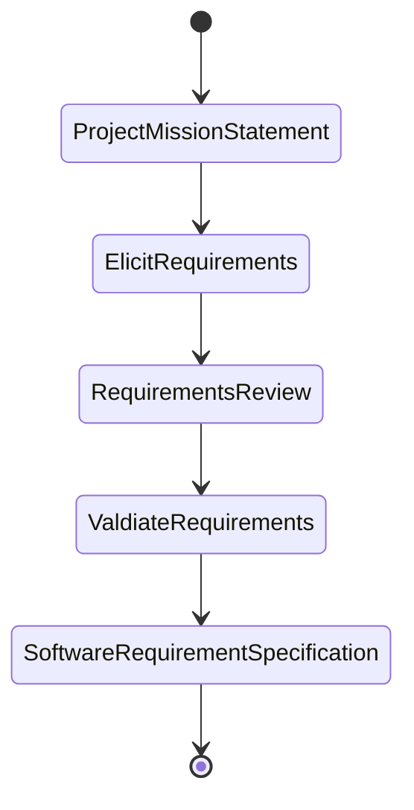
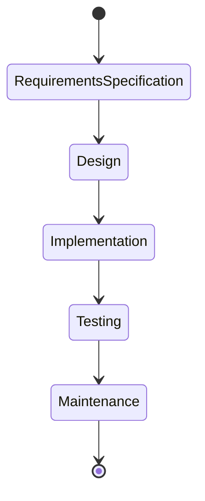

# Requirements Elicitation

Correct requirement elicitation and specification are necessary for a successful project

From a project mission statement (PMS) document we can generate a software requirement specification (SRS)


Software development lifecycle (SDLC)



# Project Mission Statement

- A simple short statement of what you intend to accomplish in your project
- Companies and organisations have mission statements
    - Google: to organise the world's information and make it universally accessible and useful
    - BMW: the BMW Group is the world's leading provider of premium products and premium services for individual mobility

A project should have a project mission statement that describes the project in 2 or 3 sentences. Typically, these sentences define

1. Problem: What will be done
2. Stakeholders, developers and users
3. Outcomes and benefits of the project

E.g. The GoFast team will **develop a website that enables airline travellers to rate their travel experiences.** This project will be considered complete when the website has been tested and approved for release by the **FactFinding Organisation**. This project supports the International Travel Watchdogs objective to **ensure air passengers can openly compare airlines.**

Eliciting stakeholder needs and desires through:
- Interview
- Observation
- Workshop
- Legacy Product Study
- Competitive Product Study
- Prototype

To elicit stakeholder needs, we must learn the **problem domain** and study the **user tasks**

# Types of Requirements

## Functional Requirements

- Functional requirements describe **interactions between system and the environment**, to map program inputs to program outputs. Basically, the things that the system must do
    - System functionallity to be performed
        - The library member must be able to search the library catalog
        - The bank customer must be able to withdraw cash from the ATM
    - Information to be processed
        - The system must display the current time in 24H format
        - The system must display the temperature in degrees centrigrade in the range -10C to +130C to one decimal place of accuracy
    - Interface with other systems
        - The system must be able to use wifi to communicate all transactions witha  client's secure database
        - The system must be able to control up to 6 robot arms simultaneously

## Non-functional requirements

- Non-functional requirements describe the **properties the system must have**, that is not directly related to the functional behaviour of the system
    - Usability: How easy it is for a user to interact and use the system
        - Help messages must be displayed in the local language according to the user's locale
    - Reliability/Maintainability: How much uptime is required, how easily errors of the system can be recovered from
        - After a system reboot, the full system functionality must be resotred within 5 minutes
    - Performance: How well the system should be able to perform 
        - When a book is placed in the checkout pad, the system must detect it within 2 seconds
    - Supportability: How easily components can be used to support the system
        - The database must be replaceable with any commerical product supporting standard SQL queries
    - Scalability: How easily the performance of the system can be increased
        - The software must be able to support 10000 concurrent users at once
    - Security: How secure the system is
        - All network connections must be made throught HTTPS

# Documenting Requirements

- Use good technical writing styles
    - Write **complete**, **simple**, **precise**, **unambiguous** sentences using an **active** voice
    - Define terms **clearly**
    - Use terms **consistently**
    - Use **clear layout** and **formatting** (e.g. organising the requirements in a hierarchy)
- State requirements in an atomic manner, such that the specification is **verifiable** and **traceable** and **unambiguous**

# Atomic Requirements

A requirement that is
- Measureable
- Testable
- Traceable
- Detailed enough to define all aspects of a need without further breakdown
  
Example non-atomic requirement:

> When a computer is added, the tracking system requires the user to specify its type and allow the user to provide a description. Both these fields must be text of length >0 and <512 characters

Example atomic requirement:

```
1.1 When a computer is added to the tracking system, the user must enter the computer type
    1.1.1 The computer type data must be text of at least 1 character and less than 512 characters

1.2 When a computer is added to the tracking system, the user must enter a description of the computer
    1.2.1 The description of the computer must be text of at least 1 character and less than 512 characters
```

# Requirements Verifiability

Requirements must be **sufficiently specific to be testable**

| Not specific enough                               | Specific enough                                                                                                    |
| ------------------------------------------------- | ------------------------------------------------------------------------------------------------------------------ |
| The user interface must be user friendly          | 80% of first time users must be able to enter a somple search query within 2 minutes of starting to use the system |
| The system must control more than one drill press | The system must control up to seven drill presses concurrently                                                     |

# Requirements Traceability

- Requirements traceability is the **tracking of requirements throughout the product development lifecycle** 
- The **ability to track requirements from their expression** in an SRS to their realisation in design, documentation, source code and their verification in reviews and tests
- The **ability to track dependencies** among requirements, system functions, and system components

# Requirements Validation

Requirements validation is the process of **checking that requirements** defined for development, define the system that the **customer really wants.**

- Stakeholders - the system specified meets their needs and desires (i.e. correct) and requirements are prioritised
- Development Team - requirements (and underlying assumptions) are properly understood
- Review requirements
    - Walkthrough, inspection, critical review
    - Checklist for completeness, consistency, unambiguity, correctness
- Prototype

# User Interface Prototype

- Sketches or a model of what a system will look like brings the requirements to life for all stakeholders
- Can be implemented with
    - Storyboarding - sequence of graphics showing different views of the interface in a specific interaction
    - Still images created on a computer
    - Interactive prototype that illustrates some simulated dialogue

# Data Dictionary

A set of information describing the contents, format, and structure of a database and the relationship between its elements, used to control access to and manipulation of the database.

- The problem domain glossary
- Ensures consistent unambiguous terminology that all stakeholders can agree on
- E.g. within a university/college we define the terms
    - Programme of Study
    - Course
    - Degree Programme
- Ensures specialised terms are also defined
    - Lecture
    - Tutorial
    - Class
    - Laboratory
    - Seminar

E.g.

| Term             | Definition                                                                                                                                                      |
| ---------------- | --------------------------------------------------------------------------------------------------------------------------------------------------------------- |
| Program of Study | A university program that a student enrolls into. There are three levels of programs: undergraduate, master, and PhD.                                           |
| Semester         | There are four semesters in an academic year. Semester 1 and Semester 4 have 13 teaching weeks. Semester 2 and Semester 3 have 5 teaching weeks.                |
| Course           | A course is a basic unit of teaching. A course must be either compulsory or elective. A course must include lectures and tutorials. Some courses may have labs. |
| Lecture          | The traditional form of class that are delivered in lecture theaters. Each lecture will be video recorded and published in the learning management system       |
| Tutorial         | The interactive, small-size classes that are conducted in technology-enhanced tutorial rooms. Tutorials will not be video recorded.                             |

A data dictionary should focus on **problem domain** terms, not implementation terms