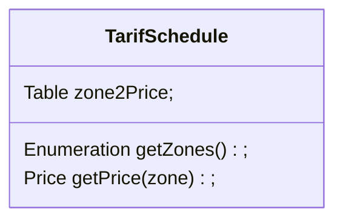
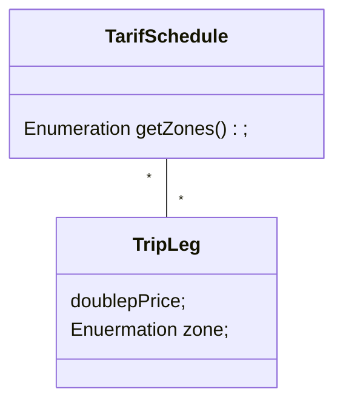
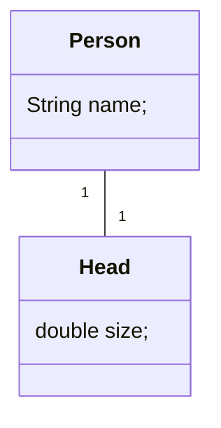
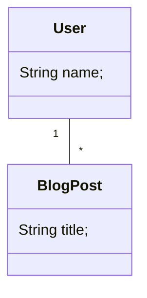
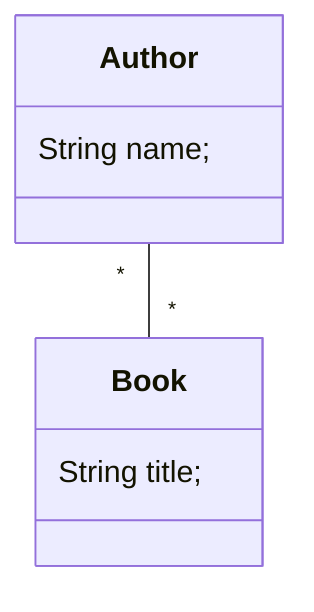
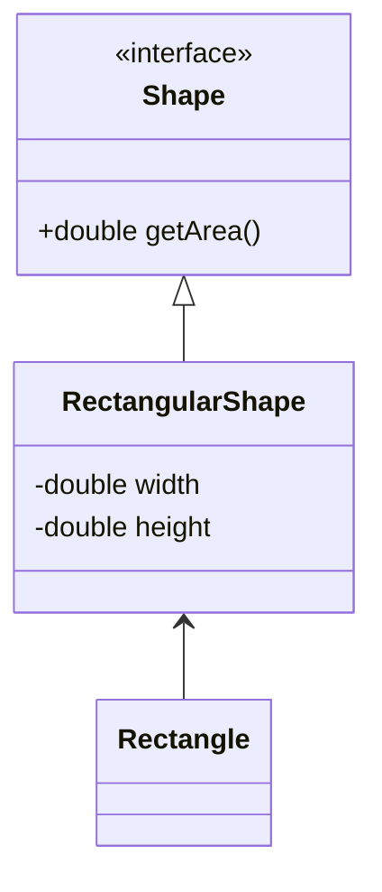
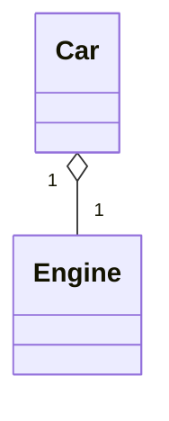
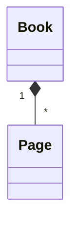
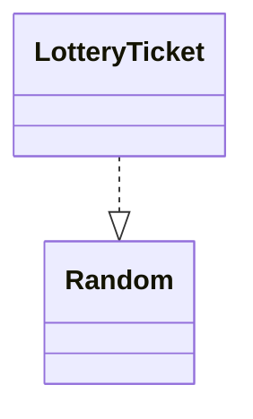

# Requirements Analysis

# Requirements Analysis vs Requirements Elicitation

- Requirements elicitation
    - Purpose: Finding out what customers want
    - Output: A description of the system in terms of actors and use cases
- Requirements analysis
    - Purpose: Produce a system model that is correct, complete, consistent, unambiguous based on use cases
    - Output: conceptual model (system structure) + dynamic model (system behavior)

# Formalising Requirements with Analysis Models

- Clarifies structural and dynamic aspects of systems to be built
- Validates requirements
- Underpins solution modelling

# Requirement Analysis Goals

- Conceptual model (Structural aspect)
    - Analyse use cases to identify objects/roles of objects involved in the system
- Dynamic model (Dynamic aspect)
    - Determine how to fulfil the processes defined in the use cases, and which objects do these processes

## Conceptual Model

- Object: Anything that has a state, and exhibits behaviors
    - E.g. Bus, Dog, Person
    - LoginForm, UserVerifier, UserList
- Operations: Procedures through which objects use to communicate amongst themselves
    - E.g. Bus goes forward, Dogs bark/growl
    - LoginForm: submit, UserVerifier: autheticate, UserList: search user
- Attributes: Variables that hold state information
    - E.g. Bus: Color, Dog: Name

### Conceptual Model in Class Diagram

- Document and visualise conceptual model in class diagram
    - Object -> Class
    - Roles (Attributes and operations) of object -> attributes and methods of a class

### Class Diagram

- Represents the structure of the system
- Classes define responsibilities for performing various activities
- Used during:
    - Requirement analysis: Modelling application domain concepts
    - System design: Modelling subsystems
    - Object design: Specifying detailed behavior and attribute of the object

### Classes

- `TarifSchedule` - Name of the class
- `Table zone2Price` - Attribute(s) of the class
- `Enumeration getZones()` - Method(s) signature(s) of the class

A class represents a concept. A class encapsulates states and behaviors
- Each attribute has a type
- Each operation has a signature

### Associations

- Associations denote relationships between classes
- The multiplicity of an association end denotes how many objects the instance of a class can legitimately reference
- Multiplicity is either
    - A number (1)
    - A range of numbers (1..6)
    - A large unspecified number (*)

One-to-one association
- Each person can have 1 head
- Each head can have 1 person

One-to-many association
- Each author can have many blogPosts
- Each blogPost can only have 1 author

Many-to-many relationship
- Each author can have multiple books
- Each book can have multiple authors

### Class Relationships

- Generalisation: An inheritance relationship
    - Inheritance between classes
    - Implementation of an interface
- Association: A usage relationship
    - Dependency
    - Aggregation
    - Composition

#### Generalisation

- Hierarchies drawn top down with arrows pointing up to parents
- Line/arrow styles differ based on whether is a
    - Class (Solid line, black arrow)
    - Abstract class (Solid line, white arrow)
    - Interface (Dashed line, white arrow)
- We sometimes omit trivial relationships (E.g., all classes in java inherit from the `Object` class)

#### Aggregation

- "is part of"
- Symbolised by white diamond

#### Composition

- "is entirely made out of"
- Stronger version of aggregation
- The parts live and die as a whole
- Symbolised by black diamond

#### Dependency

- "uses temporarily"
- symbolised by dotted line
- Often an implementation detail, and not part of that object's intrinsic state

### Requirements Analysis

1. Identify classes (Use case model -> Class diagram)
2. Identify attributes for each class
3. Find methods/operations for each class
4. Find association between classes

### Identification of Initial Objects/Classes

Look for
1. Recurring words/concepts in use cases
2. Real-world entities the system must track
3. Application domain terms in data dictionary

Review definition and attributes with stakeholders

### Stereotypes of Classes

Boundary class
- Interface between system and actor (e.g. a user and an external device)
- E.g. windows, screens, menus

Control class
- Objects that mediate between boundaries and entities
- Serve as the glue between boundaries and entities
- Implements the logic required to manage various elements and their interactions

Entity class
- Objects representing system data, often from the domain model
- Information tracked by system

### Types of Entity Classes

- Things remembered, or data that persists
    - UserInfo, Event, Course, Book
- Organisational units
    - Company, Tutorial Group
- Structures
    - Orderlist

## Dynamic Model

- Determine how to fulfill processes defined in use cases

# Resources

- https://stackoverflow.com/questions/683825/in-uml-class-diagrams-what-are-boundary-classes-control-classes-and-entity-cl
