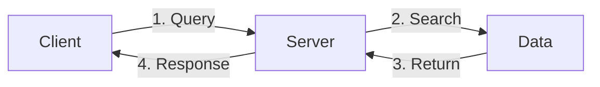

# The Internet

Users connect to storages and servers through the internet

-   [Transmission Control Protocol/Internet Protocol (TCP/IP)](https://www.avast.com/c-what-is-tcp-ip)

# Connection Protocols

-   HTTP (Hypertext Transfer Protocol)
-   HTTPS (Hypertext Transfer Protocol Secure)
-   IRC
-   SMTP (Email)
-   ICQ (I seek you)
-   FTP (File transfer protocols)
-   NNTP

# Server-Client - Internet/Intranet

-   A client queries a server
-   The server searches a database for data
-   The database returns the data
-   The response returns to the client

# World Wide Web

-   Transfer and store process
    -   Entire document is transferred and then stored on the local computer before the browser displays it
    -   Creates opportunities for sending different types of malicious code to user's computer

# Balancing Information Security and Access

-   Impossible to obtain perfect information security - It is a process, not a goal
-   Balance between protection and availability
-   Level of security must balance against reasonable access yet offer adequate protection against threats

# Impossible to obtain Perfect Information Security

-   CISO Encryption used to protect secrets of the organisations
-   Users think encrypting email is a hassle
-   Users think that encrypting emails slows them down

# Information Security Implementation - Bottom-Up Approach

-   Begins at grassroots levels where sysadmins attempt to improve security of their systems
-   Main advantage is the ability to tap on the technical expertise of individual administrators
-   Usually **fails to work** because it does not have
    -   Participant support
    -   Organisational staying power

# Top-Down Approach

-   Begins at upper management level
    -   Issue policy, procedures and processes
    -   Dictate goals and expected outcomes of project
    -   Determine accountability for each required action
-   Preferred approach

# Security Professionsals and the Organisation

-   Diverse group of professionals required
-   Senior/upper management is a very important component
-   Additional staffs are needed to offer administrative support and technical expertise - to implement the details of an information security program

# Data Responsibilities

-   Data owners: senior management responsible for the security and use of a particular set of information
-   Data custodian: responsible for information and systems that process, transmit and store it
-   Data users: individuals with an information security role

# Information Security - Is it an Art or a Science?

-   Implementation of information security is often described as a combination of art and science
-   "Security artisan" idea: based on the way individuals perceive system technologists and their abilities

## Security as an Art

-   No hard and fast rules nor many universally accepted complete solutions
-   No manual for implementing security through entire system

## Security as a Science

-   Dealing with technologies designed for rigorous performance levels
-   Specific conditions cause virtually all actions in computer systems
-   Almost every fault, security hole and system malfunction is a result of interaction of specific hardware and software
-   If developers had sufficient time, they coudl resolve and eliminate faults

## Security as a Social Science

-   Social science examines behaviors of individuals interacting with systems
-   Security begins and ends with the people that interact with the system, intentionally or otherwise
-   Security administrators can greatly reduce the levels of risk caused by end users and create more acceptable and supportable security profiles
