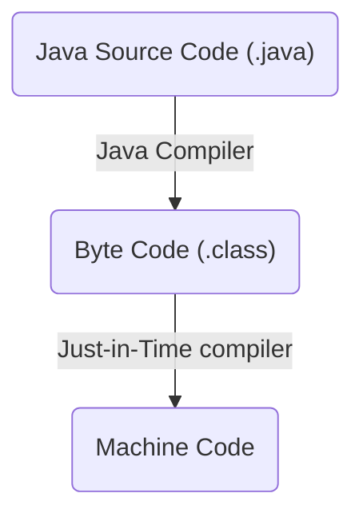
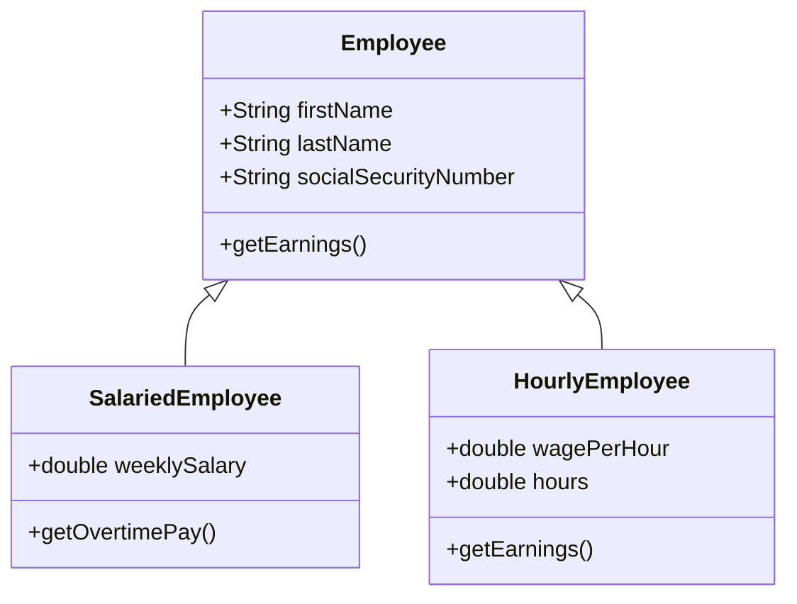
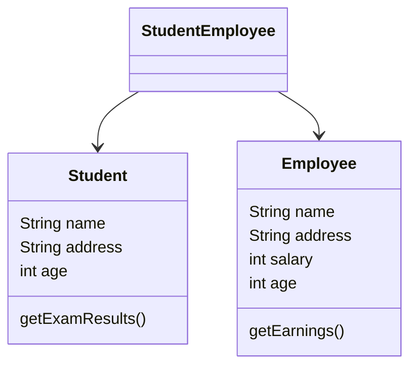
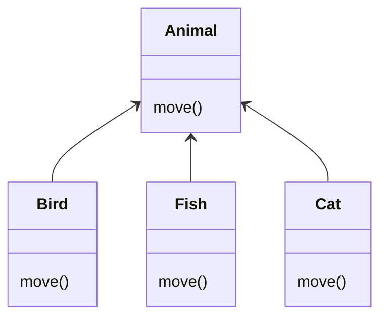

# Introduction to OOP

# Programming Paradigms

- Unstructured Programming
  - Closest to CPU language
  - Assembly, COBOL, Basic

```
clrscr proc near
    mov ax, 0b800h
    mov es, ax
endp
```

- Procedural Programming
  - Programs are based on procedures (Sequence, selection, iteration)
  - Pascal, C, ADA, Fortran

```c
int main() {
    int x = 1;
    x += 2;
    printf("%d\n", x);
}
```

- Object-oriented Programming
  - Programs are based on objects, and how they interact with each other
  - Java, C++, C#

```java
public class Main {
    public static void main(String[] args) {
        Person p = new Person("John", 'M');
        p.talk();
        p.cry();
    }
}
```

# Object Oriented Programming

- Based on the notion of objects
- Computation is represented by interactions with objects, or communcation between objects

# Java

- Developed by SUN for embedded consumer goods; now popular for Web
- No pointers
- No multiple-inheritance
- Uses a Java Virtual Machine (JVM)
- Slow (Java code must be converted into byte-code, which can be translated by the java virtual machine into machine-readable code to be executed)
- "Compile once, run everywhere"



# Classes and Objects

# Object

- Each object has attributes and behaviors
- E.g. Person
- Person has attributes: height, weight, gender, age, wealth etc.
- Person has behaviors: eat, study, sleep

`Person` is a **Class**. Obama is an **Object** (Instance) of a `Person` Class

# Components of Object-Oriented Model

- Objects
  - An entity that contains both **attributes** that describe the state of a real-world object and the **actions** that are associated with the object
- Messages
  - Requests from one object to another for the receiving object to produce some desired result
- Methods
  - Descriptions of operations/actions that an object performs when it receives a message
- Classes
  - Template for objects which consists of methods and attributes that belong to the object

# Concepts of OOP

- Abstraction
- Encapsulation/Information hiding
- Inheritance
- Polymorphism

# Abstraction

> An abstraction denotes the essential characteristics of an object that distinguish it from all other kinds of objects and this provide crisply defined conceptual boundaries relative to the perspective of the viewer

Abstraction focuses on the idea rather than the specifics of an event. For example, a coffee machine is an abstraction. We do not need to know how coffee is made, we just need to provide the ingredients. The coffee machine abstracts away the specifics of making coffee.

# Encapsulation and Information Hiding

> Encapsulation refers to the bundling of data along with methods that operate on that data into a single unit

Encapsulation builds a barrier to protect an object's private data. Access to private data can be done through public methods of the object's class (getters and setters)

Information hiding hides the details or implementation of the class from the user

- When you sort a list, you can call `Array.sort()`, and not need to know how to actually sort the array.
- There are many actions required for a car to make the wheels turn. However, we can just turn the steering wheel and the car will turn for you.

With encapsulation and information hiding, the user of a class only need to know **what** a class does and **how** to call the methods that perform the task. User does not need to know the **implementation details** for the methods.

# Inheritance

> Inheritance is a mechanism that defines a new class which inherits the properties and behaviors of a parent class

- **Superclass** or **Base** Class (**Parent**)
  - The class from which another class inherits structures and/or behaviors
- **Subclass** or **Derived** Class (**Child**)
  - A class that inherits from one or more classes
  - Any inherited behaviors may be redefined in the subclass, overriding the inherited definition
- Can create new classes without extensive duplication of code
- Reuse parent's code



Every `Employee` will have the attributes

- `firstName`
- `lastName`
- `socialSecurityNumber`

And a method

- `getEarnings()`

Now we don't have to repeat for `SalariedEmployee` and `HourlyEmployee` since they both inherit from `Employee`.

However, to differentiate between the `SalariedEmployee` and `HourlyEmployee`, we have different variables and methods

- SalariedEmployee has a new attribute `weeklySalary`, and a new method `getOvertimePay()`
- HourlyEmployee has 2 new attributes `wagePerHour` and `hours`, while it overrides the inherited `getEarnings()` method

# Multiple Inheritance

- A class can inherit from more than one superclass
- However the problem arises on which property/method to inherit if they are present in more than 1 superclass
  - User specified precedence (Smalltalk)
  - Rename one property/method
  - Accept both if signatures are different
    - `print(String s)` and `print(char c)` have different signatures



# Polymorphism

> Polymorphism is the condition of occurring in several different forms

- Poly: Many, Morph: Forms/Transformations. Hence polymorphism means "many forms"
- Same message can be sent to different object
  - Each object performs operations appropriate to its class
  - Do similar things differently
- Sending object does not need to know class of receiving object or how the object will respond
- E.g. `account.getBalance()`, the `account` could be a `SavingsAccount`, `DepositAccount`, `AdminAccount` etc.
  - Even though they are all different classes, they can perform the same `getBalance()` action



Each subclass of `Animal` implements its own `move()`. Even though each `Animal` is different, we can call `animal.move()` and each animal will move accordingly.
