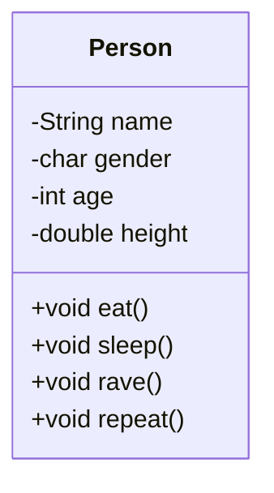
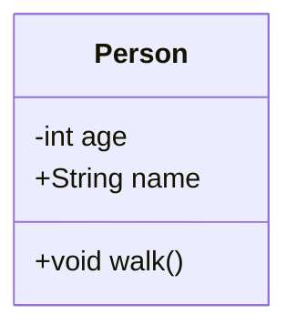

# Classes and Objects

In computer science, an object can be a variable, a data structure, a function, or a method, and as such, is a value in memory referenced by an identifier.

E.g.

```java
Person BillGates = new Person();
Person JohnCena = new Person();
```

## Object State

-   Made up of different attributes (or properties)
-   E.g.
    -   Person's name
    -   Person's age

## Object Behavior

-   Actions an object can perform
-   E.g.
    -   Person can walk
    -   Person can talk

# What is a Class?

-   Class defines the blueprint/structure of an object. Each class contains
    -   Attributes
    -   Methods
-   To create an object we need to define a class for it
-   We can use Unified Modelling Language (UML)



An object is a **specific instance** of a class. Each object has its own state and behaviors

```java
billGates.name = "Bill Gates";
johnCena.name = "John Cena";
```

# Class Definition

```java
public class Person {
	// properties
	private int age;
	String name;

	// constructor
	Person(int age, String name) {
		this.name = name;
		this.age = age;
	}

	// methods
	void walk() {
		System.out.println("I'm walking over here");
	}
}
```



Note: `+` in the UML class diagram means public, while `-` means private

# Creating Objects

```java
Person p = new Person(32, "John Cena");
Rectangle r = new Rectangle(1, 6);
Scanner s = new Scanner(System.in);
```

## Constructors

-   Called when creating `new` objects
-   If no constructors are written, java has a default blank constructor without arguments

# Dot Notation

-   Used to make a specific object do something, or to access the attribute of a specific object

```java
System.out.println(johnCena.name);
bankAccount.withdraw(100);
mySquare.displayToScreen();
```

# this

-   `this` refers to the object itself with which you call the method from

```java
public class Rectangle {
	double width;
	double height;

	public double getArea() {
		return this.width * this.height;
	}
	public double getPerimeter() {
		return this.width * 2 + this.height * 2;
	}

	public void print() {
		System.out.println("Area: " + this.getArea() + " Perimeter: " + this.getPerimeter());
	}
}
```

# Accessors and Mutators

-   Accessors are responsible for accessing and returning attribute values
-   Mutators are responsible for changing attribute values

```java
class BankAccount {
	private double balance;

	// accessor
	public double getBalance() {
		return this.balance;
	}
}
```

-   Because `BankAccount` has an accessor but no mutator, and `balance` is a private variable, we cannot change `balance` from the outside, protecting it

```java
class Person {
	private String name;

	// accessor
	public String getName() {
		return this.name;
	}

	// mutator
	public void setName(String name) {
		this.name = name;
	}
}
```

-   `getName` is an accessor which gets the name of `Person`, while `setName` is a mutator which sets a new value to `Person.name`

# static

-   A `static` variable is a variable that is related to the entire class, rather than an individual instance
-   Static variables are shared among all instances of a class. If it changes in 1 instance, it changes in all of them
-   Static methods are methods that do not depend on an individual instance of a class

```java
class Person {
	private String name;
	public static double PI;
	public static int numberOfPeople;

	// ...

	public static int getNumberOfPeople() {
		return numberOfPeople;
	}
}
```

-   The value of `PI` is shared among all `Person` instances
-   When accessing static variables/methods, we do not need to use an individual instance, but we can use the class itself

```java
public class Main {
	public static void main(String[] args) {
		Person p = new Person();
		Person q = new Person();

		p.name;
		q.name;

		Person.PI;
		Person.getNumberOfPeople();
	}
}
```

> Static methods cannot access non-static members of a class

# final

-   To declare a variable whose value cannot change, we use `final`

```java
public static final double PI = 3.1415;
```

# Encapsulation and Information Hiding

-   Encapsulation: Build a barrier to protect an object's private data. Access to private data can be done through public methods (get and set) to limit other user's access to the data and control their access
    -   Users of a class only need to know what the class does, and how to call the methods that perform the task
-   Information hiding: Hides the details of implementation away from users

# Object Composition

-   An object can include other objects as attributes, this is called object composition
-   Class can contain object references to other classses
-   Object references are of reference data types
-   **has-a** relationship

```java
public class Student {
	private String name;
	private int age;
	private char gender;
	private Course[] courses = new Course[10];
	private Professor mentor;
}

public class Course {
	private int id;
	private String name;
}

public class Professor {
	private String name;
}
```

# String

-   `java.lang.String`
-   A series of characters in double quotes `"Hello world"`
-   In java, strings are always created as objects `String var_name;`
-   String is immutable (cannot be changed)

# Java Naming Conventions

-   Lowercase for package names (`package.com.packagename`)
-   Uppercase, separated by underscores for constants (`public static final int HOURS_IN_DAY`, `final double PI`, `final int MAX_NUMBER_OF_PAGES`)
-   Camel case for class names (`class HappyPerson`, `class BankAccount`)
-   Pascal case for variable and method names (`int numberOfChildren`, `double bankBalance`, `String myMessage`)
