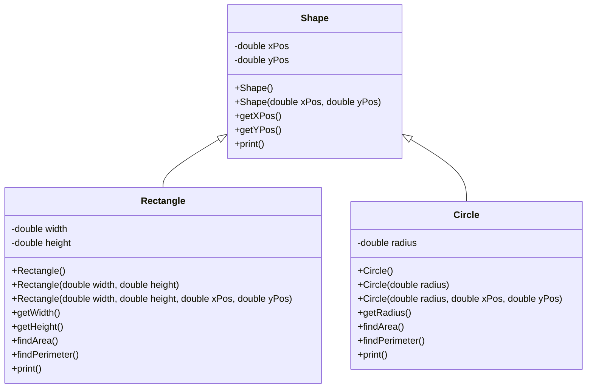

# Inheritance

A concept where you can derive a class from another class by inheriting (absorbing) their attributes and behaviors

- Inheritance allows code reuse
- E.g. `Person` is a `Student`, hence `Person` inherits from `Student`
  
The generalisation relationship:
- The **superclass** is a generalisation of the subclasses
- The **subclasses** is a generalisation of the superclasses

# Inheritance Hierarchy




# Base Class (Shape)

```java
public class Shape {
    private double xPos;
    private double yPos;

    Shape() {
        this.xPos = 0;
        this.yPos = 0;
    }

    Shape(double xPos, double yPos) {
        this.xPos = xPos;
        this.yPos = yPos;
    }

    public double getXPos() {
        return this.xPos;
    }

    public double getYPos() {
        return this.yPos;
    }

    public void print() {
        System.out.println("This is a shape");
    }
}
```

# Subclass Definition (Rectangle and Circle)

```java
public class Rectangle extends Shape {
    private double width;
    private double height;

    Rectangle() {
        super()
        this.width = 1;
        this.height = 1;
    }

    Rectangle(double width, double height) {
        super();
        this.width = width;
        this.height = height;
    }

    Rectangle(double width, double height, double xPos, double yPos) {
        super(xPos, yPos);
        this(width, height);
    }

    public double getWidth() {
        return this.width;
    }

    public double getHeight() {
        return this.height;
    }

    public double getArea() {
        return this.width * this.height;
    }

    public double getPerimeter() {
        return 2 * (this.width + this.height);
    }

    public void print() {
        System.out.println("This is a rectangle");
    }
}
```

- Note the `super` call 
    - A call to the constructor of the base class
    - Can also be used to access methods and attributes of the base class (`super.name`, `super.doSomething()`)
  
Exercise: Write the `Circle` class based on the specification in the class diagram above.

# Method Overloading

When a method is overloaded, it is designed to behave differently when provided with a different signature

- Same method name
- Different number of parameters
- Different parameter type

Advantages
- Overloading allows methods to have similar tasks, but behave differently when different number or types of parameters are supplied to the method
- Without overloading, we need to provide different names for each similar task
    - `printString`, `printInt`, `printBool` vs `print(String a)`, `print(int a)`, `print(boolean a)`

# Method Overriding

- A subclass inherits all methods and attributes from the superclass
- However sometimes we want to replace the behavior
- To replace behavior, method must have the same signature
    - Same name
    - Same parameter types
    - Same parameter order

