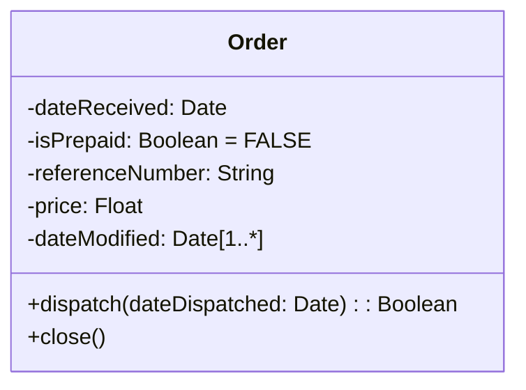
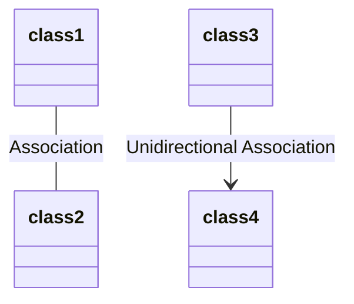
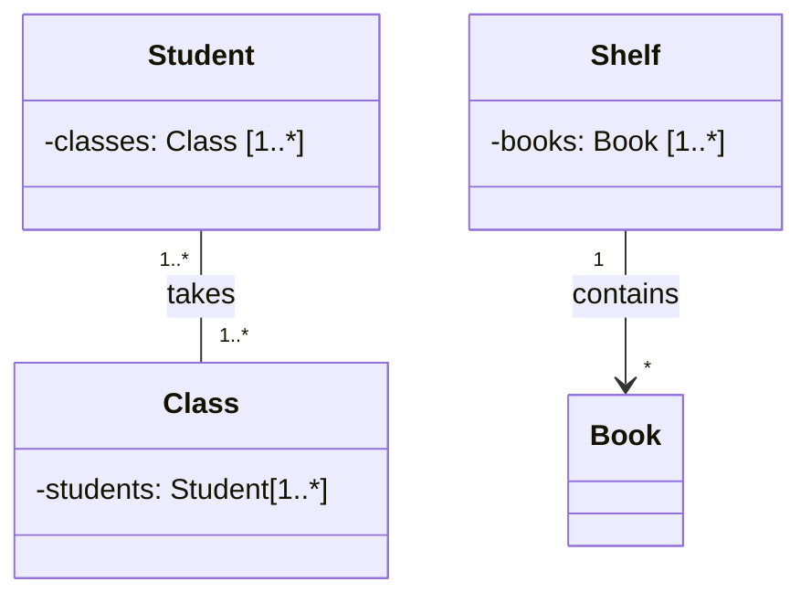
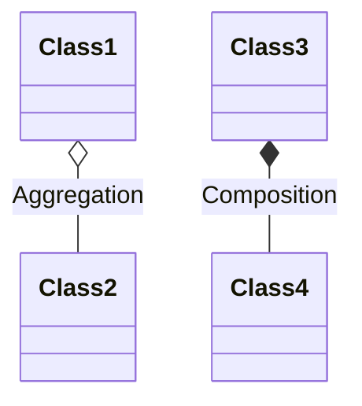
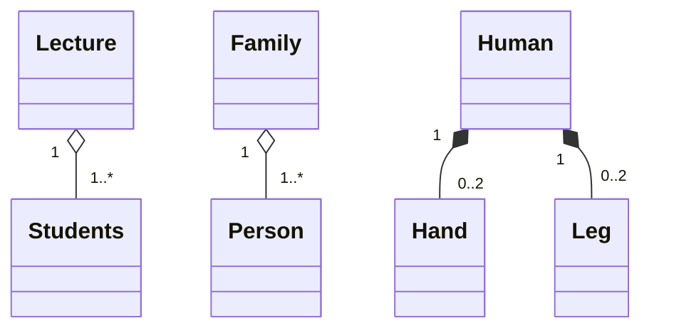
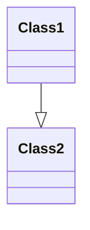
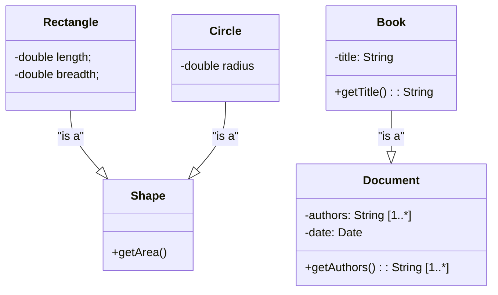
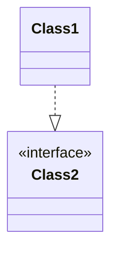
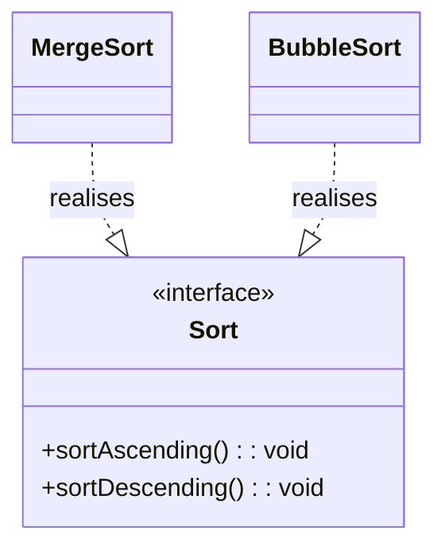
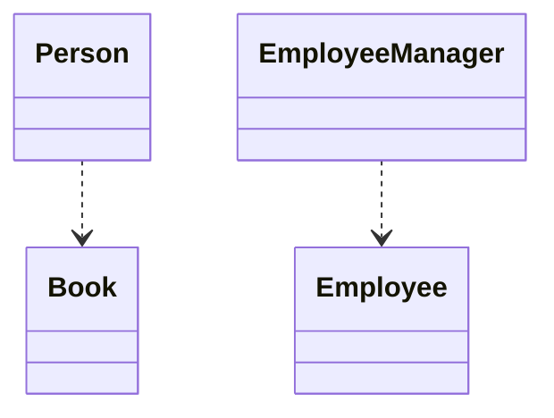

# Class Diagrams

We use Unified Modelling Language (UML) to model relationships between classes



For attributes, the format is 

```
accessModifier name [multiplicity]: type [=DEFAULT_VALUE]
```

- `accessModifier`: Which parts of code can access the attribute
    - `-` - private
    - `+` - public
    - `#` - protected
    - `~` - default (package protected)
- `name`: Name of attribute
- `Multiplicity`: the cardinality of the attribute 
    - [1..*] is at least 1
    - [1..10] is at least 1 to 10
    - [5..8] is at least 5 to 8
- `type`: The data type of the attribute
    - `int`, `bool`, `Date`, `String` etc.
- `DEFAULT_VALUE`: Default value of the attribute if not provided

For example:

```
-radius: int
-students: Student [1..*]
+balance: double = 0
```

For methods, the format is

```
accessModifier methodName(direction parameterName: parameterType): returnType
```

- `accessModifier` is which parts of code can access the method
    - Same as attribute access modifiers
- `methodName`: Name of the method
- `direction`: whether the parameter is ingoing or outgoing
    - `in` parameters are parameters provided to the method by the caller
    - `out` parameters are parameters from the caller that will be affected by the method
- `parameterName`: Name of parameter
- `parameterType`: Type of parameter
- `returnType`: Return type of method
- Static methods are underlined

For example:

```
+ add(in x : int, out y : int, inout z : int) : int
- sendDelivery(in deliveryDate: Date) : void
```

# Relationships Between Classes

We will look at the following relationships

- Association
- Aggregation/Composition

## Association




An association indicates that objects of one class have a relationship with objects of another class. An association is modelled with a solid line, or a solid lined arrow

For example:



A student takes multiple classes. A shelf contains many books. 

Note that for the Student/Class relationship, it is 2 ways (Student keeps a record of classes, classes keep a record of students). This is a bi-directional relationship

However, for the Shelf/Book relationship, a shelf keeps a record of the books in the shelf, but the book does not keep a record of which shelf it is on. This is a uni-directional association.

In code, for uni-directional association

```java
class Shelf {
    Book[] books;
}

class Book {
    // ...
}
```

In code, for bi-directional asoociation

```java
class Student {
    private Class[] classes;
}

class Class {
    private Student[] students;
}
```

## Aggregation/Composition



Aggregation is a special case of association. It means "consists of". Aggregation also implies that the child can exist independently of the parent. For example, consider the `Class` and `Student`. Each class is taken by many students. However, if `Class` is deleted, `Student`s can still exist. Aggregation is modelled with a hollow diamond arrow

Composition implies a relationship where the child cannot exist independently of the parent. For example, a dog's tail cannot exist withot the dog, or a human's hand cannot exist without the human. Aggregation is modelled with the solid diamond arrow with a solid line 

For example, 



For aggregation

```java
class Lecture {
    Student[] students;
}

class Student {
    String name;
    int age;
    // ...
}
```

Note how `Students` can exist without the `Lecture` class.

However, for composition

```java
class Human {
    Hand[] hands = new Hand[2];
    Leg[] legs = new Leg[2];
}
```

Note how `Hand` and `Leg` cannot exist without `Human`

## Generalisation



A generalisation is when a class extends (inherits from) another class. For example, the `Book` class extends the `Document` class, or a `Rectangle` extends the `Shape` class, and a `Circle` also extends the `Shape` class.

A generalisation is modelled by a triangle head arrow with a solid line



In code,

```java
class Shape {
    public double getArea() {
        //
    }
}

class Circle extends Shape {
    private double radius;
}

class Rectangle extends Shape {
    private double length;
    private double breadth;
}

class Document {
    private String[] authors

}
```

## Realisation



When a class implements an interface, the interface is **realised**. For example, `BubbleSort` and `MergeSort` implement the `Sort` interface. The realisation is modelled by dotted triangle head arrow



In code,

```java
class MergeSort implements Sort {
    void sortAscending();
    void sortDescending();
}
```

## Dependency

An object of one class may use an object of another class. For example, a `Person` may read a `Book`, or an `EmployeeManager` uses methods from the `Employee` class



In code, it looks like this:

```java
class EmployeeManager {
    Employee getEmployee(int employeeId) {
        // as a return type
    }

    <ReturnType> doSomething(Employee e) {
        // as a parameter
    }

    <ReturnType> doSomething2() {
        Employee a = new Employee(); // as a variable within a method
    }
}
```

# Class Stereotypes


## Entity

Persistent information tracked by the software application
- E.g. Person, Course, UserAccount etc.

## Boundary

Interaction between the system and external forces
- E.g. Keyboard, Game controller, Touchscreen etc.
- E.g. MainScreenUI, InvoiceForm

## Control

Contains logic to coordinate and realise use cases
- E.g. EntityManager, EmployeeManager, UserController


# Resources

- https://forums.codeguru.com/showthread.php?394759-UML-class-diagrams-parameter-direction
- https://stackoverflow.com/questions/14799455/in-out-inout-return-parameter-direction-in-uml
- https://sourcemaking.com/uml/modeling-it-systems/structural-view/class-diagram
- http://www.cs.utsa.edu/~cs3443/uml/uml.html
