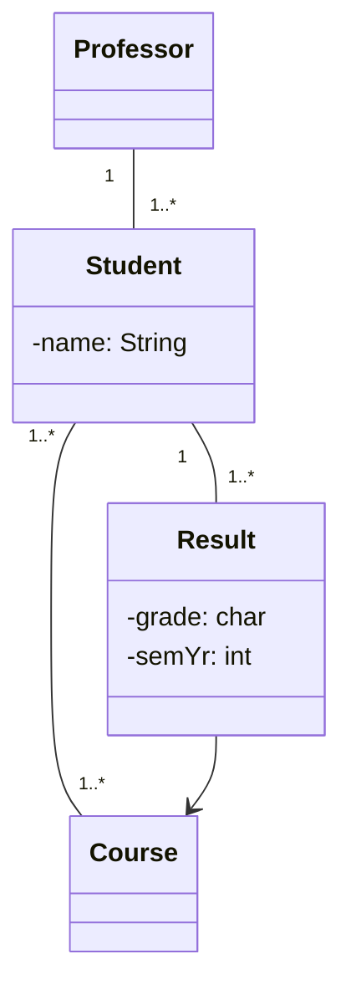
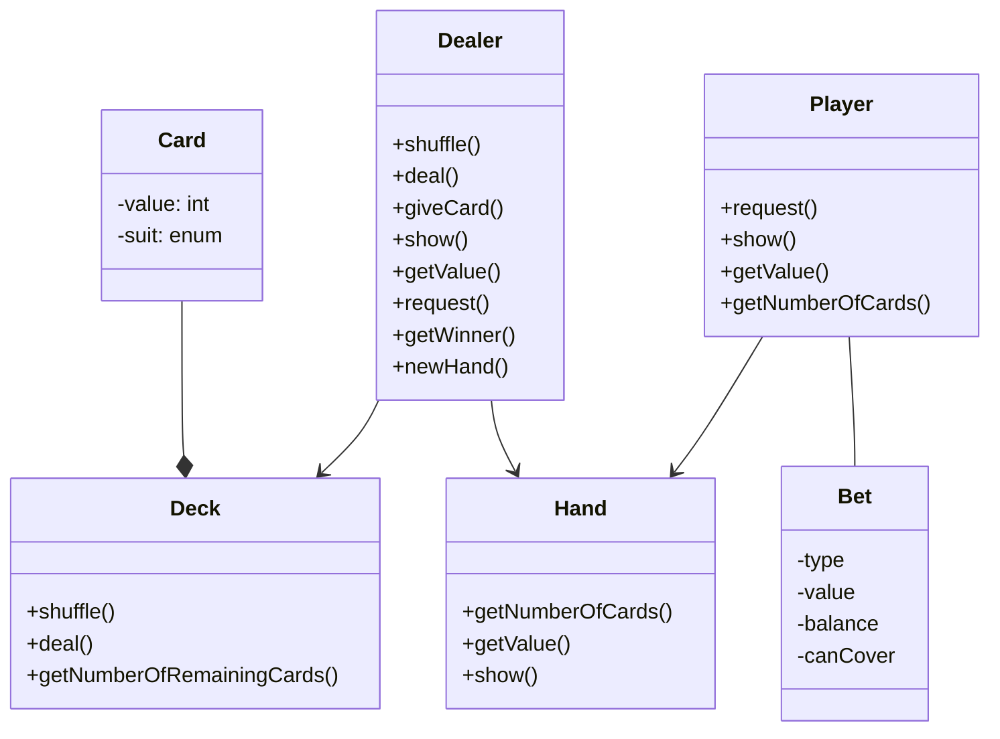

# Modelling OO Applications

- The primary goal of OO is to model real-world systems in ways similar to ways people think
- Identify objects - encapsulated data and behavior
- Model how objects interact with real-world objects
- Identify classes
  - Entity
  - Boundary
  - Control
- Add attributes and methods
- Add class relationshipos
- Add multiplicities

> ... A professor is a mentor to at least 1 student. He/she can check the course results of his/her mentees, which the students have registered...

# Case Study: BlackJack

Rules of BlackJack

1. One or more players play aginst the dealer or house
2. Each player plays against the dealer, not against each other
3. Draw cards form the deck until the sum of the face value of all the cards equals 21
4. You lose if your card value is over 21
5. Blackjack winner = 21

## Dealer's Role

- Dealer deals the cards
- Present players additional cards if requested
- Show all/part of a hand
- Calculate the value of all or part of a hand
- Calculate the number of cards in a hand
- Determine a winner and start a new hand

## Card

- A card must know what its face value is, and be able to report the value
- Suit of card is of no importance
- All cards must be a member of a deck of cards
- 52 cards in a deck
- Must have functionality to deal the next card, as well as report how many cards are in the deck

## Player

- Player can request that a card be dealt to his hand
- Player must be able to display the hand, calculate the face value of the ahnd, and determine the number of cards in the hand. Player responds to the dealer's request for a new card or start a new game

## Draw

- If the player and dealer have identical scores, and the score is at least 17, considered a draw, player retains the bet

