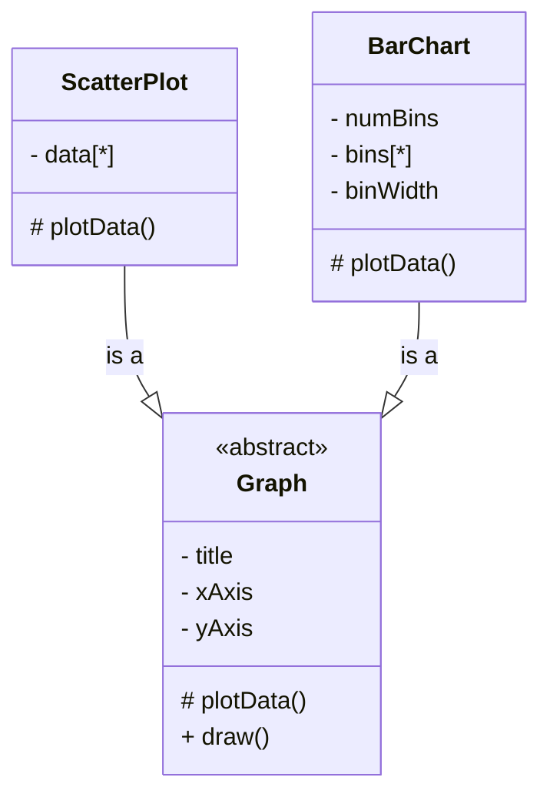
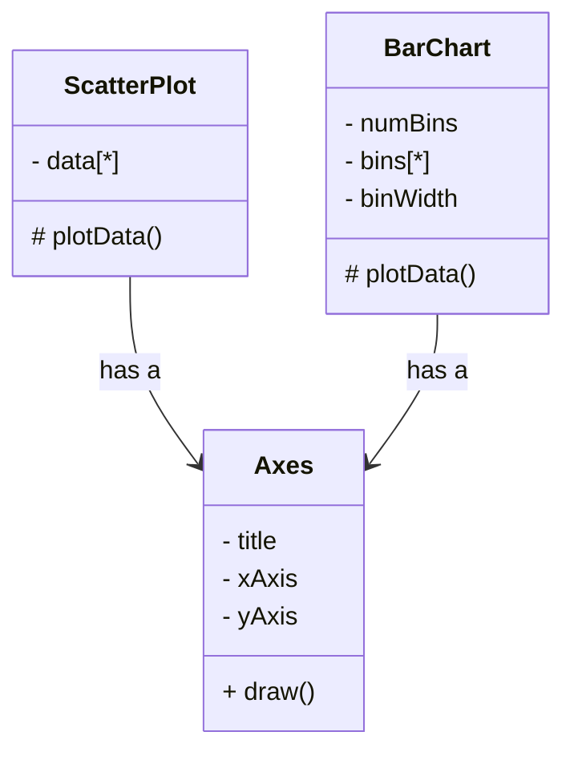
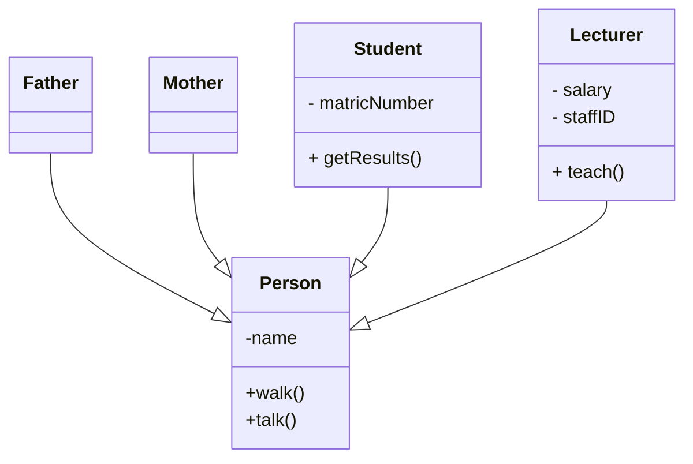
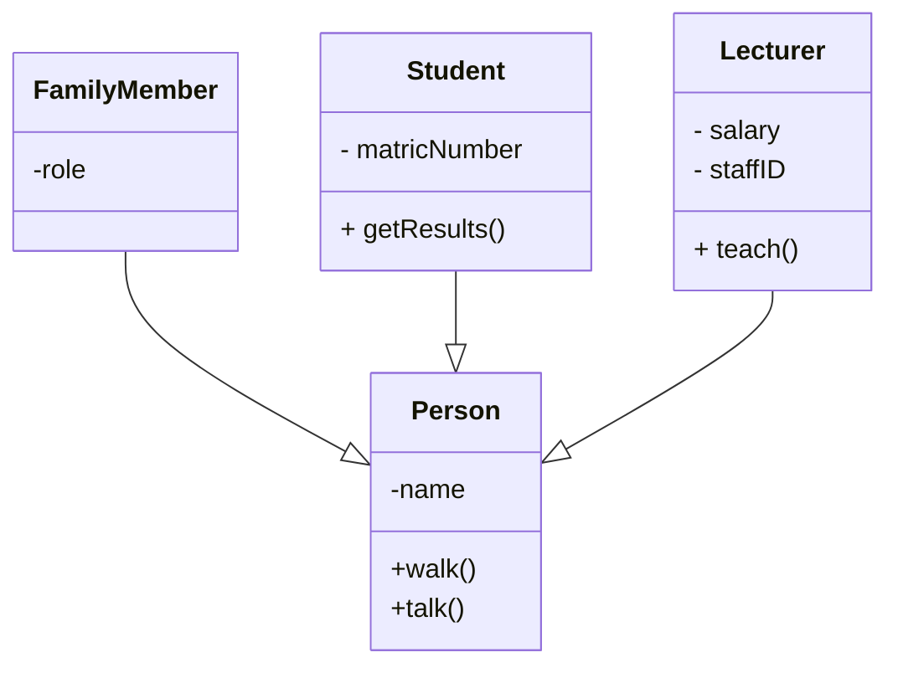

# Design Principles

- A working piece of software does not necessarily mean it is well designed

## Symptoms of Bad Design

- Rigidity
  
  - Software becomes difficult to change, even in simple ways
  - A single change requires a cascade of subsequent changes for the system to work again
- Fragility
  
  - When a small change is made, software breaks easily
  - Often the breakage occurs in areas that have no conceptual relation to the change being made
- Immobility
  
  - Inability to reuse existing modules from other projects or from parts of the same project

# Signs of Well-Designed Software

1. Easy to read
2. Easy to maintain
3. Easy to modify

## OO Design Goals

> MINIMISE IMPACT OF CHANGES

- Make software easy to change
- Classes/packages will require changes when requirements change
- We might want to change a class/package when a dependency of that class changes
- We must manage dependencies between classes and packages to minimise the impact of changes on other parts of the software
- Minimise reasons that modules/packages will be forced to change

We want to achieve **loose coupling** and **high cohesion**

- Design with reusability in mind
- Design with extensibility in mind
- Design with maintainability in mind

## Designing for Change

A modular program has well defined, conceptually simple and independent units interacting through well defined interfaces

- Encapsulation
- Low coupling
- High cohesion

### Example of Bad Encapsulation

```java
class DataManager {
    boolean validatePassword(String username, String password) {
        User currentUser = this.db.get(username);

        return currentUser.getUsername().equals(password);
    }
}
```

Our `DataManager` has a dependency on `User`, and if `User` changes, the `DataManager` will need to change as well. `User` and `DataManager` are too tightly coupled. If our validation for `User` password changes, then `DataManager` would have to change as well. Instead, we should:

```java
class DataManager {
    boolean validatePassword(String username, String password) {
        User currentUser = this.db.get(username);

        return currentUser.validate(password);
    }
}

class User {
    boolean validate(String password) {
        return this.password.equals(password);
    }
}
```

Now, if password validation requirements change, only `User` will change, and `DataManager` can remain the same. `User` becomes responsible for its own validation

# Inheritance vs Delegation

Inheritance



In inheritance, when `Graph` changes, `BarChart` needs to be recompiled.

```java
class BarChart extends Graph {

}
```

Delegation



When `Axes` change, `BarChart` does not need to be recompiled.

Consider the following scenario: The current graphs are in 2D, but we want to make the graphs 3D. In the inheritance example, if we added a `z` axis into the `Graph` object, it does not make sense because both the `ScatterPlot` and `BarChart` do not use the `z` axis. Also, both `plotData` and `draw` of all 3 classes will change due to the new property

However for delegation, we can just inherit from `Axes` and make a new `Axes3D` class, which contains the additional `z` axis. Then any class that uses the 3D graph can just use the `Axes3D` class instead of the `Axes` class. This time, `BarChart` and `ScatterPlot` do not need to change

```java
class BarChart {
    private Axes axes;
}
```

# Inheritance vs Role

Inheritance

```mermaid
classDiagram
```



For `Student` and `Lecturer`, they both share common properties in the `Person` object, and they have their own specialisations as well. Hence it is appropriate to use a `is-a` relationship and inheritance.

However, for `Father` and `Mother`, even though it is appropriate to say "Father is a Person" and "Mother is a Person", however, they both do not have any specialisations for themselves. If a subclass does not have a specialisation, then we should rethink whether inheritance is really the most appropriate way to represent the classes.

Over here, we can set a `role` attribute for `Father` and `Mother` instead

Role



```java
public enum FAMILY_ROLE {
    MOTHER,
    FATHER
}
```
