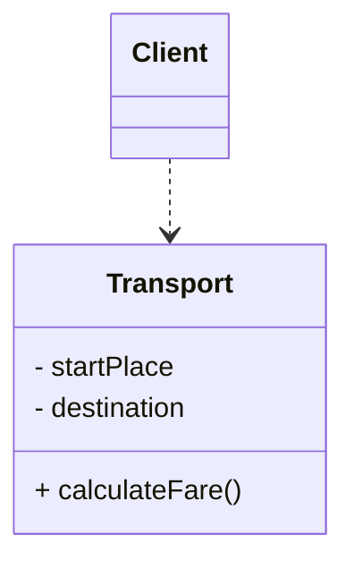
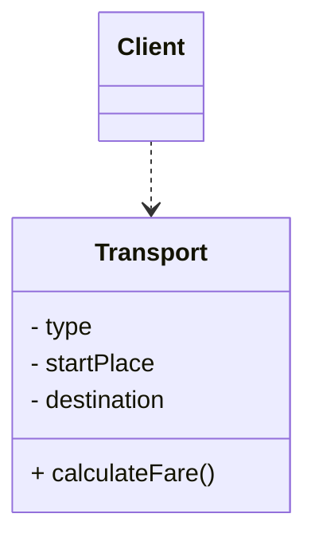
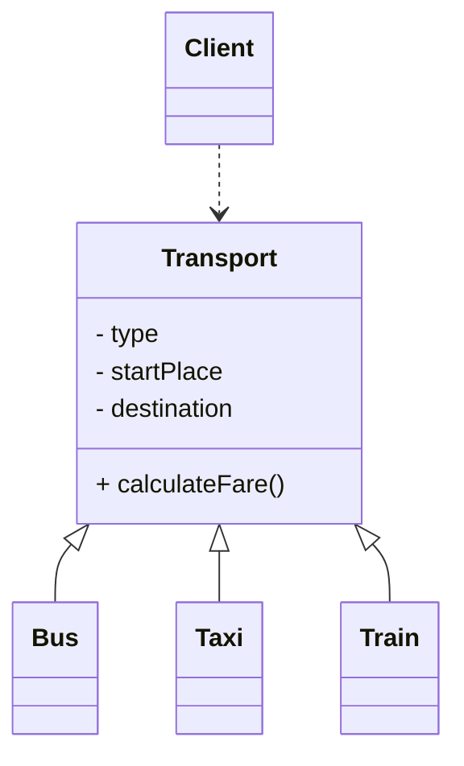
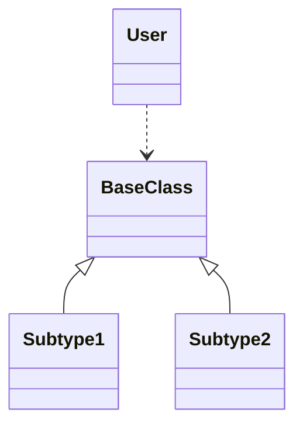
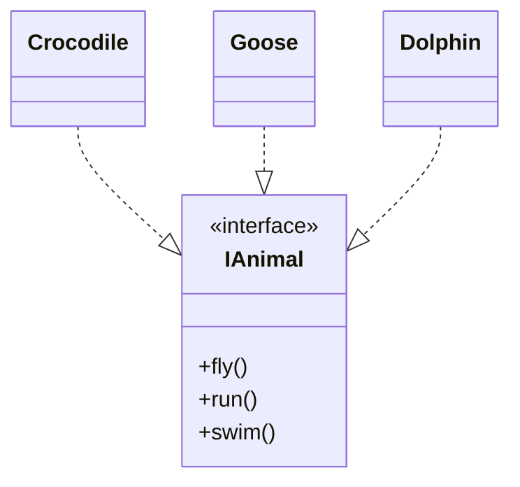
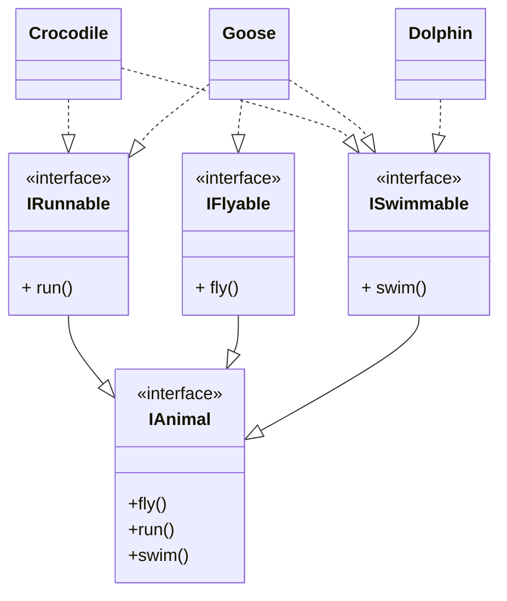

# SOLID Design Principles

SOLID stands for

- Single responsibility principle
- Open-closed principle
- Liskov substitution principle
- Interface segration principle
- Dependency injection principle

# Single Responsibility Principle

> There should never be more than ONE reason for a class to change

- Each responsibility is an axis to change
- If a class has multiple responsibilities, it will have multiple reasons to change
- If a class has multiple responsibilities, these responsibilities become coupled with one another

One common violation of SRP is creating "God" classes (Classes which can do everything). This is bad because the class itself will frequently change

```ts
class Person {
	public name: string;
	public surname: string;
	public email: string;
	constructor(name: string, surname: string, email: string) {
		this.surname = surname;
		this.name = name;
		if (this.validateEmail(email)) {
			this.email = email;
		} else {
			throw new Error('Invalid email!');
		}
	}
	validateEmail(email: string) {
		var re =
			/^([\w-]+(?:\.[\w-]+)*)@((?:[\w-]+\.)*\w[\w-]{0,66})\.([a-z]{2,6}(?:\.[a-z]{2})?)$/i;
		return re.test(email);
	}
	greet() {
		alert('Hi!');
	}
}
```

In here, the `Person` class should not have the responsibility of validating the email, because it is not related to the `Person`'s behavior. Instead, we should extract the validation outside to its own dedicated class

```ts
class Email {
	public email: string;
	constructor(email: string) {
		if (this.validateEmail(email)) {
			this.email = email;
		} else {
			throw new Error('Invalid email!');
		}
	}
	validateEmail(email: string) {
		var re =
			/^([\w-]+(?:\.[\w-]+)*)@((?:[\w-]+\.)*\w[\w-]{0,66})\.([a-z]{2,6}(?:\.[a-z]{2})?)$/i;
		return re.test(email);
	}
}

class Person {
	public name: string;
	public surname: string;
	public email: Email;
	constructor(name: string, surname: string, email: Email) {
		this.email = email;
		this.name = name;
		this.surname = surname;
	}
	greet() {
		alert('Hi!');
	}
}
```

By separating responsibilities, it also becomes clearer what each class is responsible for, and its easier to look for and make changes within the application

# Open-Closed Principle

> A module should be open for extension, but closed for modification

We want to be able to change what the modules can do (open for extension), without changing the original source code of the module (closed for modification). Being open for extension allows new features to be added, and being closed for modification prevents existing dependencies from being broken.

Abstraction is key for OCP. Consider the following example



We have a `Client` that depends on a `Transport` class. Now, we want to add new types of transports, such as `Bus`, `Train`, `Taxi` etc., each with its own way of calculating the fare. What we could do initially, is modify the `Transport` class to include a `type` variable, and change `calculateFare` to calculate the fare based on the `type` of `Transport`



```java
public double calculateFare() {
    case(type) {
        case TAXI:
            //
        case BUS:
            //
        case TRAIN:
            //
        default:
            return 0;
    }
}
```

However, by changing `Transport`, `Client` needs to change as well, because now `Client` needs to pass a `type` attribute to the `Transport` class.

Instead of doing this, we can make `Transport` closed for modification. We shall make 3 new classes inherit from the `Transport` class instead



Each subclass of `Transport` will override the `Transport`'s `calculateFare` and calculate their own individual fares. We have closed `Transport` for modification, but opened it for extension by creating new classes that extend from it. And with this extension we can implement new features.

# Liskov Substitution Principle

> If for each object $O_1$ of type $S$, there is an object of type $O_2$ of type $T$ such that for all programs $P$ defined in terms of $T$, the behavior of $P$ is unchanged when $O_1$ is substituted for $O_2$, then $S$ is a subtype of $T$

LSP states that subtypes must be substitutable for their base types. A user of a base class must continue to function properly if a derivative of that base class is passed to it.



For example, if `User` uses a class `BaseClass`, if we substitute a `SubType1`, or `SubType2`, the whole program should be able to continue working.

Design by Contract

- Methods (public interfaces) should specify their pre and post conditions: what must be true before, and what must be true after their execution, respectively.

A derived class is substitutable for its base class if

1. The derived class's pre-conditions are no stronger than the base class's (Expects no more)
2. The derived class's post-conditions are no weaker than the base class's (Returns no less)

An example is using a `Square` and a `Rectangle` class. A `Square` is a specialisation of the `Rectangle` class, hence we would like to have `Square` inherit from `Rectangle`. However, this inheritance violates LSP. To satisfy LSP, anywhere we use `Rectangle`, if we replaced `Rectangle` with a `Square`, then we should expect everything to still work as expected.

Imagine that the `Rectangle` has a `setWidth` and `setHeight` method. However, for the `Square` class, `setWidth` and `setHeight` do not make sense because changing one would change the other to match it. In this case, `Square` inheriting from `Rectangle` is a bad abstraction.

# Interface Segregation Principle

> Many client specific interfaces are better than one general purpose interface

Classes should not need to depend on interfaces that they do not use. We should avoid fat interfaces, and instead only give classes exactly what they need to know (principle of least privilege)

For example, consider the following



`Dolphin` only needs to use `swim`, `Goose` uses `run`, `fly`, and `swim`, while `Crocodile` uses only `run` and `swim`. However, since all methods in the interface are abstract, we need to implement these methods in classes that do not use them. Both `Dolphin` and `Crocodile` have interfaces that they do not need to use, hence this violates ISP.

We should be more specific when designing the `Dolphin` and `Crocodile` classes. We want to prevent `Dolphin` and `Crocodile` from knowing more than they should. Hence,



If we still need a class that requires all 3 interfaces, we can either

1. Create that class which extends all 3 interfaces (`Goose implements IFlyable, IRunnable, ISwimmable`)
2. Create an `IAnimal` class which inherits from all 3 interfaces, and then create a concrete class that inherits from that interface

# Dependency Injection Principle

DIP contains 2 parts.

1. High level modules should not depend on lower level modules. Both should depend upon abstractions

   When high level modules are independent of lower level modules, the high level modules can be reduced very easily. This is the principle at the very heart of the Framework design, and is known as **Inversion of Control** (IoC).

   In this case, when the lower level modules change, the higher level modules do not need to change.

   Consider the example of a car. The higher level modules (`Pedal` and `SteeringWheel`) abstract away what is happening inside the `Engine` (the lower module). The driver will know how to use the `Pedal` and the `SteeringWheel`, but the implmentation details of these classes are not needed to be known by the user. If the `Engine` is replaced with a new engine, such as a `DieselEngine` or a `ElectricEngine`, the driver should still be able to drive the car without changing the `Pedal` and `SteeringWheel`.

2. Abstractions should not depend on details, but details should depend on abstractions

   This is saying that a class should not take a dependency to meet the need of a descendant.

   Consider the example of a `Switch` and a `TimedSwitch`. The `TimedSwitch` is a `Switch` which resets itself after a certain length of time. We have the `TimedObject` class already so it would make sense for `TimedSwitch` to derive from it. However `TimedSwitch` already derives from `Switch`. So in order to meet the needs of the `TimedSwitch`, `Switch` will inherit from `TimedObject` **even though it doesn't need that functionality itself.**

   The `Switch` (abstraction) is dependent on the details of `TimedSwitch`. To fix this violation of the DIP, we have `TimedSwitch` implement `ITimedObject` and delegate to a contained `TimedObject` class (prefer composition over inheritance).

Let us look at an example of DIP

```java
class Car {
    private Wheel wheel = new NepaliRubberWheel();
    private Battery battery = new ExcideBattery();
}
```

From here, we can see that a `Car` depends on the `Wheel` and the `Battery` for it to run. Here, the `Car` is responsible for instantiating its dependent components. However, what if we want to change its dependent objects? For example, what if the tires puncture, and we want to replace the wheels with a `ChineseRubberWheel` instead? This means we need to recreate an entire `Car` instance, with its new dependencies, but only the car manufacturer can do that.

We can fix this by using dependency injection. Rather than letting the `Car` be responsible for instantiating its dependent components, we shall inject the dependencies into the `Car` when we create it

```java
class Car {
    private Wheel wheel;
    private Batter battery;

    // inject an instance of wheel and battery at runtime
    public Car(Wheel wheel, Battery battery) {
        this.wheel = wheel;
        this.battery = battery;
    }

    // or set the wheels and batteries

    public void setWheel(Wheel wheel) {
        this.wheel = wheel;
    }

    public void setWheel(Battery battery) {
        this.battery = battery;
    }
}
```

By using dependency injection, we have

- Successfully decoupled the object from its dependencies
- Ability to replace dependencies (change wheel/battery types)
- Promotes "code to an interface, not an implementation" principle
- Ability to mock dependencies during tests

# Resources

- https://stackoverflow.com/questions/10620022/what-is-an-example-of-the-single-responsibility-principle
- https://stackoverflow.com/questions/56860/what-is-an-example-of-the-liskov-substitution-principle
- https://stackoverflow.com/questions/130794/what-is-dependency-injection
- https://softwareengineering.stackexchange.com/questions/64932/what-does-abstractions-should-not-depend-on-details-actually-mean
