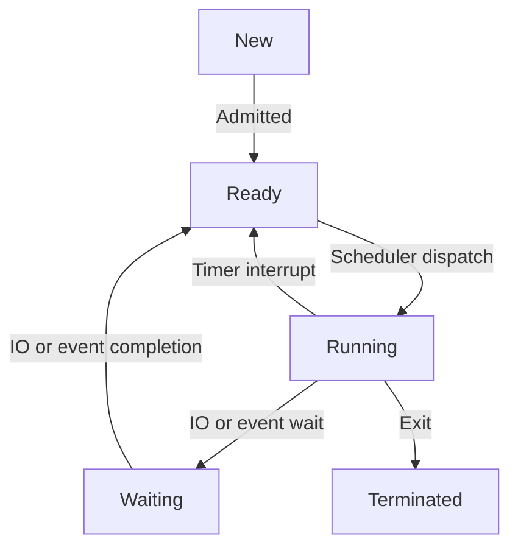

# Processes and Threads

# Process Concept

- Process: A program in execution. Process execution must occur in sequential fashion
- Operating system executes a variety of processes
    - Batch system - Jobs
    - Time-sharing system - user programs and commands

# Process State

- As a process executes, it changes state

## New

The process is being created

## Running

The instructions are being executed

## Waiting 

The process is waiting for an IO or event

## Ready

The process is ready to be run, but is waiting to be assigned to the CPU

## Terminated

The process has completed

# Diagram of Process State Transitions



- Timer interrupt is used in multiprogramming systems to switch between ready processes

# Process Control Block (PCB)

Process Control Block is a data structure that contains information of the process related to it. It keeps information associated with each process


1. Pointers to other PCBs (PCBs are maintained in a queue/list structure)
2. Process state
3. Process number (Process ID)
4. Program counter (pointer to next instruction)
5. CPU registers
6. Process priority (used in program scheduling)
7. Memory management information (e.g. base and limit register values)
8. Information regarding files (e.g. list of open files)

The PCB has 4 main regions:

1. Text: to store instructions
2. Data: for static and global variables
3. Stack: for managing function calls and local function variables
4. Heap: for dynamically created variables

# Process Scheduling

## Context Switching


- When the system switches to another process, the system must save the context (information) of the old process, and load the saved context for the new process, before executing the new process
- Context switch time is an **overhead cost**: System is idle and does NO work while switching processes

## Process Scheduling Queues

- Job queues: Set of all processes with the same state in the system
    - Ready queue (processes in ready state)
    - Device queue (processes in waiting state and waiting for specific IO device) etc.
- All the queues are stored in main memory (kernel memory space)
- Process migrates between queues when its state changes


## Process Schedulers

We require multiple schedulers for different purposes
1. Long-term scheduler (or job scheduler): Selects processes from disk and loads them into main memory for execution
    - Invoked infrequently (e.g. seconds or minutes)
2. Short-term scheduler (or CPU scheduler): Selects from among the processes in main memory that are ready to execute, and allocates the CPU to one of them
    - Invoked frequently (e.g. 100 milliseconds) in a multi-programmed system for responsiveness and efficiency purposes
3. Medium-term scheduler
    - When system load is heavy, swaps out a partially executed process from memory to hard disk
    - When system load is light, such processes are swapped back into main memory

- The degree of multiprogrammer is initially controlled by the long-term scheduler, and thereafter by the medium-term scheduler

# Operations on Processes

## Process Creation


- Parent processes create child processes which in turn create other processes, forming a tree of processes (The process of creating a new process is called forking)
- 2 possible execution orders
    1. Parent and child execute concurrently (and independently)
    2. Parent waits until all children terminate (`wait()`, `join()`)
- E.g. many web browsers fork a new process everytime we open a new tab. OS may create background processes for monitoring and maintenance tasks

## Process Termination

2 possible ways to terminate a process
1. Exit: Process executes last statement and asks the OS to delete it
    - Child may return output data to parent
    - Process resources are deallocated by the OS
2. Abort: Parent may terminate execution of child process at any given time
    - Child exceeded allocated resources
    - Task assigned is no longer required
    - Parent is exiting

# Interprocess Communication

## Cooperating Processes
- An independent process cannot affect or be affected by the execution of any other process
- A cooperating process is a process that can affect, or be affected by the execution of other processes
    - Such processes have to communicate with each other to share data
    - 2 models of Inter-Process Communication (IPC)
        - Message passing
        - Shared memory


### IPC - Message Passing

- Processes communicate and synchronise their actions without resorting to shared variables
- Two operations are required
    1. send(message) - message size fixed or variable
    2. receive(message)
- If 2 processes wish to communicate, they need to
    - Establish a communication link between them
    - Exchange messages via send/receive

#### Direct vs Indirect Message Passing

- Direct: Processes must name each other explicitly
    - `send(P, message)`: Send a message to process P
    - `receive(Q, message)`: Receive a message from process Q
- Indirect: Messages are sent to or received from mailboxes (also called ports)
    - Mailbox is an object into which messages are placed and removed (like a queue)
    - Primitives are
        - `send(A, message)`: Send message to mailbox A
        - `receive(A, message)`: Receive message from mailbox A

### IPC - Shared Memory

- Multiple processes will share the same block of memory, with shared variables
- One process will set the value of a variable, then another process will use the new value of the variable for its own computations

#### Producer-Consumer Process Paradigm for Shared Memory

- Classical paradigm for cooperating processes
    - Producer process produces information, consumer process consumes information
    - Shared buffer used to store information
- 2 models for shared buffer
    1. Unbounded buffer: Places no practical limit on the size of the buffer
    2. Bounded buffer: Assumes there is a fixed buffer size

#### Bounded Buffer

```
void producer(void) {
    message m;
    while (1) {
        // preprocessing
        while (mailbox is full) wait();
        send(mailbox, m);
    }
}

void consumer(void) {
    message m;
    while (1) {
        while (mailbox is empty) wait();
        receive(mailbox, m);

        // postprocessing
    }
}
```

# Threads

A thread (or lightweight process) is a basic unit of CPU utilisation. It consists of:
- Thread ID
- Program counter
- Register set
- Stack space

A thread shares with its peer threads in the same process:
- Code and data sections
- OS resources (open files, etc.)

A traditional or heavyweight process is an executing process with a single thread of control

## Multi-threading


- In a multi-threaded process, while one thread is blocked and waiting, a second thread can run
    - Cooperation of multiple threads in the same process results in higher throughput
    - E.g. in a word processor, a background thread may check for grammar and spelling mistakes, while a second thread records and outputs the user's keystrokes, and a third thread does automatic backups
- The benefits of multi-threading
    - Responsiveness: One thread may provide rapid response while other threads are blocked or doing intensive work
    - Resource sharing: By default threads share common code, data and other resources which allows multiple tasks to be performed simultaneously in a single address space
    - Economy: Creating and managing threads and switching contexts between threads is much faster than performing the same tasks for processes
    - Scalability: A single threaded process can only run on a single CPU, while execution of multi-threaded application can be split among available processors

## Thread Implementation Models

- Paradox
    - Allows users to implement an arbitrary number of threads, BUT
    - OS kernel can only support a limited number of threads due to resource constraints
- Solution: Two layers of abstraction
    - User threads (logical): These are the threads that application programmers would put into their programs, created in user space. User can create as many as they want
    - Kernel threads (physical): Created in kernel space, by the OS itself
        - Slower to create and manage than user threads
        - Resources eventually allocated to kernel threads
    - OS maintains mapping from user threads to kernel threads

### Multi-threading Models

- Models that defines the mapping between user threads and kernel threads
    - Many-to-One
    - One-to-One
    - Many-to-Many
- Why no One-to-Many mapping?
    - Wastage of OS resources to map a single user thread to multiple kernel threads

### Many-to-One


- Many user threads are mapped to a single kernel thread
- Thread management handled by the thread library in the user space, which is very efficient
- However, if a blocking call is made, then the entire process is blocked, even if the other threads would otherwise be able to continue
- Because a single kernel thread can only operate on a single CPU, the many-to-one model does not allow individual processes to be split across multiple CPUs

### One-to-One


- Create a separate kernel thread to handle each user thread
- Overcomes the problem of blocking calls and splitting processes
- However the overhead of managing one-to-one model is more significant, as each thread created adds more load to the system, slowing system down
- Most implementations of this model limit how many threads can be created

### Many-to-Many


- Multiplexes any number of user threads into an equal or smaller amount of kernel threads, combining best features of one-to-one and many-to-one models
- Users have no restriction on number of threads created
- Blocking kernel system calls do not block the entire process
- Processes can be split across multiple processors
- Individual processes may be allocated variable number of kernel threads, depending on number of CPUs and other factors
- However, hard to decide on the mapping between user and kernel threads


# Resources
- https://www.cs.uic.edu/~jbell/CourseNotes/OperatingSystems/3_Processes.html
- https://www.cs.uic.edu/~jbell/CourseNotes/OperatingSystems/4_Threads.html

