# Process Scheduling

# Basic Concepts

## CPU-IO Bursts

Process execution alternates between CPU executions and IO operations

- CPU Burst: Duration of 1 CPU execution cycle
- IO Burst: Duration of 1 IO Opeation (wait time)

## Burst Time

- Total time taken by the CPU to actively execute the process

## Arrival Time

- The time when a process enters into the ready state and is ready for execution

## Exit Time

- The time when a process completes execution and exits from the system

## Response Time

- The time between when the process is in the **ready** state, and the **first time the CPU executes the process**

## Waiting Time

- Total time process spends in "ready" state (waiting to be executed by the CPU)
- Turnaround time = waiting time + burst time

## Turnaround Time

- Total time process takes from **coming in the ready state** to its **first time to completion**

## CPU Scheduling Objective

The objective of CPU scheduling is to **keep the CPU busy as much as possible**

For simplicity, we focus on the concept of short-term scheduler (ready queue) for both single- and multi-processor CPUs.

# CPU Scheduler (Short-term)

The goal of the short-term scheduler is to select one or more processes in the ready queue, and allocate it to the CPU (one process per core). Scheduler may run whenever a process changes state.

- "running" to "waiting"
- "running" to "terminated"

## Types of CPU Schedulers

1. Nonpreemptive
   - Once the CPU has been allocated to a process, the process keeps the CPU until it **voluntarily releases the CPU**, either by terminating or requesting an IO event wait
   - Scheduling is nonpreemptive if it happens only for "running" -> "waiting" or "running" -> "terminated" (It might run when a process transitions from "new" to "ready", only when a CPU core is idle)
2. Preemptive
   - The CPU can be taken away from a running process at any time by the scheduler
   - Scheduling is preemptive if it also hapens for transitions "running" -> "ready" (interrupt), "waiting" -> "ready" (IO/event completion), or from "new" -> "ready" (admitted)

# Scheduling Objectives

## System-wide Objectives

1. Maximise CPU Utilisation: Keep the CPU as busy as possible
   - CPU utilisation measured as a percentage of time during which the CPU cores are busy executing process
   - (sum of execution time on each core) / (total time) \* (number of cores)
2. Max throughput: Number of processes that complete their execution per unit of time
   - Number of "exit" transitions per unit time

## Individual Process Objectives

1. Minimum turnaround time: Amount of time to execute a particular process (from time of creation to time of termination)
   - Time elapsed between "admitted" and "exit" transitions for a process
   - Average over all process is denoted as the average turnaround time
2. Minimum waiting time: Amount of time a process has been waiting in the "ready" state
   - We do not consider time in "waiting" state, because nothing can be done even if the CPU wants to
   - Turnaround time components: CPU burst (running), IO burst (waiting) and waiting time (ready)
   - If all processes have a single CPU burst (no IO), then waiting time = turnaround time - CPU burst
3. Minimum reponse time: Time from a request submission ("admitted") until the first response is produced (we assume first response coincides with start of execution)

# Scheduling Algorithms for a Single-Processor System

1. First come, first serve
2. Shortest job first
3. Priority-based scheduling
4. Round robin
5. Multilevel Queue Scheduling

We assume a single CPU burst for each process, a single CPU core and focus on the average waiting time

## First come first serve

Consider the following processes with their corresponding CPU burst lengths

| Process | CPU Burst Length |
| ------- | ---------------- |
| P1      | 24               |
| P2      | 3                |
| P3      | 3                |

Suppose that processes arrive in the order P1, P2, P3 all at time 0

```mermaid
gantt
    title First Come First Serve
    dateFormat m
    axisFormat %M
    P1 : p1, 0, 24m
    P2 : p2, after p1, 3m
    P3 : after p2, 3m
```

- Waiting time for P1 = 0
- Waiting time for P2 = 24
- Waiting time for P3 = 27
- Average waiting time = (0 + 24 + 27) / 3 = 17

Now consider the processes arrive in the order P2, P3, P1 instead

```mermaid
gantt
    title First Come First Serve
    dateFormat m
    axisFormat %M
    P2 : p2, 0, 3m
    P3 : p3, after p1, 3m
    P1 : after p3, 24m
```

- Waiting time for P2 = 0
- Waiting time for P3 = 3
- Waiting time for P1 = 6
- Average waiting time = (0 + 3 + 6) / 3 = 3

Note that FCFS scheduling is nonpreemptive, because processes have to voluntarily release the CPU once allocated.

The main problem with FCFS is the **convoy effect**

- Short processes suffer increased waiting times due to an earlier arrived long process
- We see this effect in the first example of FCFS vs the second example

## Shortest Job First Scheduling

SJF prioritises processes based on their CPU burst lengths

- Shorter burst implies higher priority
- Intuitive way to handle convoy effect of FCFS

There are 2 schemes for SJF

1. Nonpreemptive: Once a core is given to a process, it cannot be preempted until it completes its CPU burst
2. Preemptive (also known as Shortest Remaining Time First): If a newly created process has CPU burst length less than the remaining CPU burst of a currently running process, then preemption will occur

SJF/SRTF is optimal for minimising average wait time

Consider the following processes

| Process | Arrival time | Burst Time |
| ------- | ------------ | ---------- |
| P1      | 0            | 7          |
| P2      | 2            | 4          |
| P3      | 4            | 1          |
| P4      | 5            | 4          |

```mermaid
gantt
    title Shortest Job First (Nonpreemptive)
    dateFormat m
    axisFormat %M
    P1 : p1, 0, 7m
    P3 : p3, after p1, 1m
    P2 : p2, after p3, 4m
    P4: after p2, 4m
```

Average waiting time: (0 + 6 + 3 + 7)/4 = 4

```mermaid
gantt
    title Shortest Remaining Time First
    dateFormat m
    axisFormat %M
    P1 : p1, 0, 2m
    P2 : p2, after p1, 2m
    P3 : p3, after p2, 1m
    P2 : p4, after p3, 2m
    P4 : p5, after p4, 4m
    P1 : p6, after p5, 5m
```

Average waiting time: (9 + 1 + 0 + 2)/4 = 3

## Priority Based Scheduling

- A priority number (integer) is associated with each process
- CPU is allocated to the process of highest priority

  - Usually, smallest integer implies highest priority
  - 2 schemes: Preemptive and non-preemptive
  - FCFS: Priority based on arrival order
  - SJF: Priority based on CPU burst length

- Problem of Starvation: Lower priority processes may never execute in a heavily loaded system
  - Solution is aging: As time progresses, slowly increase the priority of the processes that are not able to execute

## Round Robin Scheduling

- Fixed time quantum for scheduling (q): A process is allocated PCU for q time units, preempted thereafter and inserted at the end of the ready queue
  - Processes are scheduled cyclically based on q
  - Usually q is small, around 10-100 milliseconds
- Performance
  - n processes in ready queue implies waiting time is no more than (n-1)q time units
  - Large q: Degenerates to FCFS
  - Small q: Large overhead due to many context switches
- RR typically has higher average waiting time, but better response time

## Multi-level Queue Scheduling

- Different processes have different requirements
  - Foreground processes like those handling IO need to be interactive (RR is preferred)
  - Background processes need not be interactive, scheduling overhead can be low (FCFS)
- Solution: Multi-level queue scheduling
  - Ready queue is partitioned into several queues
  - Each queue has its own scheduling algorithm
  - However, how do we schedule among the queues?
- 2 schemes for inter-queue scheduling
  - Fixed priority scheduling
    - Queues served in priority order (e.g. foreground before background)
    - However, starvation for lower priority queues
  - Time-sliced based scheduling
    - Each queue gets a fixed time quantum on the CPU (e.g. 80ms for foreground, 20ms for background, and then repeat)

# Scheduling Algorithms for Multiprocessor Systems

1. Partitioned Scheduling (Asymmetric Multiprocessing - AMP)
2. Global Scheduling (Symmetric Multiprocessing - SMP)

We assume a multi-core CPU and that each process may only execute on one CPU core at any time instant

## Partitioned Scheduling

- Processes are partitioned apriori (at process creation time) among CPU cores
  - Each process is mapped to one core
  - Separate uniprocessor CPU scheduling for each core (asymmetric scheduling)
- Advantages
  - Core-specific scheduling strategy is feasible (FCGS, SJF, RR, multi-level, etc.)
  - Easy and simple extension of uniprocessor CPU scheduling to multiprocessor CPU scheduling
- How to map cores to processes?
  - Poor mapping can lead to unequal loads: a core is idling while another is overloaded
  - May reduce system/process performance
  - NP-Hard problem: Similar to the [knapsack problem](https://en.wikipedia.org/wiki/Knapsack_problem)
  - Heuristics such as best-fit could be used if CPU burst lengths are known

## Global Scheduling (SMP)

- One or more ready queues for the entire system (no mapping of queues to CPU cores)
  - When any core becomes idle, CPU scheduler runs and allocates the next process to execute
  - Process selection based on strategy applied globally or symmetrically across all cores (FCFS< SJF, etc.)
  - It is possible that the same process may execute on different cores at different times
  - No core-process mapping problem
- Issues with global scheduling
  - Implementation complexity is high when compared to partitioned scheduling
    - Need to synchronise clocks across cores
    - Global strategy for process selection combining all the cores
  - Implementation overhead is high when compared to partitioned scheduling
    - Process could context switch from one core and be scheduled on another (private core-specific cache data needs to be migrated)
