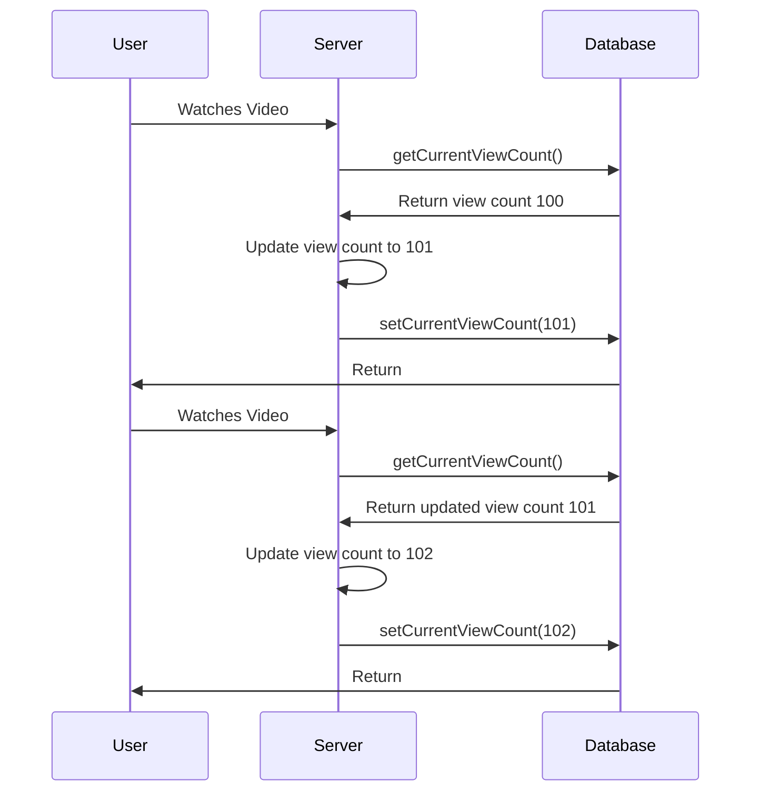
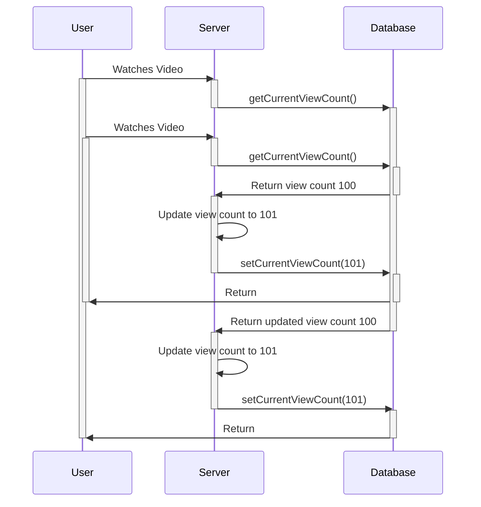

# Process Synchronisation

# Background

-   Access to shared data from concurrent processes may result in data inconsistency
    -   Data value depends on the order of instructions executions from concurrent processes. I.e. when context switches occur between concurrent processes
-   Maintaining data consistency requires mechanisms to ensure the orderly execution of concurrent processes
    -   We need to find a way to sequence concurrent processes to ensure data consistency

# Race Conditions

A race condition is the condition of a system where the system's behavior is **dependent on the sequence or timing of other uncontrollable events**. It becomes a bug when one or more of the possible behaviors is undesirable.

For example, consider the following process that are used to update the view count of a video

```c
void updateViewCount() {
    int currentViewCount = await getCurrentViewCount();
    int newViewCount = currentViewCount + 1;
    await setCurrentViewCount(newViewCount);
}
```



Here, there is no race condition because the view count has been updated before it was accessed again. However, consider the scenario where 2 users watch the video at roughly the same time



Now, when both users access the current view count at the same time, they incorrectly update the view count.

# The Critical-Section Problem

-   $n$ processes all competing to use some shared data
-   Each process has a code segment, called the **critical section**, in which the shared data is accessed
    -   Process may be changing shared variables, updating shared table, writing shared file etc.
    -   At least one process modifies the shared data
-   Problem: Design a protocol to ensure that when one process is executing in its critical section, no other process is allowed to execute in its own critical section

# Generic Solution Structure for Critical Section Problem

1. Entry section: Ask for permission to enter critical section
2. Exit section: Exit critical section (notify other processes)

```c
while (1) {
    runEntrySection(); // what should be the logic here?
    runCriticalSection(); // only 1 process can be executing this code at the same time
    runExitSection();  // what should be the logic here?
    // remainder section of code
}
```

# Desired Properties of Solutions to the Critical-Section Problem

-   Assumptions of critical and remainder sections
    -   Each process is guaranteed to make progress over time in these sections (no halting)
    -   No assumption about relative execution speed of different processes in these sections

## Desired Properties of Entry and Exit Sections

1. Mutual Exclusion

> If a process is executing in its critical section, no other process can be executing in its critical section at the same time

-   This is to ensure the shared data is consistent and contains the most updated value whenever a process tries to access the shared data

2. Progress

> If no process is executing in its critical section and some processes wish to enter their critical sections, then only those processes that are not executing in their remainder section can participate in deciding which will enter its critical section next, and this selection cannot be postponed indefinitely.

-   If a process is executing in its critical section, then work is being done, and we are making progress.
-   If no process is executing in its critical section, but no process wants to enter its critical section, it means that there is no more work to do. But since there is at least 1 process that wants to enter their critical section, there is more work to be done
-   Only processes that have not completed their critical section should be able to choose which process to enter the critical section
-   Since the selection cannot be postponed indefinitely, it will only take a limited amount of time for some process to enter its critical section. If no process enters its critical section, although at least 1 process wants to enter its critical section, we will have reached a **deadlock** or **livelock**, and no work will be done

3. Bounded Waiting

> There exists a bound, or limit, on the number of times other processes are allowed to enter their critical sections after a process has made request to enter its critical section and before that request is granted.

-   Consider a process P that has made a request to enter its critical section
-   If there was no bound for other processes to enter their critical sections, P's entry to its critical section can be postponed indefinitely
-   This means P will never make any progress, and starvation will occur
-   By placing an upper bound on the number of times other processes are allowed to enter their critical section after P requested to enter, it is guaranteed that after a finite amount of time, P will enter its critical section and make progress

# Process Synchronisation

## User-level Solutions

Remember our generic structure of a process

```c
while (1) {
    runEntrySection();
    runCriticalSection();
    runExitSection();
    // remainder section
    ...
}
```

We shall consider 2 processes P0 and P1

-   Although P0 and P1 have the same generic structure, they may have different implementations for the 4 sections
-   Now we will consider user-level software approaches without OS support

### Algorithm 1

Global variables:

```c
int turn = 0; // turn = i means process i can enter its critical section
```

Process i

```c
while (1) {
    // run entry section
    while (turn != i) {
        wait();
    }; // while not your turn, do nothing

    runCriticalSection(); // run critical section

    // run exit section
    runCleanup();
    turn = k; // give process k its turn, where k is some other process number

    runRemainderSection();
}
```

1. Algorithm 1 supports mutual exclusion
    - When turn = 0, P0 can enter its critical section, but no other
2. Algorithm 1 does not support progress
    - P0 will only progress if and only if some other process `j` changes its turn back to `0`
    - P1 could be in the entrance section and crash, which means that P0 will forever wait for its turn (since no other process can change turn back)
    - More information [here](https://stackoverflow.com/questions/48288215/petersons-solution-with-single-variable)
3. Algorithm 1 supports bounded waiting (Assuming turn is updated fairly)
    - If turn is updated fairly throughout all processes (e.g. `turn = (turn + 1) % numberOfProcesses)`), then it can be guaranteed that sooner or later, all processes will have their turn

### Algorithm 2

Global variables:

```c
bool[] isReady = [false, false]; // isReady[i] tells whether process i is ready to enter its critical section
```

Process i:

```c
while (1) {
    // before entry section
    runEntrySection();

    // entry section
    isReady[i] = true;

    bool otherProcessesAreReady = isReady.some(process => process == 1);
    while (otherProcessesAreReady) {
        wait();
    } // if other processes are ready, wait for them to finish first

    runCriticalSection();

    // exit section
    runCleanUp();
    isReady[i] = false; // once done, set process back to not ready

    runRemainderSection();
}
```

1. Algorithm 2 supports mutual exclusion
    - Suppose P0 enters critical section, which implies `isReady[0] = true` and `isReady[1] = false`
    - `isReady[0]` is updated only after P0 exits
    - Process P1 therefore cannot enter critical section until P0 is complete
2. Algorithm 2 does not support progress
    - Consider if P0 and P1 suddenly update their own `isReady` to `true`
    - Now P0 will wait until P1 is not ready, and P1 will wait until P0 is not ready
    - None of them can update their own ready states because they are waiting on the other process
    - Deadlock has occurred, no progress will be made
3. Algorithm 2 supports bounded waiting time
    - Once P0 sets `isReady[0] = true`, no other process can enter their critical sections
    - Hence P0 will be able to enter its critical section after requesting permission in a finite amount of time

### Algorithm 3 ([Peterson's Algorithm](https://en.wikipedia.org/wiki/Peterson%27s_algorithm))

Combine algorithm 1 and 2 together

Global variables:

```c
bool[] isReady = [false, false]; // when isReady[i]
turn = 0; // when turn = i, process i can enter its critical section
```

Process i:

```c
while (1) {
    isReady[i] = true; // process is ready to enter critical section
    turn = k; // give turn to other process

    while (isReady[k] && turn == k) {
        wait();
    } // while others are ready and its not your turn, wait

    runCriticalSection();

    // exit section
    runCleanUp();
    isReady[i] = false; // not ready anymore

    runRemainderSection();
}
```

1. Algorithm 3 supports mutual exclusion
    - Proof by contradiction: Assume both P0 and P1 are in their critical section
    - `flag[0] = flag[1] = true`
    - The test for entry cannot be true for both processes, because turn favors one process, therefore one process must have entered the critical section first (WLOG, P0)
    - However if P0 entered the critical section, `turn == 0` is true, and P1 cannot have found `turn == 1` to be true, and therefore contradiction
2. Algorithm 3 supports progress
    - Consider P0 blocked in the while loop
        - P1 is not interested in entering the CS
            - Then `flag[1] = false`
            - Hence the while loop is false for P0 and it can go
        - P1 is also blocked at the while loop
            - Impossible because `turn` = 0 or 1
            - Hence the while loop is false for some process (either P0 or P1) and it can go
3. Algorithm 3 supports bounded waiting (Assuming that turn is updated fairly)
    - Assume that P1 is executing its CS repeatedly
        - Upon exiting its CS, P1 sets `flag[1]` to false
        - Hence the while loop for P0 evaluates to false, and it can proceed
    - However P1 may attempt to re-enter its own CS again before P0 has a chance to run
        - But to reenter P1 set `flag[1]` to true and sets `turn` to 0
        - Since P0 is trying to enter its own critical section previously, we know that `flag[0]` is true as well
        - Now we can see that P1's while loop is true, and it waits
        - The while loop is now false for P0, and it can go

# OS-level solutions

-   Previous software solutions are hard to implement for >2 processes
-   We shall use the OS to help us synchronise processes to run
-   The OS has 3 kinds of support for the critical section problem
    -   Synchronisation hardware
    -   Semaphore
    -   Monitor

## Synchronisation Hardware

-   Modern processors provide special atomic hardware instructions
    -   Atomic: Non-interruptible (No context switches)
-   `testAndSet`: Test and modify the memory of a main memory word atomically

```c
boolean testAndSet(boolean *target) {
    // disable interrupts

    boolean oldValue = *target; // get current value
    *target = true; // store new value
    return oldValue; // return old value

    // enable interrupts
}
```

### Critical Section with `testAndSet`

Global variables:

```c
boolean lock = false;
```

-   If `testAndSet(&lock)` returns false, then process can enter critical section (and then lock will be set to true)

For process i:

```c
while (1) {
    while (testAndSet(&lock)) {
        wait();
    } // while locked, wait

    // run critical section
    runCriticalSection();

    // clean up
    runCleanUp();
    lock = false; // set lock back to false to allow other processes to proceed

    runRemainderSection();
}
```

1. `testAndSet` supports mutual exclusion
    - If a process enters its critical section,
    - `lock` is `false` immediately before it executes, and `true` thereafter
    - `lock` is `false` again only when process exits critical section
    - No process can enter their critical section if a process is already in its critical section, because `lock = true`
2. `testAndSet` supports progress
    - If `lock = false`, then the first process that executes `testAndSet` will immediately enter its own critical section
3. `testAndSet` does not support bounded waiting time
    - Suppose that a round robin scheduling strategy is used, such that only the lines `while (testAndSet(&lock))` runs
    - Initially `lock = false`
    - When P0 runs, it sets `lock` to true
    - Context switch occurs and P1 runs
    - P1 checks the lock, and will wait
    - Context switch occurs and P0 runs again from where it left off
    - P0 completes its critical section, sets lock to false
    - P0 goes back to the top of the loop, and since `lock = false` now, it re-locks again
    - Context switch occurs and P1 runs from where it left off
    - However since P1 realises that `lock = true` it will wait again
    - This infinite loop causes P0 to run indefinitely, and P1 will wait forever

## Semaphore


In computer science, a semaphore is a variable or abstract data type used to control access to a common resource by multiple processes and avoid critical section problems in a concurrent system such as a multitasking operating system.

-   A semaphore `S` is a shared integer variable
-   `S` is only accessible through 2 signal calls
    -   `wait(S)`: `if (S > 0) S--; else wait();`
    -   `signal(S)`: `S++;`
-   2 types of semaphores
    1. Counting semaphore: Integer value can range over an unrestricted domain, used to control access to a resource with multiple instances
    2. Binary semaphore: Integer value can never be greater than 1 (usually called a `mutex lock`)

### Semaphore Solution for the Critical-Section Problem

Global variables:

```c
int mutex = 1;
```

-   A semaphore `mutex` used
-   Initally `mutex = 1`
-   If `mutex == 1` and process executes `wait(mutex)`, then it can enter its critical section
-   `mutex == 1` means that the resource is available to be used

For process i:

```c
while (1) {
    wait(mutex); // acquire semaphore

    runCriticalSection();

    runCleanUp();
    signal(mutex); // release semaphore
}
```

### Classical Semaphore Implementation (Busy Waiting)

```c
void wait(int S) { // waits for a resource to be ready. When resource is ready, occupy the resource
    while (S <= 0) { // while resource is not available
        wait();
    }

    S--; // decrement semaphore by 1, to signal that a process is going to use the resource
}

void signal(int S) { // signal to others that resource is freed up
    S++; // increment semaphore by 1, to signal that we have finished using the resource
}
```

-   For a semaphore, the initial value of `S` describes how many instances are able to use the resource
-   Everytime an instance of the resource is used, `S` is decremented by 1
-   If `S` is a negative value `-k`, that means that `k` resources are waiting to access the resource
-   Everytime the process has finished using the shared resource, it increments `S` by 1 to signal that an instance is freed up

-   Pros: No context switch overhead
-   Cons: Inefficient if critical sections are long, `wait` wastes a lot of CPU cycles

#### Busy Waiting Semaphore Property Analysis

-   To avoid race conditions, `s++` and `s--` must be atomic
-   `wait(s)` must be atomic to ensure mutual exclusion

### Blocking Semaphore Implementation

-   Define semaphore as a record

```c
typedef struct {
    int value;
    struct process *L; // a queue of the processes waiting for the semaphore
} semaphore;
```

-   Provides `L`, a queue of processes that are waiting for the semaphore
-   Requires 2 simple operations
    -   `block()` - blocks the current process from executing, and adds it to `L`
    -   `wakeup()` - resumes the execution of a blocked process in `L`

```c
void block() {
    Process *currentProcess = dequeue(&readyQueue); // dequeue current process from ready queue
    enqueue(&waitingQueue, currentProcess); // enqueue the current process again to waiting queue
    currentProcess->status = "WAITING"; // change state of current process to "waiting" for semaphore
}

void wakeup() {
    Process *currentProcess = dequeue(&waitingQueue); // dequeue current process from waiting queue
    enqueue(&readyQueue, currentProcess); // enqueue current process to ready queue
    currentProcess->status = "READY"; // change state of current process to "ready"
}
```

### Blocking Semaphore Implementation for `wait(S)` and `signal(S)`

```c
void wait(S) {
    S.value--;
    if (S.value < 0) {
        block();
    }
}

void signal(S) {
    S.value++;

    if (S.value <= 0) {
        wakeup(P); // wakeup process
    }
}
```

Note that `wait` and `signal` must both be atomic for this implementation to work

# Semaphore Best Practices

1. Undestamd application scenario and identify
    - Shared variables/data
    - Shared resources
2. Protect shared variables
    - Identify critical sections
    - Use binary semaphore, add entry (wait) and exit (signal)
3. Protect shared resources
    - Identify each resource; allocate one semaphore for each resource
    - Initial value: number of resource instances
    - When resource is requested/consumed: `wait`
    - When resource is released: `signal`

# Deadlocks

> A deadlock occurs when 2 or more processes are waiting indefinitely for an event that can only be caused by one of the waiting processes

Examples of deadlocks include:

-   P0 waiting on P1 to release, but P1 waiting on P0 to release

# Starvation

> Starvation occurs when a process is indefinitely postponed (no progress is made by the process indefinitely)

Examples of starvation include:

-   Priority-based: Low priority processes may starve if higher-priority processes always keep joining the queue
-   Last-In-First-Out queues: The first process in may never run if other processes keep joining the queue

# Classical Synchronisation Problems

There are a few classical problems with synchronisation, namely

-   Bounded-buffer (Consumer-Producer problem)
-   Dining philosophers problem
-   Readers and Writers problem

## Bounded-Buffer Problem

-   Consider multiple producers/consumers
    -   We used `counter`, `in` and `out` variables to keep track of states between a producer/consumer pair
    -   `in` and `out` variables are also shared now (`in` - producers, `out` - consumers)

1. Identify shared data and resources

-   `item buffer[n]`
-   `buffer` is a shared data structure
-   Slots in the `buffer` are shared resources
-   Semaphores to be used to synchronise between processes

```c
semaphore full;
semaphore empty;
semaphore mutex;

full = 0; // counting semaphore used to identify
empty = n;
mutex = 1;
```

2. Protect shared data

Without synchronisation:

```c
item nextProduced;
while (1) {
    // code
    produce nextProduced;
    // more code
    add nextProduced to buffer;
}
```

Now we need to protect shared data, by using a `mutex` to signal to processes whether we can access the buffer

```c
item nextProduced;
while (1) {
    // code
    produce nextProduced;
    wait(mutex);
    // more code
    add nextProduced to buffer;
    signal(mutex);
}
```

3. Protect shared resources

For the producer process:

```c
item nextProduced;
while (1) {
    // code

    produce(nextProduced);

    // code

    wait(empty); // consume 1 empty slot
    wait(mutex);

    // code

    add nextProduced to buffer;

    // code

    signal(mutex);
    signal(full); // signal consumers that buffer can be consumed
}
```

For the consumer process:

```c
item nextConsumed;
while (1) {
    wait(full); // consume 1 full slot
    wait(mutex);

    // code

    nextConsumed = item from buffer;

    // code

    signal(mutex);
    signal(empty); // signal producers that consumer is done

    consume the item nextConsumed;
}
```

## Dining-Philosophers Problem

-   5 philosophers sit around a table, alternating between eating and thinking
-   5 plates (1 for each philosopher) and only 5 chopsticks (one between each plate)
-   Problem: Design a solution to allow the philosophers to eat peacefully

### Initial Solution

-   Each philosopher is a process
-   Each chopstick is a shared resource protected by a binary semaphore (`chopsticks[5]`)
-   Initially, for all chopstick, `chopsticks[i] = 1`

For a single philosopher `i`

```c
while (1) {
    wait(chopsticks[i]); // wait for chopsticks[i] to be ready
    wait(chopsticks[(i + 1) % 5]); // wait for next chopstick to be ready as well

    eat(); // with 2 chopsticks, he can eat (critical section)

    signal(chopsticks[i]); // signal that chopsticks[i] is now freed
    signal(chopsticks[(i + 1) % 5]); // signal that next chopstick is also freed

    think(); // remainder section
}
```

However, the solution above has a problem

-   P0 executes `wait(chopsticks[0])`, and then context switches to P1
-   P1 executes `wait(chopsticks[1])`, and then context switches to P2
-   P2 executes `wait(chopsticks[2])`, and then context switches to P3
-   P3 executes `wait(chopsticks[3])`, and then context switches to P4
-   P4 executes `wait(chopsticks[4])`, and then context switches to P5
-   P5 executes `wait(chopsticks[5])`, and then context switches to P0

But now, each philosopher has 1 chopstick, and needs another to eat. A deadlock has occured.

### Remedies

-   Allow at most 4 philosophers to be hungry simultaneously
-   Allow a philosopher to pick up his chopsticks only if both are available
-   Use an asymmetric solution
    -   An odd philosopher picks up first his left chopstick, then his right chopstick
    -   An even philosopher picks up first his right chopstick, then his left chopstick

## Readers-Writers Problem

-   Problem: Scenario in a database/file
    -   Writer requires exclusive access
    -   Multiple readers can concurrently access
        -   The first reader must block access to writers
        -   The last reader must allow access to writers afterwards
        -   Readers are given preference (writer preference also possible)
-   Shared data
    -   `int readCount = 0` - tracks number of readers in a database
    -   Database itself
-   Semaphores used
    -   `mutex = 1` - binary semaphore protecting `readCount`
    -   `wrt = 1` - binary semaphore to access database (write)

For the writer process

```c
// code
wait(wrt); // wait for write access

writeToDatabase(); // actually write to the database

signal(wrt); // signal that process is complete
```

For the reader process:

```c
// code

// when a reader enters
wait(mutex); // wait for readCount to be accessible
readCount++; // increment readCount by 1
if (readCount == 1) { // if process is the first reader
    wait(wrt); // request access to database - remember we do not want writes to occur if reading
}
signal(mutex); // free up readCount to be accessible agains
// note that the signal occurs after the if statement, to ensure readCount does not change
// while requesting access to database

readFromDatabase(); // read from the database

// when a reader leaves
wait(mutex); // wait for readCount;
readCount--;
if (readCount == 0) signal(wrt); // if last reader, release database
```

# Monitor

-   High level synchronisation construct that allows sharing of variables between concurrent processes
-   Monitor is a collection of procedures and data
-   Processes may call procedures within monitor to access and update the data
-   Only 1 process can be active in the monitor at any given time
-   Data in the monitor can only be accessed by procedures within it

# Resources

-   https://stackoverflow.com/questions/33143779/what-is-progress-and-bounded-waiting-in-critical-section
-   https://www.geeksforgeeks.org/petersons-algorithm-in-process-synchronization/
-   https://stackoverflow.com/questions/48288215/petersons-solution-with-single-variable
-   https://pages.mtu.edu/~shene/NSF-3/e-Book/SEMA/TM-example-buffer.html
-   https://cis.gvsu.edu/~wolffe/courses/cs452/docs/CS_AlgProof.html
