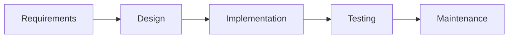
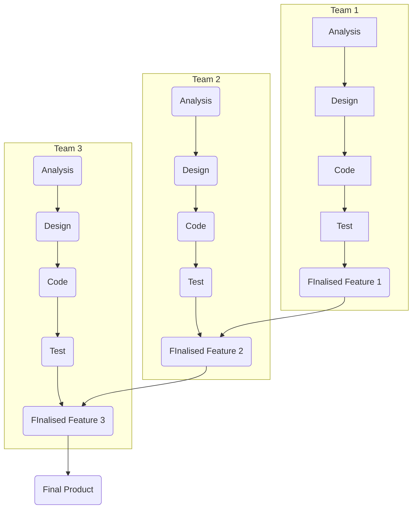
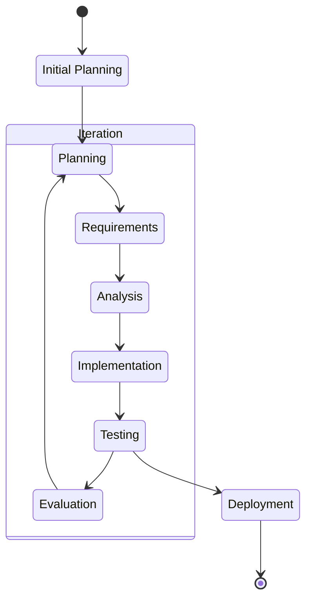

# Introduction to Software Engineering

# What is Software Engineering?

> Software Engineering is the production of maintainable, fault-free software that meets the user's requirements and is delivered on time and within budget

# Activities in Software Engineering

1. **Requirements elicitation** - specify what we are going to make, what it will do and how it will do it
    - Software Requirement Specification
    - Prototype
2. **Design** - What will it look like and how will we make it?
    - Software Design Document
    - Interface Design Document
    - Test Cases
    - Models
3. **Implement** - Construct based on design and requirements specification
    - Source Code
    - System Build
    - Technical Documentation
    - User Manual
    - Test Report
4. **Test** - Ensure it meets requirements and is error free
    - Change Requests
    - Bug Reports
5. **Release it** and **maintain it**

# Software Products are Complex Systems

-   Software products are in continuous change
    -   New releases are required to fix bugs, change/improve functionality, replace legacy hardware or subsystems etc
    -   Failure to design and engineer properly and handle change through development and maintenance of accurate records and documentation results in new errors, instability and degradation of product
    -   Leads to poor customer satisfaction and potentially major accidents/disasters
-   Software products are developed by a team and sometimes multiple teams
    -   No single person can know everything about a large software system
    -   A standard means of modelling and rigorous processes of project management is required to design, implement, test and maintain large complex systems

# Common Models for Software Development Lifecycle (SDLC)

There are 2 major models for SDLC

1. Formal document driven models, which use documentation to drive the developmental process
2. Iterative and Incremental models,

## Formal Document Driven Models

-   Document driven (Requires rigorous documentation to proceed)
-   Simple to understand, easy to use
-   Little flexibility
-   Difficult and expensive to change scope
-   Good for large and mission-critical projects

Examples of Formal Document Driven Models include

-   [Waterfall Model](https://www.tutorialspoint.com/sdlc/sdlc_waterfall_model.htm)
-   [V&V Model](https://www.tutorialspoint.com/sdlc/sdlc_v_model.htm)
-   [Spiral Model](https://www.tutorialspoint.com/sdlc/sdlc_spiral_model.htm)

## Incremental and Iterative Models

> Incremental Development is when parts of the system are developed at different times or rates, and then integrated as they are completed

-   E.g. building a blogging platform
-   Team 1 will build the user authentication feature
-   Team 2 will build the user profile page
-   Team 3 will build the main user feed
-   Team 4 will build the blog post editor
-   When a team finishes their part of the project, it will be added into the project

> Iterative development is when parts of the system are revisited for revision and improvement

-   Once the user authentication is done, the team can add more features like OAUth signin, "Forgot password" features, linking of accounts etc.
-   Blog post editor may include new features such as custom themes, mentioning other users, hiding posts before a certain date etc.
-   As time goes on, the teams will keep iteratively adding features to the system

By satisfying the customer through early and continuous delivery of software, we provide early and continuous feedback - allowing for flexibility.

-   For example, the team finishes building the user profile page, but the customer wants a change to the looks of the page. Due to early feedback from customer, it is very easy to change it to fit the customer's requirements.
-   If we had added a lot more features already, and then the customer wanted to change the looks of the page, it would be harder because there are more features to move around

Examples of Incremental and Iterative Models:

-   [Agile](https://www.javatpoint.com/software-engineering-agile-model)
-   [Rapid Prototype Development](https://resources.pcb.cadence.com/blog/2019-what-is-the-rapid-prototype-development-process-and-what-are-the-benefits)

# Which Model to Choose?

-   In practice, a mix of formal document driven and iterative and incremental methods are used
-   Documentation and robust design, implementation and testing is required
-   Flexibility through incremental and iterative design is often needed in some stages of the project

# Resources

-   [What is iterative model?](https://www.professionalqa.com/iterative-model)
-   [What is incremental model?](https://www.guru99.com/what-is-incremental-model-in-sdlc-advantages-disadvantages.html)
