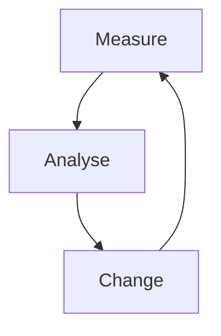

# The Software Process

- A structured set of activities required to develop a software system
- There exist many different software processes, but they all involve
    - Specification - defining what the system should do
    - Design and implementation - defining the organisation of the system and implementing the system
    - Validation - checking that the system does what the client wants
    - Evolution - changing the system in response to changing client's needs
- A software process model is an abstract representation of a process. It is a description of a process from a particular perspective

# Software Process Description

- When we describe and discuss processes we usually talk about activities in the process. E.g. specifying data model, describing user interface etc.
- Process descriptions include
    - Products - the outcomes of the process
    - Roles - the responsibilities of people involved in the process
    - Pre and post conditions which are statements that are true before and after an activity, or the product is produced.

# Plan Driven and Agile Processes

- Plan driven processes are those where every activity is planned in advance, and progress is measured against this plan
- Agile processes are those where planning is incremental, and its easier to change the process to reflect changing customer requirements
- In practice, most practical processes involve both agile and plan-driven approaches
- No right or wrong in software processes

# Software Process Models

- Waterfall model
    - Plan-driven model. Separate and distinct phases of specification and development
- Incremental development
    - Specification, development and validation are interleaved. May be plan-driven or agile
- Integration and Configuration
    - The system is assembled from existing configurable components. May be plan-driven or agile

In practice, most large systems are developed using a process that incorporates elements from all models.

# Waterfall Method

There are 5 phases in waterfall 
- Requirements analysis and definition
- System and software design
- Implementation and unit testing
- Integration and system testing
- Operation and maintenance

## Drawbacks for Waterfall

- The main drawback of waterfall is the difficulty of accomodating change after the process is underway. In principle, a phase has to be complete before moving on to the next phase
- Inflexible partitioning of the project into distinct stages makes it difficult to respond to changing customer needs
    - Therefore it is only appropriate to choose this model if requirements are well understood and changes will be fairly limited during the design process
    - Few business systems have stable requirements

The waterfall method is mostly used for large system engineering projects, where a system is developed at several sites
- In those circumstances, the plan-driven nature of waterfall model helps coordinate the work

# Incremental Method

## Benefits of Incremental Method

- The cost of accomodating changing customer requirements is reduced
    - Amount of analysis and documentation that has to be redone is much less than is required for the waterfall method
- Easier to get customer feedback on the development work that has to be done
    - Customers can comment on demonstrations of the software and see how much has been implemented
- More rapid delivery and deployment of the software to the customer is possible 
    - Customers able to use and gain value from the software earlier than it is possible with the waterfall method

## Problems of Incremental Method

- Process is not visible
    - Managers need regular deliverables to measure progress. If systems are developed quickly, it is not cost-effective to produce documents that reflect every version of the system
- System structure tends to degrade with every increment added
    - Unless time and money is spent to refactor the system, regular changes tend to corrupt a system's structure. Incorporating further changes becomes increasingly difficult and costly

# Integration and Configuration

- Based on software reuse where systems are integrated from existing components or application systems (sometimes called commercial off the shelf systems (COTS))
- Reused elements may be configured to adapt to their behavior and functionality to a user's requirements
- Reuse is now the standard approach to build many types of business systems

## Types of Reusable Software

- Stand alone applications (sometimes called COTS) that are configured for use in a particular environment
- Collection of objects that are developed as a package to be integrated with a component framework such as .NET or J2EE
- Web services that are developed according to service standards and which are available for remote invocation

# Reuse-oriented Software Engineering

## Advantages

- Reduced costs and risks as less software is developed from scratch
- Faster delivery and deployment of system

## Disadvantages

- Requirement compromises are inevitable so system may not meet the real needs of the user
- Loss of control over evolution of reused system elements

# Process Activities

The 4 basic process activities are

1. Specification
2. Development
3. Validation
4. Evolution

The proecss activities are organised differently in different developmental processes

## Software Specification

- Process of establishing what services are required and constraints on the system's operation and development
- Requirements engineering process
    - Requirements elicitation and analysis
        - What do system stakeholders require and expect from the system?
    - Requirements specification
        - Defining the requirements in detail
    - Requirements validation
        - Checking validity of the requirements

## Software Design and Implementation

- Process of converting the system specification into a executable system
- Software design
    - Design a software structure that realises a specification
- Implementation
    - Translate this structure into an executable program
- The activities of design and implementation are closely related and may be inter-leaved

## General Model of Design Process

## Design Activities

- Architectural design - where you identify the overall structure of the system, the principal components, their relationships with one another and how they are distributed
- Database design - where you design the system's data structures and how these are to be represented in a database
- Interface design - where you define interfaces between systems and components
- Component selection and design - where you search for reusable components. If unavailable, you design how it will operate

## System Implementation

- Software is implemented by develop program(s) or by configuring an application system
- Design and implementation activities are interleaved in most software systems
- Programming is an individual activity with no standard process
- Debugging is the activity of finding and correcting faults in a program

## Software Validation

- Verification and Validation (V and V) is intended to show that a system conforms to the specification and meets the requirements of the customer
- Involves checking and review processes and system testing
- System testing involve executing the system with test cases that are derived from the specification of the real data to be processed by the system
- Testing is the most commonly used V and V activity

## Testing Stages

- Component testing
    - Individual components are tested separately
    - Components may be functions, objects or coherent groupings of these entities
- System testing
    - Testing of a system as a whole. Testing of emergent properties is particularly important
- Customer testing
    - Testing with customer data to check that the system meets the customer's needs

# Testing Phases in a Plan-driven Software Process (V-Model)

# Software Evolution

- Software is inherently flexible and can change
- As requirements change through changing business circumstances, software that supports the system must also change

# Coping With Change

- Change is inevitable in software
    - Change in business requirements
    - Change in technologies
    - Changing platforms
- Change leads to rework so the costs of change include
    - Rework (Reanalysing requirements)
    - Cost of implementing new functionality

## Reducing Costs of Rework

- Change anticipation, where software process includes activities that anticipate possible changes before significant rework is required
- Change tolerance, where software is designed so that changes can be easily accomodated at relatively low cost

# Coping with Changing Requirements

- System prototyping, where part of a system is developed quickly to check if it is feasible and meets the needs of the customer. This approach supports change anticipation
- Incremental delivery, where system increments are developed and delivered to the customer for comment and experimentation. This approach supports both change avoidance and change tolerance

## Software Prototyping

- A prototype is an intial version of a system used to  demonstrate concepts and try out design options
- Prototypes can be used in
    - Requirements engineering process to help with requirements elicitation and validation
    - Design processes to explore options and develop UI design
    - Testing process to run back to back tests

## Benefits of Prototyping

- Improved system usability
- Closer match to user's real needs
- Improved design quality
- Improved maintainability
- Reduced development effort

## Process of Prototype Development

- May be based on rapid prototyping languages or tools
- May involve leaving out functionality
    - Should focus on areas not well understood
    - Error checking and recovery may not be included in prototype
    - Focus on functional requirements rather than non-functional requirements such as security and reliability

## Throw-away Prototypes

- Prototypes should be discarded after development as they are not a good basis for a production system
    - Impossible to tune system to meet non-functional requirements
    - Prototypes are usually undocumented
    - Prototype structure usually degrades through rapid change
    - Prototype usually will not meet organisational quality standards

# Incremental Delivery

- Rather than deliver system as a single delivery, the development and delivery is broken down into increments, where each increment delivering part of the overall required functionality
- User requirements are prioritised and the highest priority requirements are included in the early increments
- Once development of an increment is started, the requirements are frozen (cannot change when developing), however other increments can continue to evolve

# Incremental Development and Delivery

## Incremental Development
- Develop the system in increments and evaluate each increment before moving on to the next
- Normal approach in agile methods
- Evaluation done by user/customer proxy

## Incremental Delivery

- Deploy an increment for use by the end-users
- More realistic evaluation about practical use for software
- Difficult to implement when replacing existing systems as increments have less functionality than system being replaced

## Advantages of Incremental Delivery

- Customer value can be delivered with each increment so system functionality is available earlier
- Early increments act as a prototype to elicit requirements for further increments
- Lower risk of overall project failure
- Highest priority system services tend to receive the most testing because they are developed first

## Disadvantages of Incremental Delivery

- Most systems require a set of basic facilities that are used by different parts of a system
    - As requirements are usually not detailed until the increment has to be implemented, hard to identify common facilities shared by all increments
- The essence of iterative processes is that the specification is developed in conjunction with the software
    - However this conflicts with the procurement model of many organisations where the complete system specification is part of the system development contract
    - When a customer signs a contract with a company, the specification is finalised and should not change, however the basis of incremental delivery is that specification is developed in conjunction with the software

# Process Improvements

- Many software companies have turned to software process improvements as a way of enhancing quality of their software, reducing costs or accelerating development processes
- Process improvements means understanding existing processes and changing these processes to increase product quality and reduce costs/development time

# Approaches to Improvements

- Process maturity approach, which focuses on improving process and project management, and introducing good software engineering practices
    - Level of process maturity reflects the extent to which good technical and managerial practices have been adopted in organisational software development process
- Agile approach, which focuses of iterative development and reduces overhead costs in software processes
    - Primary characteristics of agile are: 
        - Rapid delivery of functionality
        - Responsiveness to changing customer requirements

# The Process Improvement Lifecycle

# Process Improvement Activities

- Process measurement
    - Measure one or more attributes of the software process or product. These measurements form a baseline that helps you decide if improvements are effective
- Process analysis
    - Current processes are assessed, process weaknesses and bottlenecks are identified. Process models (or process maps) that describe the process may be deevloped
- Process change
    - Process changes are proposed to address identified process weaknesses. Changes are introduced and cycle resumes to collect data about effectiveness of change

# Process Measurement

- Wherever possible, quantitative process data should be collected
    - Easy to show whether improvements are effective
    - However when organisations do not have clearly defined process standards, this is difficult as you would not know what to measure. A process may have to be defined before any measurement is possible
- Process measurements should be used to assess process improvements
    - But this does not mean that measurements should drive the improvements. The improvement driver should be the organisational objectives

# Process Metrics

- Time taken for activity to be completed (calendar time or effort required to complete task)
- Resources required (total effort in person-days)
- Number of occurrences of a particular event (e.g. number of defects discovered)

# Capability Maturity Levels

# Software Engineering Institute's (SEI) Capability Maturity Model

- Initial
    - Essentially uncontrolled
- Repeatable
    - Product management procedures defined and used
- Defined
    - Process management procedures and strategies defined and used
- Managed
    - Quality management strategies defined and used
- Optimising
    - Process improvement strategies defined and used

# Summary

- Software processes are the activities involved in producing a software system. Software process models are abstract representations of these processes
- General process models desribe the organisation of software processes
- Requirements engineering is the process of developing software specification
- Design and implementation processes are concerned with transforming a requirements specification into an executable software system
- Software validation is the process of checking whether a software conforms to its specification and meets the needs of the users of the system
- Software evolution occurs when existing software changes to meet the changing needs of the users. Software must evolve to remain useful
- Processes should include activities such as incremental delivery and prototyping to cope with change
- Processes may be structured for iterative development and delivery so that changes can be made without disrupting the entire system
- Principal approaches to process improvement are agile approaches, geared to reduce process overheads, and maturity-based approaches based on better process management and use of good software engineering practices
- The SEI process maturity framework identifies maturity levels that essentially correspond to use of good software engineering practices