# Requirements Elicitation

Correct requirement elicitation and specification are necessary for a successful project

From a project mission statement (PMS) document we can generate a software requirement specification (SRS)

```mermaid
stateDiagram-v2
    [*] --> ProjectMissionStatement
    ProjectMissionStatement --> ElicitRequirements
    ElicitRequirements --> RequirementsReview
    RequirementsReview --> ValdiateRequirements
    ValdiateRequirements --> SoftwareRequirementSpecification
    SoftwareRequirementSpecification --> [*]
```



Software development lifecycle (SDLC)


# Project Mission Statement

-   A simple short statement of what you intend to accomplish in your project
-   Companies and organisations have mission statements
    -   Google: to organise the world's information and make it universally accessible and useful
    -   BMW: the BMW Group is the world's leading provider of premium products and premium services for individual mobility

A project should have a project mission statement that describes the project in 2 or 3 sentences. Typically, these sentences define

1. Problem: What will be done
2. Stakeholders, developers and users
3. Outcomes and benefits of the project

E.g. The GoFast team will **develop a website that enables airline travellers to rate their travel experiences.** This project will be considered complete when the website has been tested and approved for release by the **FactFinding Organisation**. This project supports the International Travel Watchdogs objective to **ensure air passengers can openly compare airlines.**

Eliciting stakeholder needs and desires through:

-   Interview
-   Observation
-   Workshop
-   Legacy Product Study
-   Competitive Product Study
-   Prototype

To elicit stakeholder needs, we must learn the **problem domain** and study the **user tasks**

# Types of Requirements

## Functional Requirements

-   Functional requirements describe **interactions between system and the environment**, to map program inputs to program outputs. Basically, the things that the system must do
    -   System functionallity to be performed
        -   The library member must be able to search the library catalog
        -   The bank customer must be able to withdraw cash from the ATM
    -   Information to be processed
        -   The system must display the current time in 24H format
        -   The system must display the temperature in degrees centrigrade in the range -10C to +130C to one decimal place of accuracy
    -   Interface with other systems
        -   The system must be able to use wifi to communicate all transactions witha client's secure database
        -   The system must be able to control up to 6 robot arms simultaneously

## Non-functional requirements

-   Non-functional requirements describe the **properties the system must have**, that is not directly related to the functional behaviour of the system
    -   Usability: How easy it is for a user to interact and use the system
        -   Help messages must be displayed in the local language according to the user's locale
    -   Reliability/Maintainability: How much uptime is required, how easily errors of the system can be recovered from
        -   After a system reboot, the full system functionality must be resotred within 5 minutes
    -   Performance: How well the system should be able to perform
        -   When a book is placed in the checkout pad, the system must detect it within 2 seconds
    -   Supportability: How easily components can be used to support the system
        -   The database must be replaceable with any commerical product supporting standard SQL queries
    -   Scalability: How easily the performance of the system can be increased
        -   The software must be able to support 10000 concurrent users at once
    -   Security: How secure the system is
        -   All network connections must be made throught HTTPS

# Documenting Requirements

-   Use good technical writing styles
    -   Write **complete**, **simple**, **precise**, **unambiguous** sentences using an **active** voice
    -   Define terms **clearly**
    -   Use terms **consistently**
    -   Use **clear layout** and **formatting** (e.g. organising the requirements in a hierarchy)
-   State requirements in an atomic manner, such that the specification is **verifiable** and **traceable** and **unambiguous**

# Atomic Requirements

A requirement that is

-   Measureable
-   Testable
-   Traceable
-   Detailed enough to define all aspects of a need without further breakdown

Example non-atomic requirement:

> When a computer is added, the tracking system requires the user to specify its type and allow the user to provide a description. Both these fields must be text of length >0 and <512 characters

Example atomic requirement:

```
1.1 When a computer is added to the tracking system, the user must enter the computer type
    1.1.1 The computer type data must be text of at least 1 character and less than 512 characters

1.2 When a computer is added to the tracking system, the user must enter a description of the computer
    1.2.1 The description of the computer must be text of at least 1 character and less than 512 characters
```

# Requirements Verifiability

Requirements must be **sufficiently specific to be testable**

| Not specific enough                               | Specific enough                                                                                                    |
| ------------------------------------------------- | ------------------------------------------------------------------------------------------------------------------ |
| The user interface must be user friendly          | 80% of first time users must be able to enter a somple search query within 2 minutes of starting to use the system |
| The system must control more than one drill press | The system must control up to seven drill presses concurrently                                                     |

# Requirements Traceability

-   Requirements traceability is the **tracking of requirements throughout the product development lifecycle**
-   The **ability to track requirements from their expression** in an SRS to their realisation in design, documentation, source code and their verification in reviews and tests
-   The **ability to track dependencies** among requirements, system functions, and system components

# Requirements Validation

Requirements validation is the process of **checking that requirements** defined for development, define the system that the **customer really wants.**

-   Stakeholders - the system specified meets their needs and desires (i.e. correct) and requirements are prioritised
-   Development Team - requirements (and underlying assumptions) are properly understood
-   Review requirements
    -   Walkthrough, inspection, critical review
    -   Checklist for completeness, consistency, unambiguity, correctness
-   Prototype

# User Interface Prototype

-   Sketches or a model of what a system will look like brings the requirements to life for all stakeholders
-   Can be implemented with
    -   Storyboarding - sequence of graphics showing different views of the interface in a specific interaction
    -   Still images created on a computer
    -   Interactive prototype that illustrates some simulated dialogue

# Data Dictionary

A set of information describing the contents, format, and structure of a database and the relationship between its elements, used to control access to and manipulation of the database.

-   The problem domain glossary
-   Ensures consistent unambiguous terminology that all stakeholders can agree on
-   E.g. within a university/college we define the terms
    -   Programme of Study
    -   Course
    -   Degree Programme
-   Ensures specialised terms are also defined
    -   Lecture
    -   Tutorial
    -   Class
    -   Laboratory
    -   Seminar

E.g.

| Term             | Definition                                                                                                                                                      |
| ---------------- | --------------------------------------------------------------------------------------------------------------------------------------------------------------- |
| Program of Study | A university program that a student enrolls into. There are three levels of programs: undergraduate, master, and PhD.                                           |
| Semester         | There are four semesters in an academic year. Semester 1 and Semester 4 have 13 teaching weeks. Semester 2 and Semester 3 have 5 teaching weeks.                |
| Course           | A course is a basic unit of teaching. A course must be either compulsory or elective. A course must include lectures and tutorials. Some courses may have labs. |
| Lecture          | The traditional form of class that are delivered in lecture theaters. Each lecture will be video recorded and published in the learning management system       |
| Tutorial         | The interactive, small-size classes that are conducted in technology-enhanced tutorial rooms. Tutorials will not be video recorded.                             |

A data dictionary should focus on **problem domain** terms, not implementation terms

# Unified Modelling Language (UML)

-   A graphical notation with textual annotation for specifying, documenting and communicating various aspects of the structure, functionality and dynamic behavior of complex software systems
-   Not a programming language
-   We will use UML to elicitate use cases within the software development lifecycle

# Use Cases

-   A use case is a software and system engineering term that describes how a user uses a system to accomplish a particular goal
-   A list of actions/event steps typically defining the interactions between a role (known as an actor) and a system to achieve a goal

## Functional Requirements vs Use Cases

-   Both are about system functionalities
-   Functional requires are **what** (user, external system, functionality, and information) the system can do
-   Use cases are **how** actors interact with system functionalities
-   Functional requirements are the staring points for use case modelling

## Use Case Model

-   Use case diagram (static) + Use case description (dynamic)
-   Provides coherent visual and textual description of system functionalities
-   In use-case-driven iterative development, prioritise use cases for implementation

## Use Case Diagram Elements


### Actor (The stickman)

An external entity that interacts with the system

### Use Case (The ovals)

Unit of functionality, performed by system, which yields result/value for the actor

### Association (The line between actor and use case)

Connects Actor to Use Case(s) they participate in

## Use Case Association

-   Dependencies between use cases are represented by use case associations
-   Associations are used to reduce complexity
-   Two types of use case association
    -   Includes
    -   Extends

### `<<include>>`: Functional Decomposition

-   Problem: A function in the original problem statement is too complex
-   Solution: Describe the function as the aggregation of a set of simpler functions. The associated use case is decomposed into shorter use cases

### `<<include>>`: Reuse Existing Functionality

-   Problem: There are overlaps among use cases
-   Solution: The `include association` from use case A to use case B indicates that an instance of use case A performs all the behaviours described in use case B ("A delegates to B")
-   E.g. Use case "Brake" describes behavior that can be used by use cases "Drive Vehicle" and "Park" ("Park" delegates to "Brake")

### `<<extend>>`: Adding Optional Functionality

-   Problem: The functionality in the original problem statement needs to be extended
-   Solution: An extend association from use case A to use case B
-   Example: "Drive the Vehicle" is a complete use case by itself, but can be extended buy use case "Start Vehicle" ("Start Vehicle" extends "Drive the Vehicle")

## `<<include>>` vs `<<extend>>` Associations

-   Include = reuse of functionality
    -   Denotes a dependency on another use case. Included use cases are always used in a parent use case
-   Extends = adding (optional) functionality. Extends are only used in the parent use case in exceptional or unusual circumstances

# Identifying and Eliciting Use Cases

1. Identify potential actors
    - The **library member** must be able to search the system for library materials
    - The **library member** must be able to loan library materials
    - The library management system must verify library membership with the **University Account System** before the **library member** can loan library materials
2. Identify potential use cases
    - The library member must be able to _search the system for library materials_
    - The library member must be able to _loan library materials_
    - The library management system must _verify library membership_ with the University Account System before the library member can loan library materials
3. Identify potential associations between use cases
    - The library member must be able to search the system for library materials
    - The library member must be able to loan library materials
    - The library management system must verify library membership with the University Account System **before** the library member can loan library materials

The identified actors are:

-   Library member
-   University Account System

The identified use cases for each actor are

-   Library member
    -   `searchMaterials`
    -   `loanMaterials`
-   University Account System
    -   `verifyMembership`

The identified potential assocations between use cases are:

-   `loanMaterials` includes `verifyMembership` because we need the membership of an actor to be verified before loaning materials

# Use Case Model

A use case model consists of

-   Use case diagram (static)
-   Use case description (dynamic)

Use case models provide coherent visual and textual description of system functionalities. In use-case-driven iterative development, we prioritise development of use cases for implementation

Each use case must have a use case description that contains

-   Participating (Initiating) actors
    -   A use case can have multiple participating actors
    -   Initiating actors trigger the use case
    -   If the use case is triggered by a system event, or another use case, the initiating actor is NULL

Entry conditions (Pre-conditions)

-   The system state must be satisfied to execute a use case

Exit conditions (Post-conditions)

-   The system state must be reached after executing a use case

Flow of events (Normal/Main successful flow)

1. How actors trigger the use case
2. How system responds
3. ...

Alternative flows

-   Variations or errors in the interaction
-   Return back to the normal flow of events

Exceptions

-   Exceptional situations that cause the failure of the use case (e.g. network not available)

# Example 1: Actor, Entry/Exit Conditions

-   Use case: The bank customer withdraws money from the ATM
-   Participating actors
    -   Bank customer (initiating actor)
    -   Bank
-   Entry conditions
    -   Bank customer has a bank account with the bank, **AND**
    -   Bank customer has an ATM card and PIN
-   Exit conditions
    -   Bank customer receives requested cash
    -   Bank customer receives feedback from ATM about why cash cannot be dispensed

Flow of events:

| Actor steps                                       | System steps                                                                  |
| ------------------------------------------------- | ----------------------------------------------------------------------------- |
| 1. The bank customer inputs the card into the ATM |
|                                                   | 2. ATM requests the input of a 6-digit pin                                    |
| 3. The bank customer enters a PIN                 |
|                                                   | 4. ATM verifies card and PIN with account information                         |
|                                                   | 5. If card and PIN verified, ATM requests amount to withdraw                  |
| 6. Bank customer enters an amount                 |
|                                                   | 7. ATM verifies amount available in customer account                          |
|                                                   | 8. If customer has sufficient funds, ATM outputs, the money, card and receipt |
| 9. Bank customer removes card, receipt, and money |                                                                               |

Alternative Flows

AF-S5: If the card and PIN are invalid

1. The ATM displays the message "Invalid card and PIN. Please try again!" for 2 seconds
2. ATM returns to step 2

AF-S8: If the customer account has insufficient funds

1. The ATM displays the message "Insufficient funds, please enter a smaller amount" for 2 seconds
2. The ATM returns to step 6

Exceptions

EX1: If the customer enters the wrong PIN 3 times,

1. The ATM displays the message "“Card is suspended! Please call the customer service (1633) to reactive the card"
2. The ATM outputs the card

EX2. ATM has insufficient funds

1. The ATM displays the message "This ATM is off-service due to insufficient funds" at the start screen
2. The ATM does not accept the card

# Summary

-   Functional requirements
-   Use case model
    -   Use case diagram
    -   Use case description
-   Non-functional requirements
-   Data dictionary (problem domain glossary)
-   UI prototype

1. Project team - Reviews clients specification and review any legacy or competitive products (if available) to:
    1. Atomise requirements
    2. Identify actors
    3. Identify main use cases (functional requirements)
    4. Identify non-functional requirements
    5. Initiate generation of data dictionary
    6. Identify uncertainties to clarify with client (TBD). Do not guess user requirements
2. Project team meets client
    1. Present and walk through initial requirements and data dictionary, and get agreement
    2. Clarify uncertainties (TBD requirements)
    3. Discuss any new requirements the client may have
3. Repeat step 1 and 2 until the project is done
