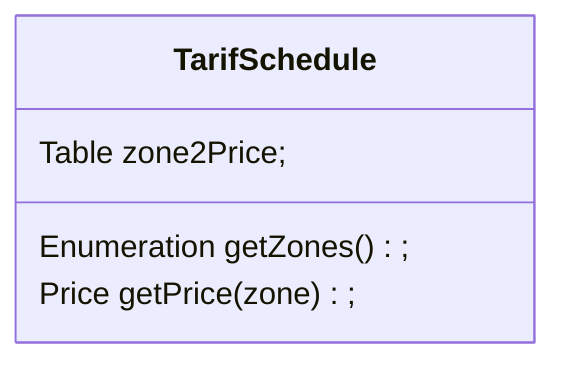
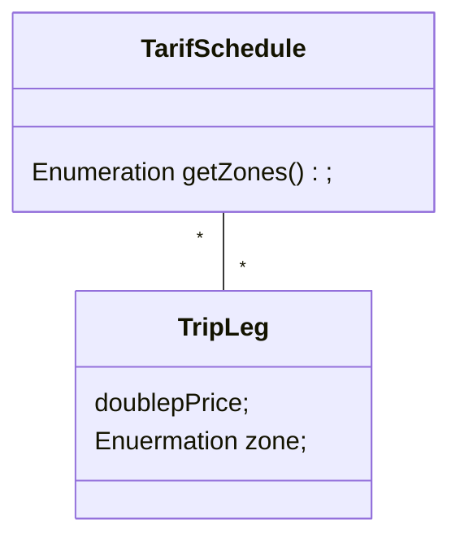
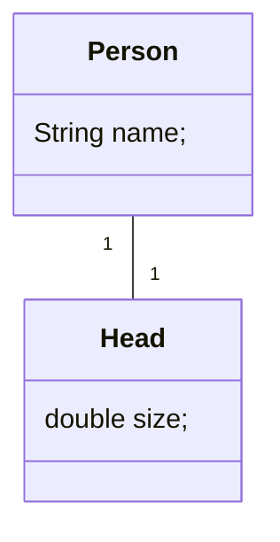
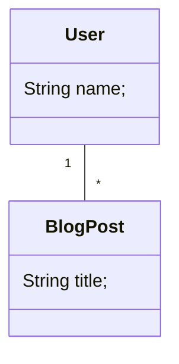
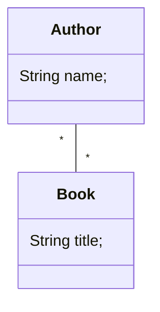
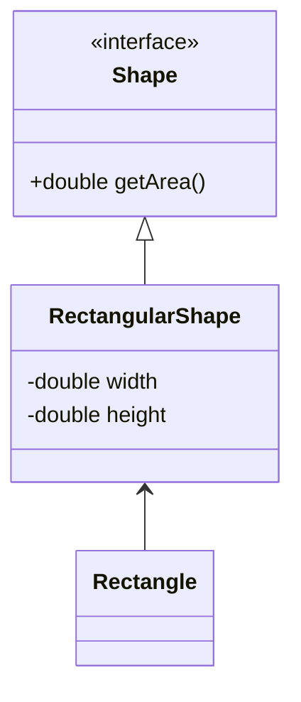
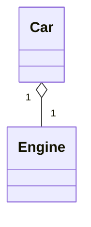
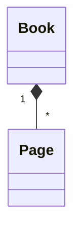
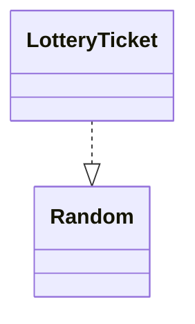

# Requirements Analysis

# Requirements Analysis vs Requirements Elicitation

-   Requirements elicitation
    -   Purpose: Finding out what customers want
    -   Output: A description of the system in terms of actors and use cases
-   Requirements analysis
    -   Purpose: Produce a system model that is correct, complete, consistent, unambiguous based on use cases
    -   Output: conceptual model (system structure) + dynamic model (system behavior)

# Formalising Requirements with Analysis Models

-   Clarifies structural and dynamic aspects of systems to be built
-   Validates requirements
-   Underpins solution modelling

# Requirement Analysis Goals

-   Conceptual model (Structural aspect)
    -   Analyse use cases to identify objects/roles of objects involved in the system
-   Dynamic model (Dynamic aspect)
    -   Determine how to fulfil the processes defined in the use cases, and which objects do these processes

## Conceptual Model

-   Object: Anything that has a state, and exhibits behaviors
    -   E.g. Bus, Dog, Person
    -   LoginForm, UserVerifier, UserList
-   Operations: Procedures through which objects use to communicate amongst themselves
    -   E.g. Bus goes forward, Dogs bark/growl
    -   LoginForm: submit, UserVerifier: autheticate, UserList: search user
-   Attributes: Variables that hold state information
    -   E.g. Bus: Color, Dog: Name

### Conceptual Model in Class Diagram

-   Document and visualise conceptual model in class diagram
    -   Object -> Class
    -   Roles (Attributes and operations) of object -> attributes and methods of a class

### Class Diagram

-   Represents the structure of the system
-   Classes define responsibilities for performing various activities
-   Used during:
    -   Requirement analysis: Modelling application domain concepts
    -   System design: Modelling subsystems
    -   Object design: Specifying detailed behavior and attribute of the object

### Classes



-   `TarifSchedule` - Name of the class
-   `Table zone2Price` - Attribute(s) of the class
-   `Enumeration getZones()` - Method(s) signature(s) of the class

A class represents a concept. A class encapsulates states and behaviors

-   Each attribute has a type
-   Each operation has a signature

### Associations



-   Associations denote relationships between classes
-   The multiplicity of an association end denotes how many objects the instance of a class can legitimately reference
-   Multiplicity is either
    -   A number (1)
    -   A range of numbers (1..6)
    -   A large unspecified number (\*)

One-to-one association

-   Each person can have 1 head
-   Each head can have 1 person



One-to-many association

-   Each author can have many blogPosts
-   Each blogPost can only have 1 author



Many-to-many relationship

-   Each author can have multiple books
-   Each book can have multiple authors



### Class Relationships


-   Generalisation: An inheritance relationship
    -   Inheritance between classes
    -   Implementation of an interface
-   Association: A usage relationship
    -   Dependency
    -   Aggregation
    -   Composition

#### Generalisation

-   Hierarchies drawn top down with arrows pointing up to parents
-   Line/arrow styles differ based on whether is a
    -   Class (Solid line, black arrow)
    -   Abstract class (Solid line, white arrow)
    -   Interface (Dashed line, white arrow)
-   We sometimes omit trivial relationships (E.g., all classes in java inherit from the `Object` class)



#### Aggregation

-   "is part of"
-   Symbolised by white diamond



#### Composition

-   "is entirely made out of"
-   Stronger version of aggregation
-   The parts live and die as a whole
-   Symbolised by black diamond



#### Dependency

-   "uses temporarily"
-   symbolised by dotted line
-   Often an implementation detail, and not part of that object's intrinsic state



### Requirements Analysis

1. Identify classes (Use case model -> Class diagram)
2. Identify attributes for each class
3. Find methods/operations for each class
4. Find association between classes

### Identification of Initial Objects/Classes

Look for

1. Recurring words/concepts in use cases
2. Real-world entities the system must track
3. Application domain terms in data dictionary

Review definition and attributes with stakeholders

### Stereotypes of Classes


Boundary class

-   Interface between system and actor (e.g. a user and an external device)
-   E.g. windows, screens, menus

Control class

-   Objects that mediate between boundaries and entities
-   Serve as the glue between boundaries and entities
-   Implements the logic required to manage various elements and their interactions

Entity class

-   Objects representing system data, often from the domain model
-   Information tracked by system

### Types of Entity Classes

-   Things remembered, or data that persists
    -   UserInfo, Event, Course, Book
-   Organisational units
    -   Company, Tutorial Group
-   Structures
    -   Orderlist

## Dynamic Model

-   Determine how to fulfill processes defined in use cases, and which objects do these processes

### Document and Visualize Dynamic Models

We can document and visualise dynamic models with the following types of diagrams

-   Sequence diagram
-   Communication diagram
-   State machine
-   Activity diagram

### Sequence Diagrams and Communication Diagrams

Captures how a group of objects (in a class diagram) interact or collaborate to achieve an activity described in a use case. These diagrams usually capture the dynamics of a single scenario and the sequence of messages that are passed between the objects and the sequence of events that happen during the scenario

Both diagrams essentially show the same information, however

-   Sequence diagrams emphasise the sequence and timings of calls and messages between objects
-   Communication diagrams emphasise the communication links between the objects
-   Use cases are too wordy or hard to read
-   Class diagrams lose information on timings of calls

However, sequence diagrams are not so good at precise definitions of behaviors

-   Use state diagrams for single objects in many use cases
-   Use activity diagrams for many use cases and many threads

### Sequence Diagram


-   Captures how a group of objects interact or collaborate to achieve a use case scenario
-   Usually captures the dynamics of a single use case that are passed between objects
-   Emphasises the time ordering of the messages

A sequence diagram is used during requirements analysis

-   To refine use case descriptions
-   Find additional/missing objects

1. Objects are represented by rectangles
2. Messages are represented by arrows
3. Activations are represented by narrow bars
4. Lifelines are represented by dashed lines

Sequence diagrams can refer to other sequence diagrams


Sequence diagrams can have if-else blocks (alt)


Sequence diagrams can have loops, that loop until condition is false


# State Machine Diagram

Also known as statecharts, or finite state automata. State machine diagrams model a system or an object based on the "states" it can be in.

A state is a stable condition of a system that can exist for a period of time, or for all time, until some action drives teh system into another state

Most systems have a finite number of states in which it can be depending on the previous state and actions which move it into another state

-   For example, a 2-bit binary counter has 4 states and moves from one state to the next when a clock signal drives it to the next state

In UML, a state is represented as a rectangle with rounded corners witha name at the top and optionally a description of the state and/or actions and activities performed while in that state


A state machine diagram begins with a **start node** followed by a series of states connected by transitions and finally an end node (unless the system is in an infinite loop and there is no end node)

A transition from one state to the next is assumed to be instantaneous in response to an event. A transition can have optionally:

-   Event: Event that triggers the transition
-   Guard: The condition which must be true to take the transition
-   Action: Action to do during the transition

```
[*]--> State1 -- event(arguments)[guard]/action --> State2 --> []
```

# Dialog Map: State Machine Diagrams in Prototyping

Prototyping is a technique to reduce the risk of building the wrong product, or of building the right product badly

Using a state machine diagram and a prototype, users can experiment with navgigation options and preview the functionality available at each screen to assess the look and feel of the system

Many user interfaces can be thought of as finite state machines, with only one dispaly screen or window active at a time (state) and defined conditions for moving from one state to another (a transition)

Such diagrams are sometimes called dialog maps

-   The dialog map helps us find missing/incorrect navigation pathways early, when they are cheap to fix
-   The dialog map allows us to spot opportunities for reuse and redundancies in the user interface, without worrying about the details of screen design prematurely


# Activity Diagram

An activity diagram is a behavioral diagram that depicts the behavior of a system. It goes through all the control flow from a start point to a finish point, showing the various decision paths that exist while the activity is being executed

-   Activities are the execution of one or more basic operations, represented by a rounded rectangle
-   Control flow between activities are represented by an arrow
-   A fork occurs when control flow has one input and 2 or more outputs (go to concurrent activities)
-   Joins are when 2 or more control flows come together into a single control flow
-   Decision boxes (branches) are when control flow can go in one of several directions, depending on a condition. They are represented by a diamond

# Differences between State Machine Diagram and Activity Diagrams

Activity diagrams are used as a flow chart of activities performed by the system. They describe the workflow behavior of the system in terms of activities

However, a state machine diagram models a system or an object based on the states it can be in

# Software Requirement Specification (SRS)

The SRS is a document that describes what the software will do, and how it will be expected to perform. It also describes the functionality the product needs to fulfill all stakeholders (business and user) needs

-   Each organisation will have its own template for an SRS
-   There is key content that must be addressed in an SRS
-   There is an IEEE standard ([830-1998 - IEEE Recommended Practice for Software Requirement Specification](https://ieeexplore.ieee.org/document/720574))

## How and Who should write the SRS?

-   It should be written in natural language, in an unambiguous manner that may also include diagrams if necessary
-   At the same time the detailed functional and non-functional requirements need to be defined and understood by the development team first
-   Development team members (both programmers and managers) are seldom the best writers of formal documents. However, they often have to write it
-   It is good practice to involve a technical writer with the development team in the drafting of the SRS, because they are usually better at assessing and planning documentation projects, and better meet customer document needs

## Contents of the SRS

1. Product description
    1. Purpose of system (mission statement)
    2. Scope of the system
    3. Users and stakeholders
    4. Assumptions and constraints
2. Functional requirements
3. Non-functional requirements
4. Interface requirements
    1. User
    2. Hardware
    3. Software
5. Data dictionary


# Resources

-   https://stackoverflow.com/questions/683825/in-uml-class-diagrams-what-are-boundary-classes-control-classes-and-entity-cl
