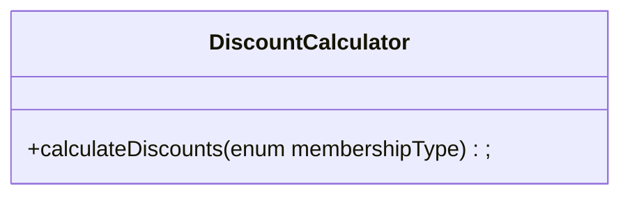
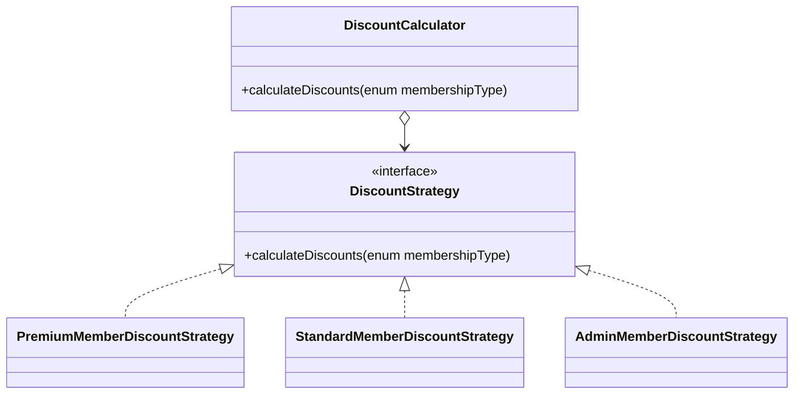
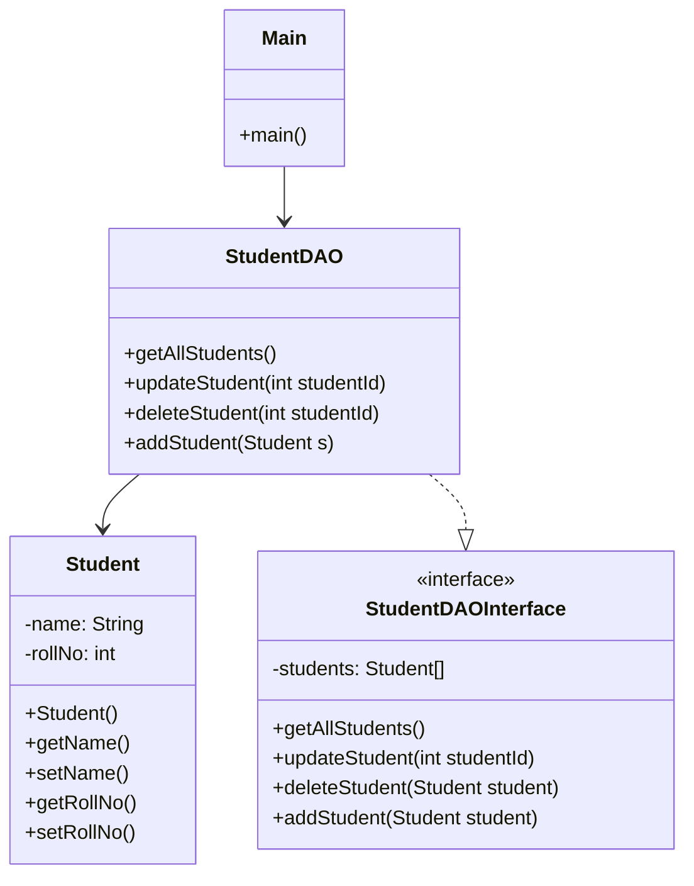

# Software Architecture, Strategy Pattern, Data Access Object Pattern

# What is Software Architecture

> The software architecture of a system is the set of strcutures (models) needed to reason about the system, which comprises software elements, relations among them, and properties of both

Software architecture is a subset of software design. Software architecture aims to design failure-proof systems by considering all possible avenues of failure.

However being able to fully understand an entire software system is too difficult. Hence, we simplify the understanding by building an architectural model.

Ask yourself what are the **most likely area of failures**? And design around **mitigating those failures**

Architectural details can be traced back to failure risks. These details aim to mitigate/avoid failures. We exclude **design details** that are **irrelevant to the risks that we identified**, and include **architectural details** which are essential to **understand our system's success**

# N-Tier Architecture

N-tier architecture is when your system/applications is divided in to n tiers.

Most commonly, systems are split into 3 layers

1. Presentation layer (what the user sees)
2. Application layer (business logic)
3. Data layer (stores application data)

## Advantages of N-Tier Architecure

1. Better security

N-tier architecture allows you to apply different levels of security to each tier. Since each tier is kept separate, it becomes easy to change each layer. For example, the data and application layer may require more security than the presentation layer, since they hold more sensitive information

2. Scales well

N-tier architecture allows you to scale each tier individually, without affecting the other layers. For example, your company can expand the data layer through database sharding etc., without having to change the other layers

3. Simple maintenance

Different people can manage different layers, without having to interact with the other tiers that they may not understand about. For example, the front-end developer can develop and maintain the presentation layer, but you would not want them to accidentally break the data/application layer

4. Easily enhanced

Each layer can be enhanced individually without having to touch the other layers. For example, adding additional databases when the company expands, or adding new business rules to the application layer as the business requirements evolve.

# Strategy Design Pattern

Strategy is a behavioral design pattern that lets you define a family of algorithms, put each of them into a separate class, and make their objects interchangeable.

## Example Problem

You are developing an e-commerce system, and you are in charge of calculating discounts.

Initially, on the there are only 2 types of customer: Standard and Premium customers. Each customer has its own way of calculating discounts.

However as the app grows, there are more types of customers, and this makes adding to the `calculateDiscounts` method a lot harder. Everytime a change had to be made, the whole class is affected, and merge conflicts are very common as well



## Solution

We extract each specific way to calculate discount into its own class/method, called a **strategy**

The original class, called a **context** must have a field that stores a reference to each of the strategies.



`DiscountCalculator` contains a reference to `DiscountStrategy` interface, and each strategy (`PremiumMemberDiscountStrategy`, `StandardMemberDiscountStrategy` and `AdminMemberDiscountStrategy`) all implement `DiscountStrategy`.

## Real World Analogy

Imagine you have to get from your house to the airport. You can go there by taxi, bus or motorcycle. These are the transportation strategies, and you can pick a specific strategy based on your constraints/requirements

## Pseudocode

```java
// The strategy interface declares operations common to all
// supported versions of some algorithm. The context uses this
// interface to call the algorithm defined by the concrete
// strategies.
interface Strategy {
    double execute(double a, double b);
}

// Concrete strategies implement the algorithm while following
// the base strategy interface. The interface makes them
// interchangeable in the context.
class ConcreteStrategyAdd implements Strategy {
    double execute(double a, double b) {
        return a + b;
    }
}

class ConcreteStrategySubtract implements Strategy {
    double execute(double a, double b) {
        return a - b;
    }
}

class ConcreteStrategyMultiply implements Strategy {
    double execute(double a, double b) {
        return a * b;
    }
}
// The context defines the interface of interest to clients.
class Context {
    // The context maintains a reference to one of the strategy
    // objects. The context doesn't know the concrete class of a
    // strategy. It should work with all strategies via the
    // strategy interface.
    private Strategy strategy;

    // Usually the context accepts a strategy through the
    // constructor, and also provides a setter so that the
    // strategy can be switched at runtime.
    void setStrategy(Strategy strategy) {
        this.strategy = strategy;
    }

    // The context delegates some work to the strategy object
    // instead of implementing multiple versions of the
    // algorithm on its own.
    double executeStrategy(double a, double b) {
        return strategy.execute(a, b);
    }
}

// The client code picks a concrete strategy and passes it to
// the context. The client should be aware of the differences
// between strategies in order to make the right choice.
class ExampleApplication {
    public static void main(String[] args) {
        Context c = new Context();

        double a = getDoubleFromUser();
        double b = getDoubleFromUser();

        String choice = getUserChoice();

        if (action == addition) then
            context.setStrategy(new ConcreteStrategyAdd());

        if (action == subtraction) then
            context.setStrategy(new ConcreteStrategySubtract());

        if (action == multiplication) then
            context.setStrategy(new ConcreteStrategyMultiply());

        double result = context.executeStrategy(a, b);

        System.out.println(result);
    }
}
```

## How to Implement Strategy

1. In the context class, identify the algorithm that keeps changing. It may also be a massive conditional that executes a specific variant of the same algorithm at runtime
2. Declare the strategy common to all variants of the algorithm
3. One by one, extract each algorithm into their own classes, which should implement the strategy interface
4. In the context class, create a field that stores a reference to the strategy object. Provide a setter for replacing the value of that field. The context should work with the strategy object only via the strategy interface. The context may define an interface which lets the strategy access its data
5. Clients of the context must associate it with a suitable strategy that matches the way they expect the context to perform the job

## When to Use Strategy

-   You want to use different variants of an algorithm within an object, and be able to switch from one algorithm to another during runtime
    -   Indirectly alter an object's behavior at runtime by associating it with different sub-objects that perform specific sub tasjs
-   You have a lot of similar classes that only differ in the way they execute some behavior
    -   Strategy allows you to extract the varying behavior into a separate class hierarchy, and combine the original classes into 1, reducing code duplication
-   You want to isolate the business logic of the class from the implementation details of the algorithm, which may not be important in the context of that logic
    -   Strategy allows you to isolate the code, internal data and dependencies of various algorithms from the rest of the code. Clients get a simple interface to execute the algorithm, and the algorithms switch at runtime
-   You have a massive conditional statement that switches between different variants of the same algorithm
    -   Strategy pattern helps to extract each algorithm into separate classes which all implement the same interface. The original object will then delegate execution to one of those strategies, instead of implementing all variants of the algorithm

## Pros and Cons

### Pros

-   Can swap algorithms with each other during runtime
-   Isolate implementation details of the algorithm from the code that uses it
-   Can replace inheritance with composition
-   Can introduce new strategies without having the change the context (open/closed principle)

### Cons

-   If you only have a few algorithms that do not change frequently, strategy pattern will only overcomplicate things
-   Clients must be aware of the different strategies, and how to select a proper one

# Data Access Object

The Data Access Object (DAO) is used to separate low-level data-accessing APIs from high-level business services. It is basically an object or an interface that provides access to an underlying database or any other persistence storage.

The DAO requires 3 entities

1. Data access object interface: Defines the standard operations to be performed on the model object
2. Data access object concrete class: Implements the above interface. Responsible for getting data from data source (such as API or database)
3. Model Object or Value Object: A simple object containing get/set methods to store data retrieved from DAO Class

## Implementation



## Code

```java
public class Student {
   private String name;
   private int rollNo;

   Student(String name, int rollNo){
      this.name = name;
      this.rollNo = rollNo;
   }

   public String getName() {
      return name;
   }

   public void setName(String name) {
      this.name = name;
   }

   public int getRollNo() {
      return rollNo;
   }

   public void setRollNo(int rollNo) {
      this.rollNo = rollNo;
   }
}

public interface StudentDAOInterface {
   public List<Student> getAllStudents();
   public Student getStudent(int rollNo);
   public void updateStudent(Student student);
   public void deleteStudent(Student student);
}

public class StudentDAO implements StudentDAOInterface {

   //list is working as a database
   List<Student> students;

   public StudentDAO(){
      students = new ArrayList<Student>();
      Student student1 = new Student("Robert",0);
      Student student2 = new Student("John",1);
      students.add(student1);
      students.add(student2);
   }
   @Override
   public void deleteStudent(Student student) {
      students.remove(student.getRollNo());
      System.out.println("Student: Roll No " + student.getRollNo() + ", deleted from database");
   }

   //retrive list of students from the database
   @Override
   public List<Student> getAllStudents() {
      return students;
   }

   @Override
   public Student getStudent(int rollNo) {
      return students.get(rollNo);
   }

   @Override
   public void updateStudent(Student student) {
      students.get(student.getRollNo()).setName(student.getName());
      System.out.println("Student: Roll No " + student.getRollNo() + ", updated in the database");
   }
}

public class Main {
   public static void main(String[] args) {
      StudentDao studentDao = new StudentDaoImpl();

      //print all students
      for (Student student : studentDao.getAllStudents()) {
         System.out.println("Student: [RollNo : " + student.getRollNo() + ", Name : " + student.getName() + " ]");
      }


      //update student
      Student student =studentDao.getAllStudents().get(0);
      student.setName("Michael");
      studentDao.updateStudent(student);

      //get the student
      studentDao.getStudent(0);
      System.out.println("Student: [RollNo : " + student.getRollNo() + ", Name : " + student.getName() + " ]");
   }
}
```

# Resources

-   https://www.youtube.com/watch?v=Rn1g6V-vlHw
-   https://www.youtube.com/watch?v=KlHvRKSH4pk
-   https://www.youtube.com/watch?v=-NCgRD9-C6o
-   https://refactoring.guru/design-patterns/strategy
-   https://en.wikipedia.org/wiki/Strategy_pattern
-   https://stackoverflow.com/questions/19154202/data-access-object-dao-in-java
