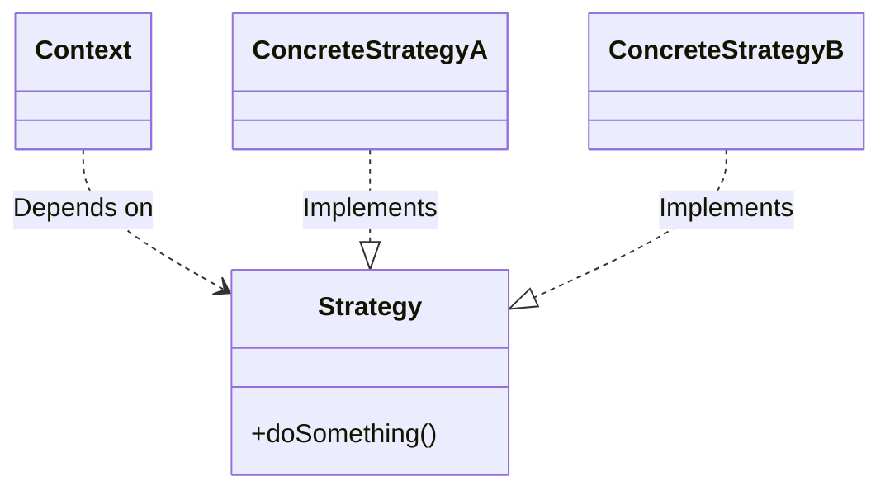
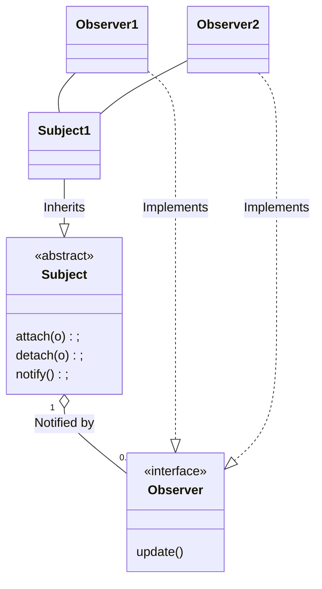
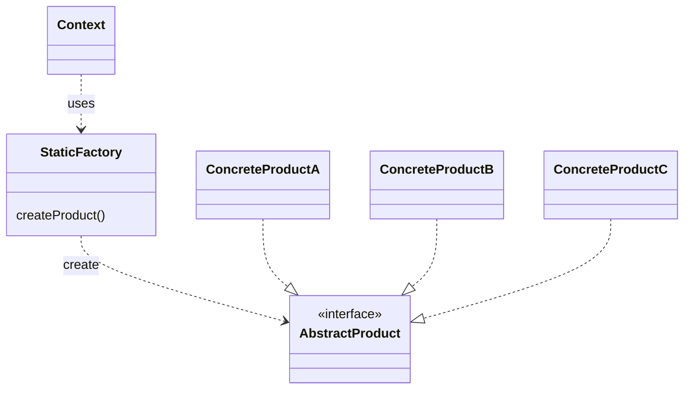
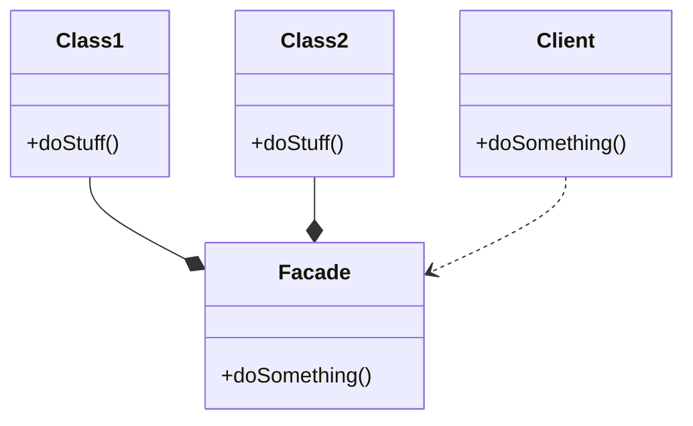

# Object Design

- Interface specification: Operations, arguments, types, signatures and exceptions
- Reuse existing libraries and design patterns
- Restructuring to meet design goal maintainability and flexibility
- Optimisation: Speed and memory

# What is a Design Pattern

- A proven solution to a problem in context
- Abstracts a recurring design structure
- A template with classes and/or object
  - Dependencies
  - Structures
  - Interactions
  - Convention

## Elements of Design Pattern

- Name
  - Describes the pattern
  - Adds to common terminology for facilitating communication (i.e. not just sentence enhancers)
- Problem
  - Describes where to apply the pattern
  - Answers: What is the pattern trying to solve?
- Solution
  - Describes elements, relationship, responsibilities and collaborations which make up the design
- Consequences
  - Results of applying the pattern
  - Benefits and costs
  - Subjective depending on concrete scenarios

## Gang of Four (GoF) Patterns

Creational patterns

- Abstract factory
- Builder
- Factory method
- Prototype
- Singleton

Structural patterns

- Adapter
- Bridge
- Composite
- Decorator
- Facade
- Flyweight
- Proxy

Behavioural patterns

- Chain of responsibility
- Command
- Intepreter
- Iterator
- Mediator
- Memento
- Observer
- State
- Strategy
- Template method
- Visitor

## Strategy Pattern

Design problem: A set of algorithms or objects should be interchangeable

Solution: Strategy Pattern



Pros

- Provides encapsulation
- Hides implementation
- Allows behavior change at runtime

Cons

- Results in complex, hard to understand code if overly used

## Observer Pattern

Design problem: Defines a one-to-many dependency between objects so that when one object changes state (subject), all of its dependents (observers) are notified and updated automatically

Solution: Subscriber-Publisher pattern, or Consumer-Producer pattern



- Subscription mechanism
  - Observers freely register/unregister their interests in the subject
- Notification mechanism
  - Subject propagates change to observers when an update in the subject occurs
- Subject does not know or care about who is observing it. All the subject needs to do is to notify all of its observers when it updates
- Observer only needs to update when the subject changes, rather than constantly polling for changes on the subject
- Loose coupling between event source (subject) and its dependent event handlers (observers)

### Update Protocol: Push vs Pull

Pull update

- Subject sends simple notification using `Observer.update()`
- Observer calls back `Subject.getData()` for details explicitly (if observer is interested) - 2 way communication

Push update

- Subject sends detailed information about the change (or update), whether Observer wants it (interested) or not - Observer does not need to call back - One-way communication

### Advantages and Disadvantages

Advantages

- Abstracts coupling between subject and observer
- Supports broadcast communication
- Enables reusability of subjects and observers independently of each other

Disadvantages

- Slower performance
- If not used carefully, unnecessary complexity is introduced

## Factory Pattern

- When you have a set of classes but do not know which specific class you need to instantiate until runtime
- When you create one of several classes that implement a common superclass without exposing the creation logic to the client
- When you want to localise the logic of instantiating objects

Design problem: Decouple class selection and object creation (abstraction instantiation process) from the client where the object is used allowing greater flexibility in object creation

- Existing subclasses that can be replaced, or new subclasses can be added
- Process of selecting subclasses to use and creating objects can be complex

Solution: Factory pattern defines an interface for creating different objects without knowing what sort of objects it needs to create, or how the object is supposed to be created. Factory pattern lets the subclasses decide which class to instantiate



- `Context` uses `StaticFactory` to obtain an object that implements the `AbstractProduct` interface

### Advantages and Disadvantages

Advantages

- Encapsulate object creation
  - Remove duplicate object creation code from clients
  - Centralise class selection and object creation code
- Easy to extend, replace, or add new subclasses
  - Replace `MySQLImpl1` with `MySQLImpl2`
  - Support new `OracleImpl`
- Easy to change object creation logic
  - Support Singleton object
  - Support lazy initialisation

## Facade

Provides a unified interface to a set of interfaces in a subsystem. Facades define a higher level interface that make the subsystem easier to use

- Identify aspects of the application that vary, and those that stay the same
- Program to an interface, not an implementation
- Favor composition over inheritance
- Strive for loosely coupled designs between objects that interact
- Classes should be open for extension, but closed for modification
- Principle of least knowledge: Talk only to your immediate friends



Inside `doSomething` of `Facade`:

```
void doSomething() {
    Class1 c1 = new Class1();
    Class2 c2 = new Class2();
    c1.doSomething();
    c2.doSomething();
}
```

For example, consider a computer with a `CPU`, `HardDrive` and `Memory`. We as the client are required to initialise all 3 to use the computer

```java
class NonFacadeExample {
    public static void main(String[] args) {
        CPU cpu = new CPU();
        HardDrive hdd = new HardDrive();
        Memory mem = new Memory();

        // use all the above
    }
}
```

With a facade, we hide these details, and the client just has to call a single method

```java
class Computer {
    // this is the facade
    public void start() {
        CPU cpu = new CPU();
        HardDrive hdd = new HardDrive();
        Memory mem = new Memory();

        // use all the above
    }
}

class Client {
    public static void main(String[] args) {
        Computer c = new Computer();
        c.start();
    }
}
```

### Advantages and Disadvantages

Advantages

- Makes code easier to use and understand
- Reduces dependencies on classes
- Decouples a client from a complex system

Disadvantages

- Results in more rework required if facade is not properly designed
- Increases complexity and decreases runtime performance for large number of facade classes
