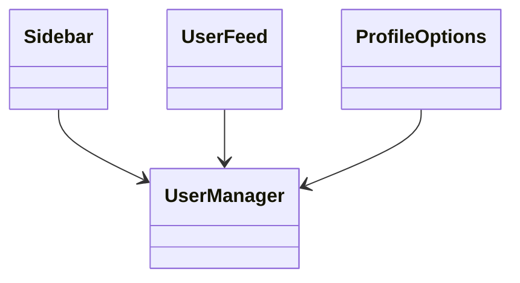
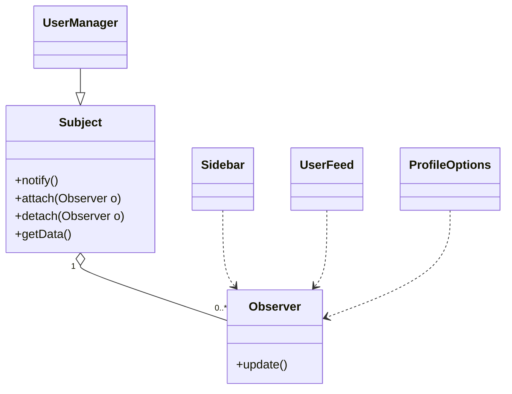
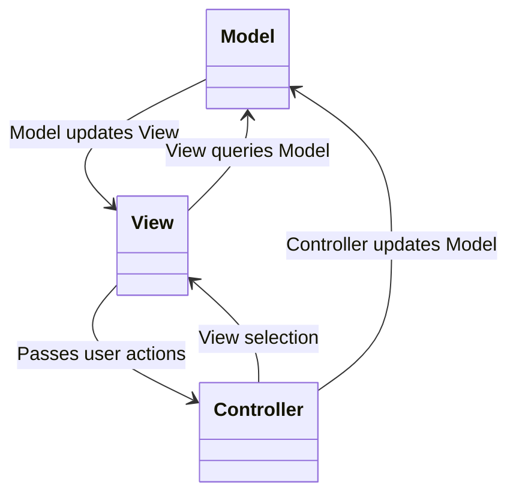

# Model View Controller

# Interactive Design Driven Systems

-   UIs change more frequently than business logic
    -   Different ways to present
    -   Different screens to present on
-   Hence UIs should not be tightly coupled to business logic

Consider the following class diagram



`UserManager` has a `Sidebar`, `UserFeed` and `ProfileOptions`. And since all these UI components change very frequently, it means that `UserManager` has to change frequently as well, which is bad.

We need a way to update the UI when the data changes, not have the data depend on the UI.

# Requirements

-   Loose coupling between the data (subject) and the different UI (observers)
    -   Data should notify UI to update when data changes
    -   Views do not know when the data updates, however they should change immediately when the data changes

We can use the observer pattern between the UI components and the `UserManager`. The UI observes the `UserManager` for updates. And whenever the state in `UserManager` changes, it notifies all the subscribers to update accordingly.



Inside the `notify` method for the `Subject`, we want to make sure we notify all observers, hence

```java
void notify() {
    for (Observer o : this.observers) {
        o.update();
    }
}
```

From this, we can see that in layered architectures, there are many occurrences of layers having to communicate with each other (dependencies). By applying design patters between layers (for e.g., observer pattern between the presentation and application layer), we are able to decouple each layer from each other.

Note that just applying a single design pattern may not solve all problems, we must be able to apply multiple design patterns to solve each problem.

# Model-View-Controller Architecture

The main goal of MVC is to facilitate and optimise the implementation of interactive systems. The key idea is

-   The separation of the **model**, **view** and **controller** components allow **multiple views of the same model**
-   The user interacts with the view, which will use the controller to update the model. When the model updates, all the other views will update based on the changes made to the model
-   It **separates the UI from the core data model**
    -   Need to support multiple different UIs
    -   UIs change frequently
    -   Easier to add new interfaces

> MVC describes the separation of UI from the core data model

## Components of MVC

### Model

-   Contains the processing (operations) and the data involved
-   Is updated solely by the `Controller`

### View

-   Presents the output based on the `Model`
-   Defines and manages how data is presented
-   When the data model changes, all the views related to that model will be updated as well

### Controller

-   Manages user interaction
-   Captures user events (e.g. clicks, keyboard presses etc.) and passes these events to the `View` and `Model`
-   Each `View` is associated to a controller that captures and processes user input, and modifies the `Model`
-   User interacts solely with the controller



-   MVC architecture is non-hierarchical
    -   `View` subscribes to changes of the `Model`
    -   `Controller` gathers inputs from the user, and updates `Model`
    -   `Model` updates the changes, and notifies all subscribed `Views` to update themselves
    -   `View` is notified and updates themselves; The user sees the change

## Observer-Strategy Pattern in MVC

Observer pattern between `View` and `Model`

-   `Model` uses Observer pattern to keep `View` updated
-   When `Model` (subject) is changed, it notifies all the subscribed `View`s (Observer)
-   This allows multiple `View`s of the same `Model`

Strategy pattern between `View` and `Controller`

-   `View` is concerned with the visual aspects of the system, while `Controller` is concerned with the interface behaviors
-   The `View` (Context) uses the `Controller` (Strategy interface) to implement a specific type of response. Each `Controller` can be replaced to allow a `View` to respond differently to user input

## Pros and Cons of MVC

Pros

-   Simultaneous development of M, V or C
-   Multiple views for a single model
-   High cohesion - MVC enables logical grouping of related actions on the same controller. Views for a specific model are also grouped together
-   Low coupling amongst M, V and C

Cons

-   Code navigatibility and pronounced learning curve
    -   Introduces new layers of abstraction that requires users to adapt to the decomposition criteria of MVC
-   Multi-artifact consistency
    -   Decomposing a feature into 3 artifacts causes scattering. Requires developers to manage consistency between multiple representations at once

Examples of MVCs include

-   Django
-   Rails
