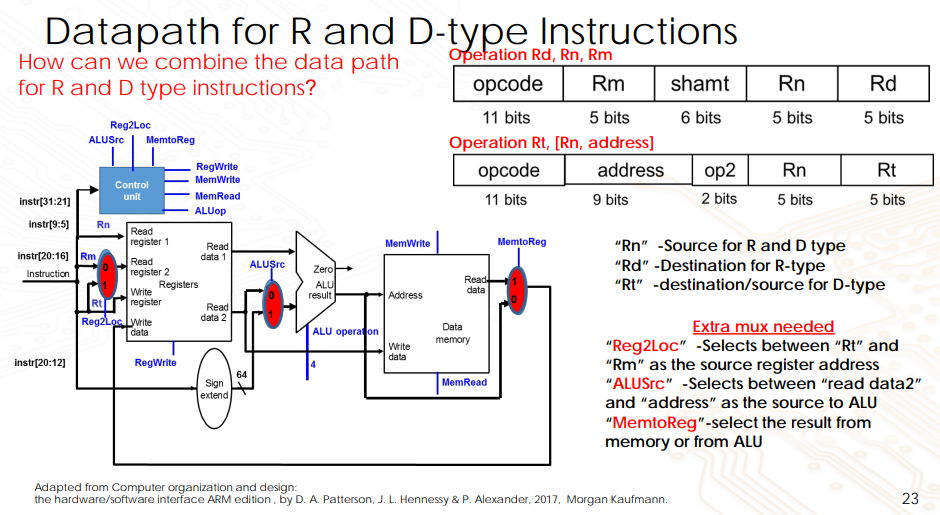
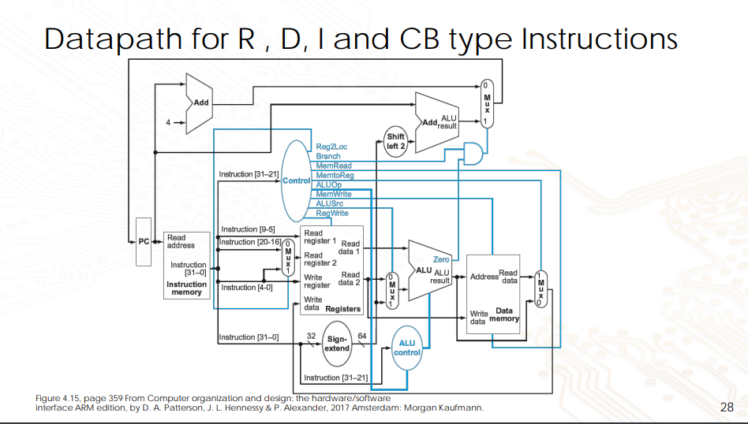
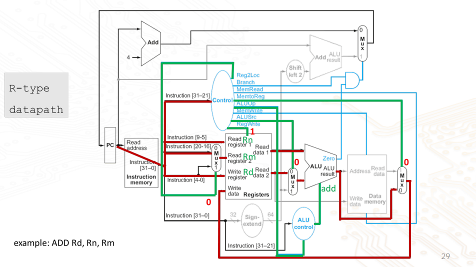
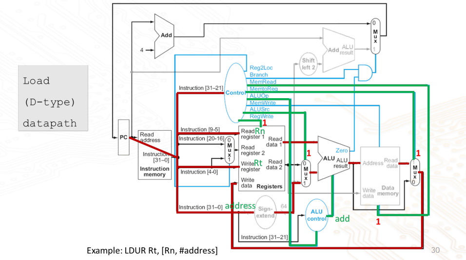
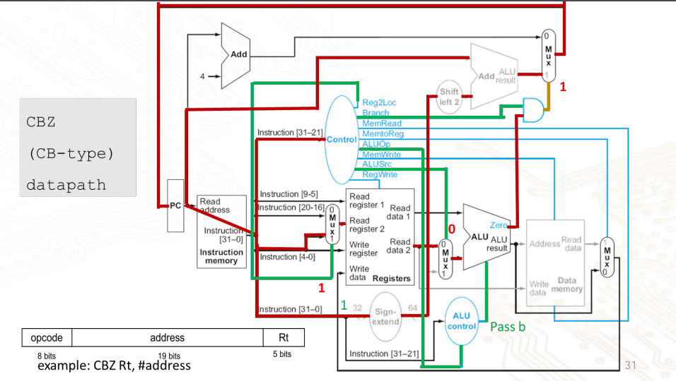
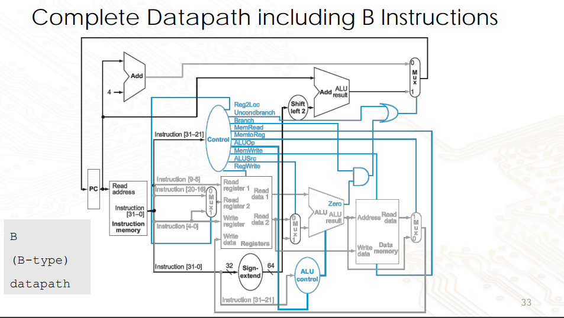

# Data Path and Control Design

# Basic Datapath Components

Arithmetic and Logic Unit (ALU)

- ALU is the CPU's data processing or execution unit implements fixed point operations
- Floating point and complex numerical function are performed by arithmetic co-processors
- Typical arithmetic functions: Add, subtract, multiply divide
- Logic function: AND, OR, XOR, NOT
- Other data manipulation functions: Arithmetic and logical shift, incrementing and decrementing operands etc.

## ALU

- $n$-bit ALU can be made by placing $n$-1-bit ALU slices parallel
- The function select (F0, ..., Fn) for each 1-bit ALU is driven by instruction being executed

## Register File


- A register file is a collection of registers in which any register can be read or written by specifying the address. They form temporary storage inside the CPU
- General Purpose Register (GPR)
  - Contains 32 64-bit registers
  - Contains 2 read ports and 1 write port
- Basic Building blocks
  - Two 32:1 Multiplexer
  - One 5 to 32 Decoder
  - Register using Flipflop
- Register is written to by supplying a register number to the decoder
- Register is read from by supplying a register number to the multiplexer

### Building Blocks of Register File

Multiplexer:

- 32:1 MUX in MIPS register file
- Selects 1 input out of the 32 input lines to use
- Each 1 out of the 32 input lines corresponds to 1 register

Decoder:

- 5:32 decoder
- Converts a 5 bit input into a 32 bit output
- 5 bits because we have 32 registers, and a 32 bit output for **one-hot encoding** of the registers (One line in the 32 bit output is dedicated to 1 register)
- Output of decoder used with RegWrite (Register Write) signal of a register file, to write to the corresponding register file

Register:

- A register is made up of multiple D-flipflops, so that it can hold multi-bit information, such as bytes or words

### Write and Read Ports


Note that the output sizes are not the same

1. On the write port, there is a 5:32 decoder to choose a register to write to
2. On the read port, there are 2 32:1 multiplexers to choose which register to read from

### How the Register File Works

```
ADD X31, X1, X0
```

- Read address1: 00001 (X1)
- Read address2: 00000 (X0)
- Write address: 11111 (X31)

Let us assume the following values already in the register

- X0 = 0
- X1 = 5

Do note that writing only happens if `RegWrite = 1` (Or in the image given, `WriteEnb = 1`). We only want to write when allowed to, to prevent any data inconsistencies. Also note that writes only happen on the edge of a clock (D-flipflops are edge triggered). So if the registers are made using positive edge triggered D-flipflops, then the write occurs only at the positive edge of the clock

What happens when the same register is read and written to during the same clock cycle?

- The register read happens **combinationally** (no clock is required)
- The register will be valid during the time it is read)
- The value returned will be the value written in the earlier clock cycle (before the write)
- The write of the register file occurs **on the clock edge**
- If we want the read to return the value after being written - we need additional logic

# Introduction to Datapath: Instruction Fetch


The components in an instruction fetch

1. Instruction memory
   - Memory to store the instructions of the program and supply instructions given an address
   - Needs only a read access
   - Treated as a combinational logic (output at any time reflects the contents of the location specified by the address input)

- No read control signal is required

2. Program Counter (PC)
   - A register that holds the address of the current instruction
   - Register that is written to at the end of every clock cycle
   - Keeps track of which instruction is being executed in the program
3. Adder
   - Adds 4 to the program counter after every instruction, so that the program can proceed to the next instruction

The procedure to fetch an instruction

1. Fetch current instruction from instruction memory using program counter
2. Prepare for next instruction by incrementing PC by 4 to point to next instruction 4 bytes later (Remember that each instruction is 32 bits (4 bytes))

# Datapath for R type instructions (Register Addressing)

| Opcode  | Rm     | shamt  | Rn     | Rd     |
| ------- | ------ | ------ | ------ | ------ |
| 11 bits | 5 bits | 6 bits | 5 bits | 5 bits |


- R-type instructions: All data values are located in registers and addressing mode is **register addressing**
- The instruction is read from the instruction memory (Instruction fetch (IF))
- The source registers specified by `Rn` and `Rm` of the instruction are read from the register file, and fed to the ALU (Instruction Decode (ID))
- ALU performs the operation specified in the opcode (Execute (EXE))
- The result is stored in the destination register, specified by field `Rd` of the instruction (Write back (WB))
- PC is incremented by 4 and stored back into the PC

# Datapath for D type - Memory-related Instructions

| Opcode  | Address | Op2    | Rn     | Rt     |
| ------- | ------- | ------ | ------ | ------ |
| 11 bits | 9 bits  | 2 bits | 5 bits | 5 bits |

```
LDUR Rt, [Rn, #address]
```

1. Source register specified by `Rn` is read from register file, and fed to the ALU with `address` after sign-extension to 64-bits
2. ALU calculates the memory address of word to be loaded (EXE)
3. Content of memory at location specified by the calcualted address is read (MEM)
4. Word read from the memory is loaded to the register specified by address in `Rt` (WB)

```
STUR Rt, [Rn, #address]
```

1. `Rt` in this case contains the address of the register that has the value to be stored to (compared to `LDUR`, where `Rt` was used as the write address)
2. `Rt` is used as read address-2 for `STUR`
3. Source register specified by `Rn` is read from register file, and fed to ALU with the sign extended operand `address` to calculate the address of the memory location to read from
4. ALU calculates the address of the memory location where the data is stored (EXE)
5. Result is stored at the memory location whose address is calculated by ALU (MEM)

# Datapath for Both R- and D-type

R-type instruction format:

| Opcode  | Rm     | shamt  | Rn     | Rd     |
| ------- | ------ | ------ | ------ | ------ |
| 11 bits | 5 bits | 6 bits | 5 bits | 5 bits |

D-type instruction format:

| Opcode  | Address | Op2    | Rn     | Rt     |
| ------- | ------- | ------ | ------ | ------ |
| 11 bits | 9 bits  | 2 bits | 5 bits | 5 bits |



- `Rn`: Source for R and D type instructions
- `Rd`: Destination for R-type
- `Rt`: Destination/source for D-type

Extra multiplexers required to support both R- and D-type instructions at the same time

- `Reg2Loc`: Selects between `Rt` and `Rm` as the source register address
- `ALUSrc`: Selects between `read data2` and `address` as the source to the ALU
- `MemToReg`: Selects the result from the memory or the ALU

# Datapath for I-type Instructions (Immediate addressing)

- One data in immediate field
- Immediate addressing: Read from source register and immediate field, then write to target register

| Opcode  | Immediate | Rn     | Rd     |
| ------- | --------- | ------ | ------ |
| 10 bits | 12 bits   | 5 bits | 5 bits |

- Immediate field is 0 extended
- Opcode is reduced to 10 bits to have more range for immediate field
- E.g. `ADDI X1, X2, #50` ([X1] = [X2] + 50)

# Conditional Branch Instructions

| Opcode | Address | Rt     |
| ------ | ------- | ------ |
| 8 bits | 19 bits | 5 bits |


- Read register (`Rt`) operands
- Compare operands according to condition
  - For `CBZ` (Use ALU and check 0 output)
- Calculate target address
  - Sign-extend displacement for `address`
  - Shift left 2 places (word displacement)
    - Branch uses word-addressing (Address by each word), but memory uses byte-address (Address by each byte)
    - Each word is 32 bits (4 bytes), hence need to multiply `address` by 4, which is done by shifting left 2 places
    - PC = PC + (signExtend(address) << 2)

# Unconditional Branch Instructions

| Opcode | Address |
| ------ | ------- |
| 6 bits | 26 bits |

- Branch uses word address
  - 26-bit unconditional branch address
  - Left shift by 2 (or add "00" to LSB)
  - Add with PC
- Need an extra control signal decoded from opcode

# Complete Datapath

Datapath for R, D, I, CB instructions


Datapath for R-type instructions


Datapath for D-type instructions


Datapath for CB-type instructions


Complete datapath to allow unconditional branches as well


# Summary for Creating an Architecture

- Combine all into a single architecture
  - Use multiplexers with control signals
- 5 steps finishes in a single clock cycle
  1. Instruction Fetch
  2. Instruction Decode, Register Fetch
  3. Execution, Memory Address Computation, or Branch Completion
  4. Memory access or R-type Instruction Completion
  5. Write-back step
- Important constraints to consider
  - No functional unit can be used twice in 1 clock cycle
  - The clock period is decided by the slowest instruction

Performance issues of single-cycle architecture

- Longest delay determines clock period
  - Critical path: Load instruction
  - Instruction memory -> register file -> ALU -> data memory -> register file
- Not feasible to vary period for different instructions
- Violates design principle
  - Making the common case fast
- Improve performance by pipelining
