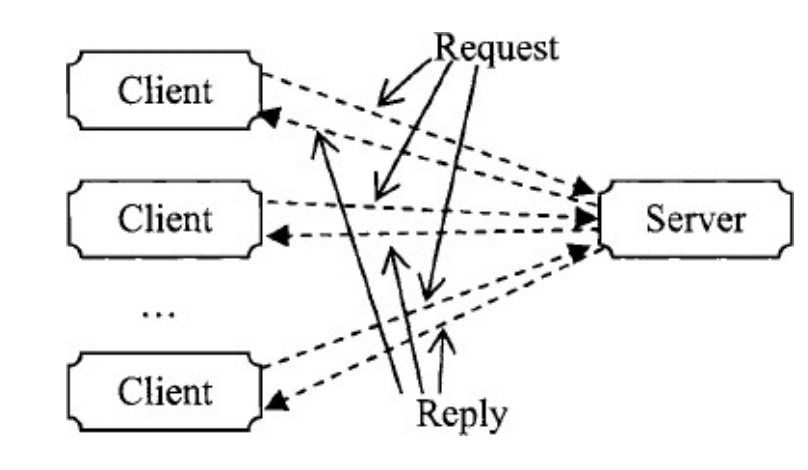

# Software Architecture and Styles

Software architecture is a description of high-level structure of a software system in terms of architectural elements and the interactions between them

Software architecture is made up of components and connectors

Components:
- A component is a unit of software that performs some function at runtime
- E.g. programs, objects, databases, clients, servers etc

Connectors:
- Connectors represent interactions between components
    - Communication, coordination or cooperation between components
- E.g. shared variable access, procedure calls, remote procedure calls, communication protocols, data streams, transaction streame etc.
- Implementations of connectors usually distributed among many system components, often do not correspond to discrete elements of the running systems

# Visual Representation of Components

- Square corner rectangles: Hardware components
- Rounder corner rectangles: Software components that are not active
- Rectangles with cut off corners: Software components that are active, i.e. runtime processes

## Active vs Passive Components

- Active components are represented by rectangle with cut off corners
- Active components have their own thread of control and execute autonomously
    - E.g. of active components: Filters, processes
- Passive components are represented by a rectangle with rounded corners
- Passive components only execute when invoked by an external execution thread
    - E.g. of passive components: Functions invoked by processes, files read by processes

## Executable Components

- Outline of component is solid
- A component has a control feature if it is **executable**
- E.g. Processes, Objects with methods are executable

## Stateful Component

- Outline of component is dotted
- A component has data feature if it stores data as its **internal state**
- Objects have their own internal state (variables), processes have their own internal state (global variables)

## Relationships Between Components

- A solid arrow represents control flow
- A dotted arrow represents data flow
- A solid + dotted arrow represents both control and data flow

### Control flow vs Data flow

- Control flows orchestrate workflows, they are process-oriented and help in processing data and executing tasks
- 2 components have a control flow if a component passes its thread of control to the other component and causes its execution
- Data flow is information oriented, groups data together based on logic and transforms the data into meaningful content. Data is extracted from the source and loaded into the destination later
- 2 components have a data flow if information is passed from one component to another

# Characteristics of Software Architecture

- Software architecture is abstract: Details about components and connectors are hidden
- Architecture is about structure
    - Focus on topology
    - Components
    - Data and control communication
- Architecture is purposeful
    - Demonstrates or analyse properties of interest
    - Design documentation, as transferable knowledge about software design, evaluation and so on

# Catalog of Software Architecture Styles

## Independent Component Architecture

- Components
    - Number of independent processes or objects
- Connectors
    - Communicate through messages
- Topology
    - No constraints

### Analysis of Independent Components

- Advantages
    - Modifiability by decoupling
    - Concurrent execution
    - Scalability
    - Easy integration
- Disadvantages
    - Components are independent
        - How to check if messages are received?
        - Complicated protocols to keep independent components fully independent from one another
    - Correctness is hard to achieve

### Example of Independent Components: Client and Server

- Components
    - 1 server, N clients
- Connectors
    - Communicate through messages
- Topology
    - Star
    - 