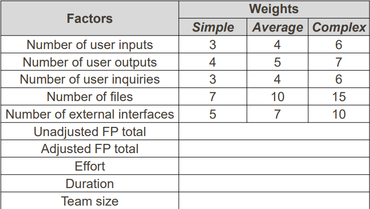
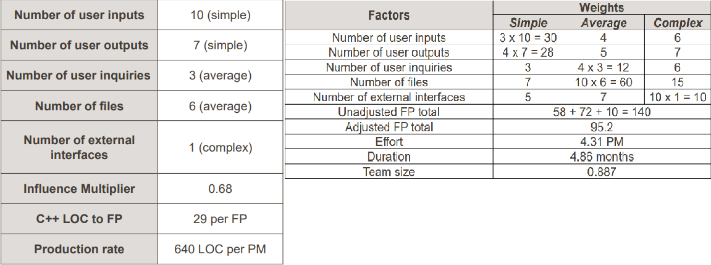

# Project Estimation (Function Points)

-   An analysis of a proposed (or active) project to produce a forecast of its effort, schedule, costs and resource requirements

# Problems of Estimation

-   Software estimation is difficult
-   Estimates are usually hurried
-   Estimates are based on many assumptions
-   Managers and developer are overly optimistic

# Steps in Creating a Project Estimate

1. Estimate the size of the product/system
2. Estimate the effort needed to create the system (e.g. person-months)
3. Estimate the duration required to complete the project (calendar time)
4. Estimate the required manpower
5. Estimate the costs
6. Estimate the phase schedule

## 1. Estimating Size

### Lines of Code

-   Define "Size" of the code
    -   Count physical or logical lines?
    -   Count blank lines or comment lines?
    -   Executable lines only? Or include data definitions?
    -   LOC (Lines of code), SLOC (Source lines of code), KLOC (kilo (thousands) lines of code), KSLOC (Kilo source lines of code), DSI (Delivered source instructions)

### Size by Function Points (FPs)

-   By analogy
-   Function point
    -   A unit of measurement to express the amount of business functionality an information system provides to the user
    -   Popularly used by software organisations
    -   FPs are easier to determine from a requirements spec. than LOC are
-   5 primary elements
    1. Inputs: Application-oriented data such as file names and menu selections
    2. Outputs: Transactional data output to the user (printed reports)
    3. Inquiries: Interactive inputs requiring a response (not update file)
    4. Logical files: Logical master files in the system
    5. Interfaces: Machine-readable interfaces to other systems

E.g., a system is being developed and has the following requirements

-   Login page/new user registration page
-   Data retrieval page
-   Print monthly report
-   Enquiry user history data from another archiving subsystem
-   Data update/delete page

From the requirements, we can find the 5 primary elements

1. Inputs: 2 (Registration, and update/delete)
2. Number of outputs: 1 (monthly report)
3. Number of inquiries: 2 (data retrieval, login)
4. Number of files: 3 (Registration, update/delete, login)
5. Number of external interfaces: 1 (Enquiry)

Adjusted FP Total

-   Influence factors that affect the complexdity of the code include
    -   Data communications, distributed processing, performance issues, designing for re-use
-   Scoring
    -   No influence, insignificant, moderate, average, significant, strong
-   Total score = sum of influence factors
-   Influence multiplier = total score \* 0.01 + 0.65
-   Total adjusted function points = unadjusted total \* influence multiplier

### Converting FP to LOC

-   Use a metric called "Number of source lines per FP" (mainly for calculating FPs for existing systems)
-   Also called "backfiring"

## 2. From Size to Effort

-   Using "conventional productivity"
    -   Simple effort = size / production rate
        -   30000 SLOC / 640 SLOC per PM (Person-month) = 46.8PM
-   Production rates can be obtained from
    -   Industry benchmarks: 31 LOC / PD for US
    -   Your own historical data

## 3. From Effort to Duration

-   Estimate an achievable duration = 3 \* effort ^ (1/3)
    -   3.0 \* 46.8^.33 = 10.7 montsh

## 4. From Duration to Team Size (Roughly)

-   Probable team size = effort / duration
    -   46.8 PM / 10.7 months = 4.4 people
    -   The amount of effort should be equally divided amongst a number of people

# Example

