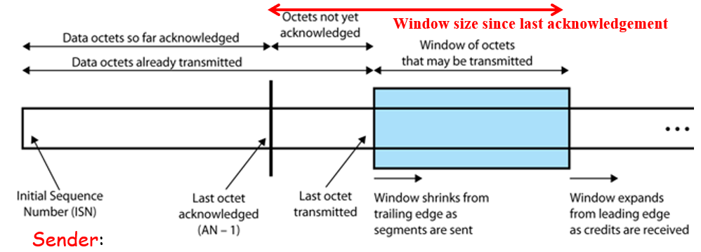
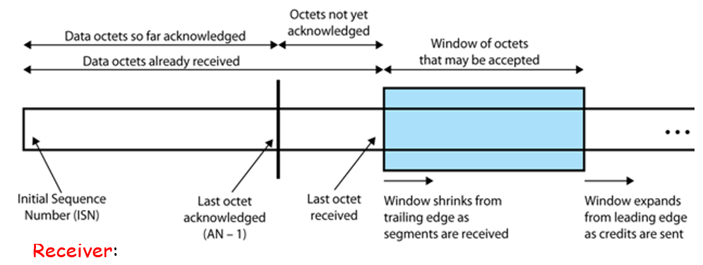

# Transport Layer: UDP and TCP

-   Transport layer provides end-to-end service for transferring data between processes (process to process communication)
-   Only implemented at the end hosts

# Ports

-   A single transport layer is used to support multiple application processes through the use of ports
-   Hence, transport layer is also said to perform multiplexing/de-multiplexing
    -   Multiplexing: Gathering data from multiple processes and passing it to a single network layer
    -   De-multiplexing: Delivering of data from single network layer to different processes correctly

# Transport Protocols in the Internet

The internet supports 2 main transport protocols

-   TCP (Transmission Control Protocol)
-   UDP (User Datagram Protocol)

TCP

-   Reliable, connection-oriented
-   Stream oriented
-   Complex
-   E.g. web (http), email (smtp), file transfer (ftp), video streaming, etc

UDP

-   Unreliable, connectionless
-   Datagram oriented
-   Simple
-   E.g. routing (RIP), domain name service (DNS), DHCP, real-time protocol, etc.

# UDP - Datagram Service

Application layer is aware that UDP sends each message as a datagram

-   On the sender's end, an ephemeral port is set up temporarily to send the datagram over to the receiver, and to receive the reply from the receiver

# TCP - Byte Stream Service

Application layer views TCP as a channel for sending a stream of bytes, and is not aware that bytes are sent in blocks called segments

-   Buffers for byte streams are used to stream the data through the TCP connection

# UDP

-   Although UDP provides non-reliable communication, some applications do not require reliable communications
    -   E.g. broadcasting, advertising messages to users, sending live vdeo streams (loss tolerant, rate sensitive)
-   UDP provides process-to-process communication service for applications to use

## UDP Header Format


Length of UDP datagram including header:

-   Minimum 8 bytes (No data, only header)
-   Maximum 65535 bytes

# TCP

-   To support applications requiring reliable communications, TCP adds reliability over unreliable IP
-   TCP features include
    -   Connection management: A connection must be setup before data exchange can be performed
    -   Flow control: Sender will not overwhelm receiver
    -   Error control: Receiver detects errors, sender retransmit error packets
    -   Congestion control: During transmission, sender detects network usage (congestion) and adjusts transmission rate

## TCP Header Format


-   Port addresses
    -   0-1023: Well known port, used by system processes to provide network services
    -   1024-49151: Registered port, assigned by IANA upon request by entities. Can also be used by the user
    -   49152-65535: Ephemeral port, dynamic/private ports that cannot be registered by IANA
-   Sequence number (SN)
    -   Each TCP connection will start with a different SN called Initial Sequence Number (ISN)
    -   The position of each data byte in the byte stream is labelled from ISN + 1, and cycles back to 0 once reaching $2^{32} - 1$
        -   i.e., first byte is (ISN + 1) mod $2^{32}$, second byte is (ISN + 2) mod $2^{32}$
-   Acknowledgement number (AN)
    -   AN of the next data byte expected from the sender
    -   Also implies that all bytes up to AN-1 have been received correctly
    -   E.g. if received sequence number 256, acknowledgement number is 257
-   Header Length (HLEN)
    -   Contains the length of the TCP header
    -   Minimum length of TCP header is 20 bytes, maximum is 60 bytes
-   Reserved bits
    -   Not used
-   URG
    -   If URG = 1, indicates to the receiver that certain amount of data within the current segment is urgent
    -   Urgent data is prioritised
    -   Receiver forwards urgent data to the receiving application on a separate channel
-   ACK
    -   When ACK = 1, indicates that acknowledgement number contained in the TCP header is valid
    -   For all TCP segements except the request segment, ACK is set to 1
    -   Request segment is sent for connection establishment during three way handshake
-   PSH
    -   When PSH = 1, all segments in the buffer are immediately pushed to the receiving application
    -   No wait is done for filling the entire buffer
    -   This makes the entire buffer free immediately
-   RST
    -   When RST = 1, indicates to the receiver to terminate the connection immediately
    -   Causes both sides to release the connection and all its resources abnormally
    -   Transfer of data ceases in both directions
    -   May result in loss of data that is in transit
    -   Only used when there are unrecoverable errors, or no chance of terminating TCP connection normally
-   SYN
    -   When SYN = 1, indicates to the receiver that the sequence number contained in the TCP header is the initial sequence number
    -   Request segment sent for connection establishment during three way handshake contains SYN bit set to 1
-   FIN
    -   When FIN = 1, indicates to the receiver that the sender wants to terminate the connection
    -   FIN segment is sent for TCP connection termination, contains FIN bit set to 1
-   Window Size (W)
    -   Indicate the number of bytes (also called credits) counting from AN that the receiver is ready to accept

## TCP Connection Management

-   Connection establishment: Serves the following purpose
    -   Ensure both ends are ready to communicate
    -   Establish initial sequence number (ISN)
    -   Exchange parameters, e.g. window size (in bytes)
    -   Allocate resources, e.g. buffer space, etc. to support the connection
-   Connection establishment starts with a synchronisation request (SYN)

## TCP Connection Establishment


-   TCP uses 3-way handshake approach with positive acknowledgement

## TCP Connection Termination


Note that for TCP 3 way handshake and connection termination,

-   A SYN and FIN segment does not carry data, but consumes 1 sequence number
-   A SYN+ACK, FIN+ACK does not carry data, but consumes 1 sequence number
-   ACK segment carrying no data does not consume any sequence number

## Sequence Number (SN)

-   SN in 32 bit range: $[0, 2^{32} - 1]$
-   Each connection starts with a different SN called the Initial Sequence Number (ISN)
-   Position of each data **byte** in the byte stream is labelled from ISN + 1, and cycles back to 0 once reaching $2^{32} - 1$
-   SN of a TCP segment indicates the position of its 1st data byte in a data stream
    -   If segment 1 starts from byte 11 and is 4 bytes long (11-14), then SN = 11
    -   Segment 2 will then have a SN = 15

## Acknowledgement Number and Window Size


-   AN
    -   SN of the next data byte expected from sender
    -   Implies all bytes up to AN - 1 have been received correctly
-   Window Size
    -   The number of bytes counting from AN that the receiver is ready to accept

## TCP Flow Control




-   Flow control is used to ensure that the sender does not overrun the receiver's buffers by transmitting too much too quickly
-   Similar to sliding-window flow control in datalink layer, although some details are different
    -   In sliding window flow control, multiple segments are allowed to be in transit at the same time
    -   Sender:
        -   Maintain a window representing bytes that can be transmitted without ACK
        -   When segment is sent, shrink window from trailing edge
        -   Stop sending when window size = 0
        -   When ACK received, new window size = W bytes starting from AN
    -   Receiver:
        -   Maintain a window representing bytes ready to accept
        -   When segment is received, shrink window from trailing edge
        -   If NOT ready to accept more windows, send ACK with credit W = remaining window size
        -   If ready to accept more segments, send ACK with W > remaining window size, and expand window from leading edge

### TCP Flow Control Enhancement 1: Delayed ACK (RFC 1122)

-   Problem: Wasteful to send ACK only segment (40 bytes TCP+IP headers)
-   Maximum < 500ms, to avoid error-control timeout re-sent
-   ACK every alternate segment received
-   Note: Piggy backed ACK can be sent immediately
-   Additionally, with a stream of full-sized incoming segments, ACK responses should be sent for **every second segment**.

### TCP Enhancement 2: Avoiding Silly Window Syndrome at Receiver - Clark's Solution (RFC 813, RFC 1122)

-   Problem: Wasteful for receiver to keep ACK with small window when sender can send more
    -   Window is small because buffer is nearly full, and receiver is receiving more data as the buffer is being processed
-   Solution: Receiver ACK W=0 instead of small window size, until free buffer becomes large enough; e.g. buffer half empty

### TCP Enhancement 3: Avoiding Silly Window Syndrome at Sender - Nagle's Algorithm (RFC 896, RFC 1122)

-   Problem: Wasteful for sender to keep sending small segments when receiver can accept more
-   Solution: Send the 1st small segment, buffer the rest, and send them together when ACK is returned

# TCP Error Control

-   TCP error control is required so that TCP can guarantee reliable service to application layer even when IP is unreliable
-   Similar to selective-reject in the data-link layer, but the details are different
-   Types of error:
    -   Segments arriving out of order
        -   Detected based on SN in TCP header; re-order and ACK
    -   Duplicated segments
        -   Detected based on SN; discard and ACK
    -   Corrupted segments
        -   Detected based on checksum in TCP header
        -   Discard and wait for timeout retransmission
    -   Segment loss
        -   Wait for timeout retransmission

## Retransmission Timer

-   How long should TCP wait for the ACK before it retransmits the segment?
    -   Too short (premature timeout): Unnecessary retransmissions occur
    -   Too long (slow reaction to losses): A long period of time is required to discover a lost segment
-   Note: Delays in network are constantly changing in practice, so timeout must be adaptive
-   Solution: Measure Round Trip Time (RTT) and compute smooted RTT (SRTT). The Retransmission TimeOut (RTO) is then derived from the SRTT

### Computing Retransmission Timer RTO - Jacobson's Algorithm (RFC 6298)

-   Initialisation, RTO = 1s
-   After 1st RTT is measured,
    -   Smoothed RTT, SRTT = RTT
    -   RTT variation, RTTVAR = RTT/2
    -   RTO = SRTT + 4\*RTTVAR
-   After each subsequent RTT is measured,
    $$
        \text{RTTVAR} = (1 - \beta) \text{RTTVAR} + \beta |\text{SRTT} - \text{RTT}|, \beta = 1/4 \\
        \text{SRTT} = (1 - \alpha) \text{SRTT} + \alpha \text{RTT}, \alpha = 1/8 \\
        \text{RTO} = \text{SRTT} + 4\text{RTTVAR}
    $$
-   $1 \leq RTO \leq max$ (at least 60s)

### Measuring RTT - Karn's ALgorithm (RFC 1122)

-   Each TCP connection measures the RTT from sending a segment to receiving its corresponding ACK
-   Typically, there is only 1 measurement ongoing at any time (i.e. measurements do not overlap)
-   Karn's Algorithm
    -   If a segment is retransmitted due to timeout, ignore its measured RTT because it is ambiguous whether the ACK is for the first time the segment was transmitted, or for retransmission
    -   When retransmission occurs, set RTO = 2RTO

## TCP Error Control Enhancement - Fast Retransmit


-   If 3 duplicate ACKs are received for a particular segment, TCP assumes that the packet is lost, and retransmits the segment immediately instead of waiting for timeout

# Congestion Control

-   Congestion control is used to prevent senders from sending too much traffic to the network such that it becomes overly congested and useless
-   Implement congestion control algorithm with a congestion window, which controls the amount of traffic that a connection can send

What happens if network congestion is ignored? Congestion collapse occurs


-   When the network is initially idle, increasing congestion will increase the throughput of data
-   Past a certain threshold, there will be several retransmissions occurring, hence output continues to increase slightly as input increases
-   However, afterwards, transmissions are dominated by retransmissions. Too many retransmissions due to network congestion, hence output decreases

TCP sender assumes network congestion when LOSS events occur

-   Timeout/receiving duplicate ACKs
    -   Possibly due to queueing or buffer overflow at routers, which are signs of congestion

## TCP Congestion Control

There are 2 phases for TCP congestion control

1. Slow start
2. Congestion avoidance

TCP congestion control requires 2 parameters

-   cwnd: Congestion window, measured in number of MSS (Maximum segment size, typically 536 bytes, but can be changed by using TCP options field)
-   ssthresh: Slow start threshold, defines the point to transition from slow start to congestion avoidance phase; in practice, typically set large value for initial ssthresh (half- maximum number of MSS)

Note: With congestion control, maximum data bytes that can be sent without ACK = min(W, cwnd*MSS), where W is the window size in bytes, and cwnd * MSS is also in bytes

### TCP Slow Start Phase

```
initialise cwnd = 1
do
    for (each segment ACKed)
        cwnd *= 2
until (loss event OR cwnd >= ssthresh)
```

-   If loss event occurs, go to recovery
-   If cwnd >= ssthresh, go to congestion avoidance
-   `cwnd` increases exponentially at each transmission round

### TCP Congestion Avoidance Phase

```
/* slow start is over */
/* cwnd >= ssthresh */

do
    for (every segment ACKed)
        cwnd += 1
until (loss event)
```

-   In contrast to slow start phase, cwnd only increases linearly at each transmission round

### TCP Congestion Control - Tahoe Algorithm


-   Recovery:
    -   ssthresh = floor(cwnd/2)
    -   cwnd = 1
    -   Go back to slow start

### TCP Congestion Control - Reno Algorithm: Implement Fast Recovery


-   Recovery:
    -   ssthresh = floor(cwnd/2)
    -   if loss == 3 duplicate ACKs
        -   cwnd = ssthresh
        -   go to collision avoidance
    -   else if loss == timeout
        -   cwnd = 1
        -   go to slow start

# Calculation of TCP Throughput

-   TCP throughput = cwnd \* MSS / RTT
    -   Assume ((cwnd _ MSS _ 8) / transmission rate) <<< RTT
    -   Assume no buffer constraint

# Resources

-   https://www.geeksforgeeks.org/tcp-congestion-control/
