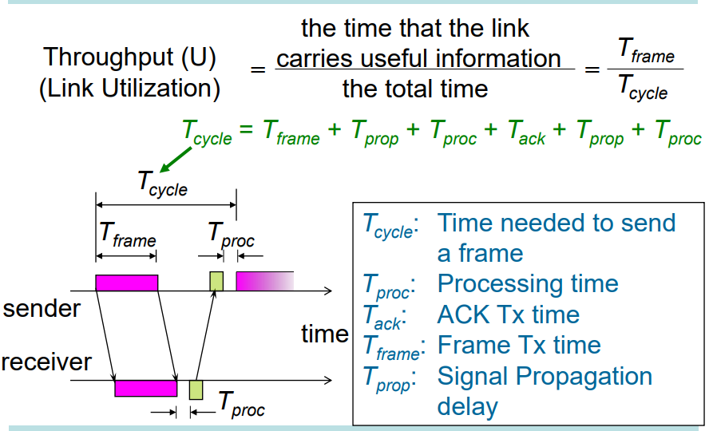

# Flow Control

# Data Link Layer Fundamentals

## Roles

-   DLL Services
    -   Framing: Encapsulate each network-layer datagram within a link-layer frame before transmission over the link
    -   Link Access: MAC protocol specifying the rules by which a frame is transmitted onto the link
    -   Flow Control: Control of data flow speed to ensure that the sender does not overwhelm the receiver of the data
    -   Reliable Delivery: Move each network-layer datagram across the link without error
        -   A datagram is an independent, self-contained message sent over the network whose arrival, arrival time, and content are not guaranteed.

### Framing

-   Byte Oriented (Character Oriented)
    -   Information is framed into a fixed 8-bit basic unit
    -   Some of these basic units are used for signalling (protocol control)
    -   Good solution when digital technology was in its primitive age (late 60s)
-   Bit Oriented (HDLC)
    -   A flag is used to frame the bits sent
    -   Header/Trailer are used to describe the content of a frame. Frames may be used for control
    -   Used by all modern protocols (e.g. HDLC, PPP, Ethernet etc)
    -   Is better than byte-oriented because bit-oriented protocols can transmit information without regard to character boundaries, and thus handle all type of information images

#### Byte-Oriented Async Transmission

-   In byte-oriented async tranmission, there is a pre-determined frame format
    -   Start/stop bit
    -   Parity check bit
    -   Data bits

### Link Configuration/Access

Our objective is to determine who gets to transmit when on a link. This depends on

-   Topology: The physical arrangement of stations
    -   Point-to-Point: Pair of hosts are directly connected
    -   Broadcast: All stations share a single channel
        
-   Duplexity
    -   Half-duplex: Only one party may transmit at a time
    -   Full Duplex: Allows simultaneous transmission and reception between two parties (e.g. 2 logical half-duplex channels on a single physical channel)
        

### Flow Control

-   Flow control ensures that a transmitting station does not overwhelm the receiving station with data, i.e. buffers at the receiver do not overflow
-   Flow control ensures that no frame errors occur

There are 2 flow-control mechanisms

1. Stop and Wait
2. Sliding Window

#### Stop and Wait Flow Control

Computer A wants to send data to computer B

1. A packs binary information into a frame
2. A sends the frame to B
3. A waits for an ACK (acknowledgment)
4. When B has received the frame, B sends an ACK
5. When A has received the ACK, A prepares to send another frame. Repeat step 1

##### Flow-Control Performance

$$
\text{Throughput, } U = \frac{T_\text{frame}}{T_\text{cycle}}
$$

The time for a cycle is

-   Frame time
-   Signal propagation delay (for sending frame from sender to receiver)
-   Processing time (Time for receiver to process that entire frame is transferred)
-   ACK transfer time
-   Signal propagation delay (for sending ACK signal from receiver to sender)
-   Processing time (Time to process ACK before sending next frame)

Assumptions:

-   Input is saturated
-   No error occurred

If we ignore the time required to send an acknowledgement, and the time to process the signals, then

$$
U = \frac{T_{frame}}{T_{frame} + 2 T_{prop}} = \frac{1}{1 + 2a}
$$

$a$ is known as the normalised propagation delay. $a = \frac{T_{prop}}{T_{frame}}$

##### Disadvantages of Stop-and-Wait

-   If frame or ACK is lost, long waiting time is expected
    -   To fix this, use a TIMEOUT control in the sender
-   If normalised propagation delay is long, the sender must wait a long time before it can perform the next transmission
    -   To fix this, we can use buffers at the sender/receiver (sliding window operation)

#### Sliding Window Flow Control

-   Allows multiple frames to be in transit
-   Sender and receivers both have a buffer which is $N$ frames long
-   Sender can send up to $N$ frames without receiving ACKs
-   Each frame is numbered
-   ACK includes number of next expected frame
-   Sequence number is bounded by field size ($k$ bits)
    -   Frames are numbered modulo $2^k$
    -   Sequence numbers range from $[0, 2^{k - 1}]$
    -   This is so that each frame in the window can be uniquely identified

##### How it works

-   Sender
    -   Sender window is denoted with a lower bound (first frame to send) and upper bound (last frame to send). Frames within window are expected to be sent
    -   Move lower bound up when frames sent
    -   Move upper bound up when acks received
-   Receiver
    -   Receiver window is denoted with a lower bound (first expected frame) and upper bound (last expected frame)
    -   Move lower bound up when frames received
    -   Move upper bound up when acks sent

##### Other Features

-   Receiver can acknowledge frames without permitting further transmission by send a "Receive Not Ready" frame. Receiver must send a normal ACK to continue transmission
-   ACK can be piggybacked on the dataframes in the reverse direction
    -   Send both data and acknowledgement at the same time

##### Performance of Sliding Window

-   Performance depends upon (error-free operation)
    -   Parameter $a$
    -   Window size $N$
-   Assumptions
    -   Acknowledgment time and processing time are negligible
    -   Only frame time and propagation delay are considered
-   Frame transmission time = 1 (normalised to itself)
-   Normalised propagation delay (one-way) = $a$
-   We have to consider 2 cases
    -   $N \geq 2a + 1$: Station can transmit continuously without exhausting its window, therefore $U = 1.0$
    -   $N < 2a + 1$: Station's window is exhaused at $t = N$, and station cannot send additional frames until $t = 2a + 1$, $U = \frac{N}{1 + 2a}$

# Resources

-   https://www.youtube.com/watch?v=NhpzBldHOYo
-   https://book.systemsapproach.org/direct/framing.html
