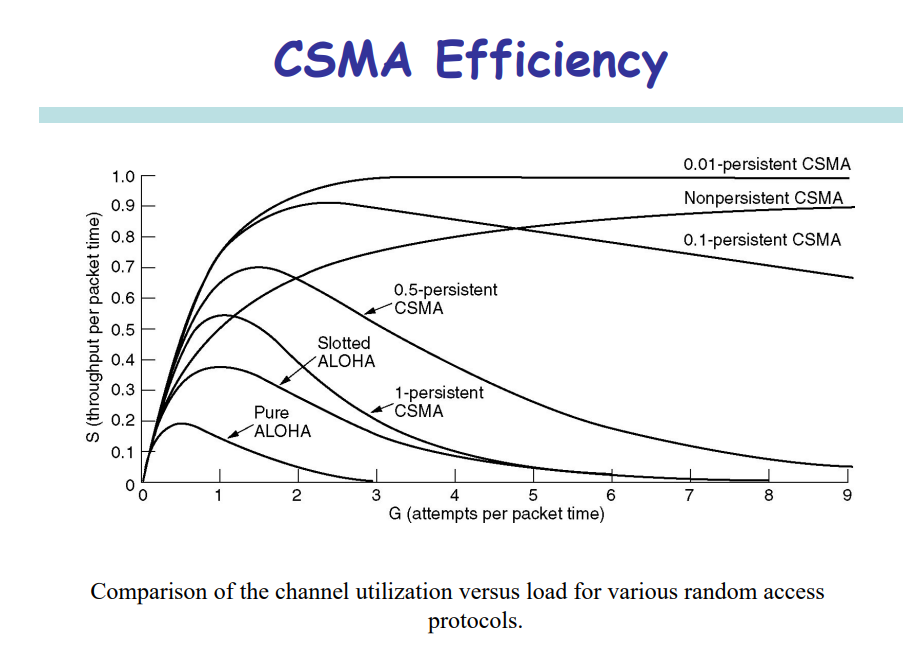

# Local Area Network: Medium Access Control Protocol

- Single shared broadcast channel
- Two or more simultaneous transmissions
    - Collision if node receives 2 or more signals at the same time
- MAC protocol 
    - Distributed algorithm to share the channel
    - Communication about channel sharing must use the channel itself
        - No out-of-band channel for coordination

# Ideal MAC Protocols

- Broadcast channel of rate $R$ bps
    - When 1 node transmits, it sends at a rate $R$
    - When $M$ nodes want to transmit, each can send at an average rate of $R / M$
    - Fully decentralised
        - No special node to coordinate transmissions
        - No synchronisation of clocks, slots
    - Simple
    - This ideal protocol is called "genie-aided" MAC

# MAC Taxonomy

- Multiple-access protocols
    - Random access protocols
        - ALOHA
        - CSMA
        - CSMA/CD
        - CSMA/CA
    - Controlled-access protocols
        - Reservation
        - Polling
        - Token passing
    - Channelisation protocols
        - FDMA
        - TDMA
        - CDMA

# Random Access Protocols

When a node has a packet to send,
- Node can transmit at full channel data rate of $R$
- No a-priori coordination among nodes

If there are 2 or more transmitting nodes
- Collisions

Design of random MAC has 3 aspects
- Whether to sense channel status
- How to transmit frames
- How to detect and react to collision (What to do with the collision)

# ALOHA Protocols

There are 2 versions of ALOHA
- Slotted ALOHA
- Unslotted ALOHA

## Slotted ALOHA

Assumptions
- All frames of the same size
- Time is divided into equal size slots, time to transmit 1 frame
- Nodes are synchronised
- Nodes start to transmit frames only at the beginning of the slots
- If 2 or more nodes transmit in slot, all nodes detect collision

### Efficiency of Slotted ALOHA

- Result of a slot
    - Successful (S): Only 1 node transmits
    - Collision (C): 2 or more nodes transmit
    - Empty (E): No transmission
- If there are $N$ nodes, and in each slot, each node transmits with a probability $P$, then
    - If a node $i$ transmits, the probability that the transmission was successful is $Pr(S_i) = P (1 - P)^{N - 1}$
    - The probability of a successful slot is $Pr(S) = Np(1-P)^{N - 1}$
- Offered load, which is a measure of traffic in a queue, is given by $G = NP$
    - Expected total number of transmissions in a slot
- If $N$ is large, 
    $$
    \begin{aligned}
        \lim_{N \to \infty} Pr(S) &= \lim_{N \to \infty} NP(1 - P)^{N - 1} \\
        &= \lim_{p \to 0} G(1 - P)^{\frac{G}{P} - 1} & \text{(As $n \to \infty, p \to 0$)} \\ 
        &= G \left( \lim_{p \to 0} (1 - P)^{1 / P} \right)^G \left( \lim_{p \to 0} (1 - P)^{-1} \right) \\
        &= G e^{-G}
    \end{aligned}
    $$

    
- $Pr(S) = \frac{1}{e}$ when $G = 1$, maximum throughput

### Pros and Cons of Slotted ALOHA

Pros
- Single active node can continuously transmit at full rate of channel
- Highly decentralised: Only slots need to be synced
- Simple

Cons
- Collisions, wasting slots
- Empty slots
- Clock synchronisation

## Pure ALOHA

- In pure ALOHA, frames are transmitted at completely arbitrary times
- Simpler, no synchronisation
- When frame first arrives, transmits immediately
- Collision probability increases due to no synchronisation
    - Frame sent at $t_0$ collides with other frames sent in $[t_0 - 1, t_0 + 1]$

### Efficiency of ALOHA

- Since transmission collision can occur in either first or second half

$$
\begin{aligned}
Pr(\text{Success for given node}) &= Pr(\text{Node transmit}) \\
& * Pr(\text{No transmission in first half}) \\
& * Pr(\text{No transmission in second half}) \\

&= P (1 - P)^{N - 1} (1 - P)^{N - 1} \\
&= P(1 - P)^{2N - 2}
\end{aligned}
$$

- For for the network, $Pr(S) = NP(1 - P)^{2N - 2}$
- For large $N$, $Pr(S) = Ge^{-2G}$, where $G = NP$ is the offered load
- Hence $Pr(S) \leq \frac{1}{2e} \approx 18.4\%$

# Carrier-Sense Multiple-Access

- To improve performance, **avoid transmissions that are certain to cause collisions**
- Based on the fact that LAN propagation time is very small
    - If a frame was sent by a station, all stations know immediately so they can wait before starting to send
    - A station with frames to be sent, should sense the medium for the presence of another transmission (carrier) before it starts its own transmission
- This reduces the possibility of collision, but cannot eliminate it
    - Collisions can only happen when more than one station begin transmitting within a short time (the propagation time period)

## CSMA Variants

- Different CSMA protocols that determine
    - What a station should do when the medium is idle
    - What a station should do when the medium is busy
- 3 types of CSMA protocols
    - Non-persistent CSMA
    - 1-persistent CSMA
    - P-persistent CSMA

### Non-Persistent CSMA

- A station with frames to be sent should sense the medium
    1. If medium is idle, transmit, otherwise go to 2
    2. If medium is busy, backoff by waiting a random amount of time and repeat 1
- Non-persistent stations are deferential (respect otherse)
- Performance
    - Random delays reduces probability of collisions because 2 stations with data to be transmitted would wait for different amount of times
    - Bandwidth wasted if backoff time is large because medium remains idle following end of transmission even if one or more stations have frames to send

### 1-Persistent CSMA

- To avoid idle channel time, 1-persistent protocol used
- Station wishing to transmit listens to the medium
    1. If medium idle, transmit immediately
    2. If medium busy, continuously listen until medium becomes idle, then transmit immediately with probability 1
- 1-Persistent stations are selfish
- Performance
    - If 2 or more stations becomes ready at the same time, collision is guaranteed

### P-Persistent CSMA

- Time is divided into slots where each time unit typically equals maximum propagation delay
- Station wishing to transmit listens to the medium
    1. If medium idle
        1. Transmit with probability (p) OR
        2. Wait 1 time unit (slot) with probability (1 - p), then repeat step 1
    2. If medium busy, continously listen until idle, and then repeat step 1
- Performance
    - Reduces possibility of collisions like non-persistent
    - Reduces channel idle time like 1-persistent

# CSMA/CD Protocol

## Collision in CSMA

Consider 2 transmitters $A$ and $C$

1. $A$ senses the medium idle and starts transmission
2. $C$ senses the medium idle and starts transmission
3. Collision occurs on the medium
4. $C$ detects the collision
5. $A$ detects the collision

## Vulnerable Time in CSMA

- Vulnerable time for CSMA is the max propagation time
- How fast the transmitters sense a collision is dependent on propagation delay
- The longer the propagation delay, the worse the performance of the protocol

## Collision Detection

- CSMA has channel wastage
    - If a collision occurs, colliding packets are still to be fully transmitted
- CSMA/CD (Carrier Sense Multiple Access with Collision Detection) overcomes this
    - While transmitting, the sender is listening to the medium for collisions
    - Sender stops transmission if collision has occurred, reducing channel wastage
- CSMA/CD is widely used for bus topology LANs (IEEE 802.3, Ethernet)

## How to Detect Collisions?

- Transceiver
    - A node monitors the media while transmitting. If the observed power is higher than the transmitted power of its own signal, that means a collision has occurred
- Hub
    - If input occurs simultaneously on 2 ports, it indicates a collision. Hub sends a collision presence signal on all ports

How long does it take to detect a collision?
- In the worst case, 2 * max propagation delay of medium

## CSMA/CD Protocol

- Transmission protocol
    - Use one of the CSMA persistent algorithms
- If a collision is detected by a station during its transmission, it should do the following
    - Abort transmission
    - Transmit a jam signal (48 bits) to notify other stations of collision so that they will discard the transmitted frame also to make sure that the collision signal will stay until detected by the furthest station
    - After sending the jam signla, backoff for a random amount of time, then 
    - Transmit the frame again

